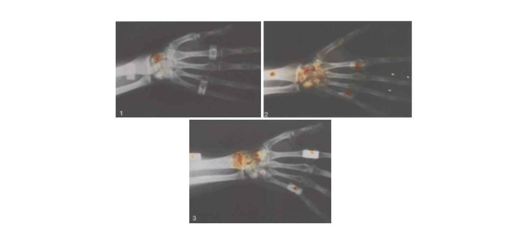
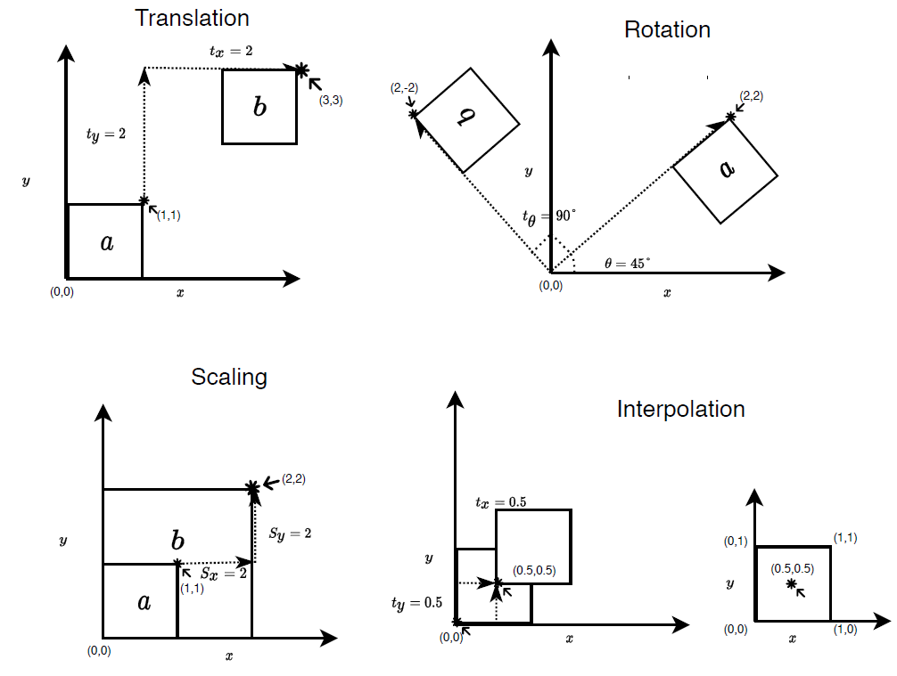
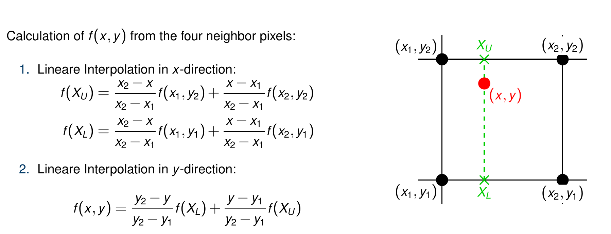
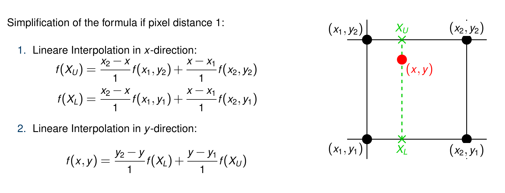

+++
date= 2020-05-18
title = "Exercise 4"

[extra]
author="Srikrishna Jaganathan"
+++

# Submission

**Submission deadline: 01.06.20 23:55h**

Please ensure that all files you created also contain **your name and your IDM ID** and also your partner's name and IDM ID if you're not working alone.

Each exercise has **10 points**. You have to achieve **30 of 60 points in six homework exercises** to pass the module.

# Image Transformations


In the previous exercises, we built a Signal and Image class for performing basic operations on the 
input data. We also implemented various filters to process the data and remove noise. 
In this exercise we will build on top of the image class and implement methods for performing image transformations.

In many medical applications there is a need to align two images so that we 
can combine the information between the images. This can be due to the images coming from 
different modalities like (CT and MRI) or in scenarios were you have an patient data at from 
different time (before and after an surgery)  and you want to compare between these two images. 
In all these scenarios we use image registration bring the different images together.

In the below image, two x-ray views (1) and (2) are fused together to obtain the combined view(3)
which produces more information for diagnosis. This is achieved using image registration between view(1) and view
 

[Image Source: Hawkes, David J., et al. "Registration and display of the combined bone scan and 
radiograph in the diagnosis and management of wrist injuries." European journal of nuclear medicine 
18.9 (1991): 752-756. ](https://link.springer.com/article/10.1007/BF00173434)

One of the crucial components of image registration is image transformations.
In this exercise we will implement basic image transformations. Additionally, we need to implement an 
interpolation method to find out the image intensity values at the transformed coordinates. 

<!-- Think of image interpolation as computing the values in the actual physical space. -->


## Overview of tasks



We will implement the following tasks for this exercise.

1. __Helper functions__ (_a. Image origin_, _b. Interpolation_)
2. __Image Transformation__ (_a. Translation_, _b. Rotation_, _c. Scaling_)

We introduce the basic theory about image transformations in [theoretical background section](./img_transform_theory).
Please read the theory before proceeding since we don't re-introduce everything in the task description. 

## Task Description

* We provide the main method for the task with an interactive ImageJ plug-in in the files
[```src/main/java/exercises/Exercise04.java```](https://github.com/mt2-erlangen/exercises-ss2020/blob/master/src/main/java/exercises/Exercise04.java)
and [```src/main/java/mt/ImageTransformer.java```](https://github.com/mt2-erlangen/exercises-ss2020/blob/master/src/main/java/mt/ImageTransformer.java)


### 0. Getting started

<P align="right"><i>1 Point</i>

* For Exercise 4 we provide a GUI that displays the image with different image transformation options.


* Once you have all the transformations implemented you should be able to adjust the sliders and perform the desired transformations in an interactive manner.

* The transformations requires an origin point about which we perform all the transformation.

* Extend the `Image` class with these three methods

```java
    // store the origin points x,y as 
    // a class variable
    public void setOrigin(float x, float y)

    // the origin() returns the {x,y} as float 
    // array from the stored origin class variable. 
    public float[] origin()

    // Sets the origin to the center of the image
    public void centerOrigin()
```

* To ensure that everything is running, run the main function.
* We already set the origin point for you in the file ```src/main/java/exercises/Exercise04.java```
* To ensure that everything is running, run the main function of `Exercise04`.

### 1. Image interpolation

<P align="right"><i>4 Points</i>

* Since the image transformations heavily relies on the interpolation, we first implement the interpolation method by extending the ```Image``` class  with the following method:

* ```public float interpolatedAt(float x, float y)  ```

* The method takes in a physical $(x,y)$ coordinate and returns the image intensity at that position.
We use bilinear interpolation to find the value at $(x,y)$ (described in the [theory](./img_transform_theory)).

* We can rewrite the interpolation equation using the linear interpolation formula when we want to interpolate between two points $x_1,x_2$ with function value $f(x_1),f(x_2)$ to find out the function value $f(x)$ at $x$.

$$ \frac{f(x) - f(x_1)}{x-x_1} = \frac{f(x_2) - f(x_1)}{x_2 - x_1} $$

<!--or-->

<!--$$ \frac{f(x) - f(x_1)}{x-x_1} = \frac{f(x_2) - f(x_1)}{x_2 - x_1} $$-->


<!---->
* Since we already know the difference $x_2 - x_1$ is either 1.0 if we have a pixel spacing of 1.0 or pixel spacing, we can simplify the above equation as follows:

$$f(x) = f(x_1) + (x-x_1) (f(x_2) - f(x_1))$$



* You can use the function below to compute linear interpolation between two points $x_1,x_2$ at $x$

    ```java
    
     // Definition of arguments
     // diff_x_x1 = x - x_1 compute the difference between point x and x_1
     // fx_1 = f(x_1), pixel value at point x_1
     // fx_2 = f(x_2), pixel value at point x_2 

     float linearInterpolation(float fx_1, float fx_2, float diff_x_x1) {
         return fx_1 + diff_x_x1 * (fx_1 - fx_2);
     }
     
    ```

* We now have an way to interpolate between two points in 1D. We need to extend this to 2D case such that we can use 
it for interpolating values in our image. An illustration of how this can be done is 
already given in the [theory](./img_transform_theory) section.

* __Implementation detail__ We describe here possible way to implement the interpolation scheme.

  * Find the 4 nearest pixel indices, for the given physical coordinate $(x,y)$. To do, this you have to transform
    the physical coordinate to the index space of the image.

  * Hint: In physical space all the values of $x$ and $y$
  are computed from origin. So we just need to subtract the origin from the coordinates for this correction.

    ```java
    x -= origin[0]
    y -= origin[1]
    ```


  * Pixel spacing also alters the physical coordinates and needs to be corrected for. 
  This can be done using just by dividing each coordinate by the pixel spacing.
    
    ```java
    x /= spacing;
    y /= spacing
    ```

  * Hint: Since each pixel is a unit square you can round up and down each coordinate ($x$ and $y$) separately 
  to get the 4 nearest pixels coordinates.

  * Interpolate along an axis (here we choose the x-axis) initially using the linear interpolation 
  function to obtain intermediate points.

  * Now interpolate along the intermediate points (i.e you are interpolating along y-axis)

  * __Note:__ Take care of image origin and pixel spacing for the input coordinates before you perform any of the steps.
   Also, always use ```atIndex``` and ```setIndex``` for accessing the image values. 
   This ensures that we handle the values at boundary correctly.


* Example:
  Here we look at a single point to understand how to implement our algorithm

  * If we have an input $(x,y) = (0.4,0.4)$, then the 4 nearest pixel coordinates are $(0,0)$,$(1,0),(1,1),(0,1)$

  * Interpolating the values between the points $a = (0,0)$, $b = (1,0)$, find the intermediate 
  value at point $I_1 = (0.4,0)$.
  * Similarly interpolate between $c = (0,1)$ and $d = (1,1)$ to find the intermediate value at point $I_2 = (0.4,1)$.
  * Now we can just use the values at the intermediate points $I_1 = (0.4,0)$ and $I_2 = (0.4,1)$ and 
  perform a linear interpolation in the y direction to obtain the final result at $(0.4,0.4)$.
  
  

### 2. Image Transformation

<P align="right"><i>5 Points</i>

Now we can start with the implementation of ```ImageTransformer``` class.

* The class consists of the following member functions for translation

```java
// Transformation parameters
public float shiftX; // tx
public float shiftY; // ty
public float rotation; // theta
public float scale; // s
```

* Also use the interface ```ImageFilter``` abstract class which you have implemented in the previous exercises. 
This can be done using ```implements``` keyword.

* Add the method `apply(Image input,Image output)` which takes in two variables input and 
output of `Image` class type. The input variable provides the input image to our transformer class. 
The output variable is where the transformed image is stored.

* Consider each pixel in the image with index $(i,j)$. When we access an image pixel we get 
the pixel intensity stored at the location $(i,j)$.

* Here $(i,j)$ represents the image coordinates $(x,y)$ and the pixel value at $(i,j)$ represents $f(x,y)$.

* We want to transform $(x,y) \to (x',y')$ and find the pixel value at the new location for a 
given set of input transformation parameters $t_x,t_y,\theta,s$ to transform the input image coordinate $(x,y)$.

* Let us go over a possible approach to implement the ```apply``` method which 
implements (translation,rotation and scaling). In addition, once we have the transformed coordinates $(x',y')$ we 
interpolate the value at this coordinate to set the output value of the new image.

* We can implement the transformations and interpolation using the equations defined 
in the [theory section](./img_transform_theory). 

* However, from the implementation perspective it is much easier to ask what will be my output image value 
at the current position $(x',y')$  for the given  transformations parameters.
* For this we need to find the input coordinate $(x,y)$ for the given transformation parameters.
This mapping from $(x',y') \to (x,y)$ is known as the inverse transformation.
* Just to recap our current aim is to iterate over the output image along each 
pixel $(i,j)$ (also referred as $(x',y')$) and find the inverse transformation (x,y).
Once we find $(x,y)$ we can just interpolate the values in the input image at $(x,y)$ and
set it to the output image value at (x',y').

* An example code to accomplish this looks like below:

```java
// We need to compute (x,y) from (x',y')
// We use xPrime,yPrime in the code to indicate (x',y')
// Interpolate the values at (x,y) from the input image to get
float pixelValue = input.interpolatedAt(x,y);

// Set your result at the current output pixel (x',y')
output.setAtIndex(xPrime, yPrime, pixelValue);

```

* The inverse transformations can be computed using the following equations.

 * Translation
    * $x =  x' - t_x$
    * $y =  y' - t_y$ 
    
 * Rotation
    * $x= x' \cos\theta + y' \sin\theta$
    * $y= - x \sin\theta + y' \cos\theta$            
 * Scaling
    * $x=  \frac{x'}{s}$
    * $y=  \frac{y'}{s}$


* __Implementation detail__ Now you can directly use the above equations to implement translation, rotation and scaling.
The entire `apply` method for the `ImageTransformer` class can be implemented as follows:

  * Iterate over each pixel in the output image (although they are just the same as input initially).
  * At each pixel the index $(i,j)$ represents our coordinates $(x',y')$ of the output image
  * Apply the transformations using the equations described above to find $(x,y)$
  * Now set the output image value at $(i,j)$ (also referred as (x',y')) from the interpolated values at $(x,y)$ 
  from the input image.
  * Use the `setIndex()` for setting the values of the output image and `atIndex()` for getting the values 
  from input image.


  * In the above formulation we assume that we have pixel spacing of $spacing = 1.0$ and the 
  image origin at $(x_0, y_0) = (0,0)$.

  * You can extend this to work for different values of pixel spacing and origin.
  
  * Hint: Think of pixel spacing as a scaling and origin as a translation transformation. 
  (apply both spacing and origin transformation to the input coordinates $(x,y)$ as  $(x * px , y * py) + (x_0,y_0))$ 

