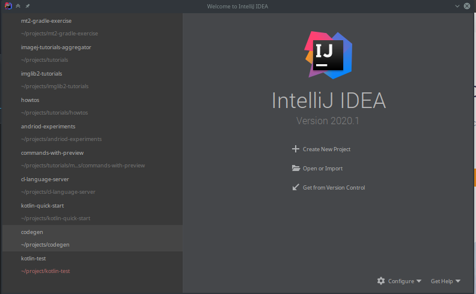
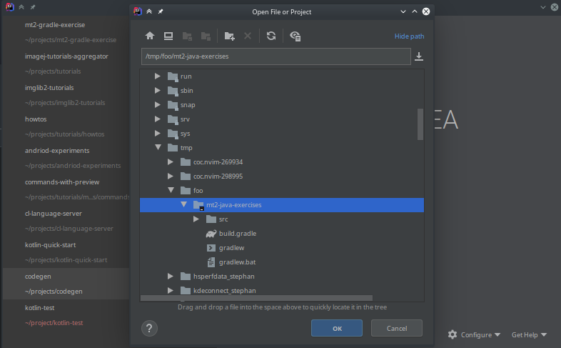
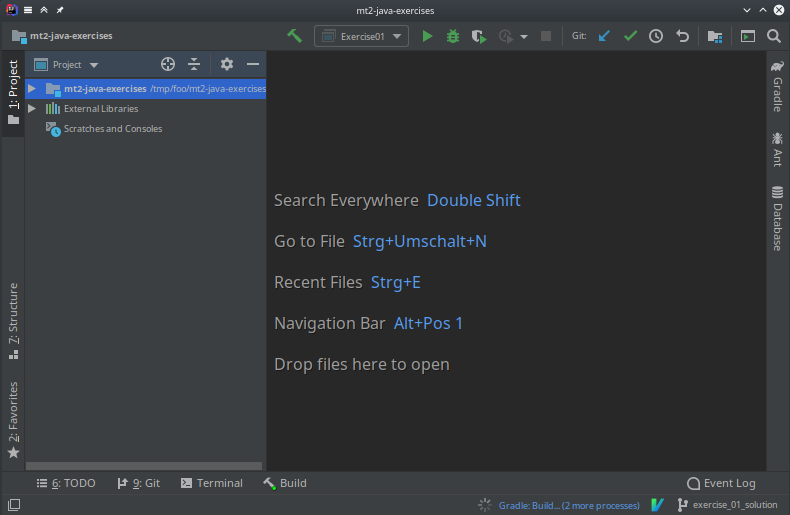

+++
date= 2020-04-21
title = "Import a Gradle project with IntelliJ"

[extra]
author="Stephan Seitz"
+++

- On Windows, macOS [download the latest Java version 15 from Oracle](https://www.oracle.com/java/technologies/javase-jdk15-downloads.html).
  On Ubuntu Linux, you can install `sudo apt install openjdk-14-jdk` or `sudo apt install openjdk-11-jdk`.
  At least Java 8 is required.

- You can [get IntelliJ from here](https://www.jetbrains.com/idea/). There's a free community edition and you can also 
  unlock the Ultimate Edition when applying with your FAU email adress [here](https://www.jetbrains.com/community/education/#students).

- Start IntelliJ and select "Open or Import"

- Select the downloaded folder

- Wait until all dependencies are downloaded

- Please make sure you enable auto-compilation: [https://www.jetbrains.com/help/idea/migrating-from-eclipse-to-intellij-idea.html#compilation](https://www.jetbrains.com/help/idea/migrating-from-eclipse-to-intellij-idea.html#compilation)

[Back to exercise 00](../exercise-0)
