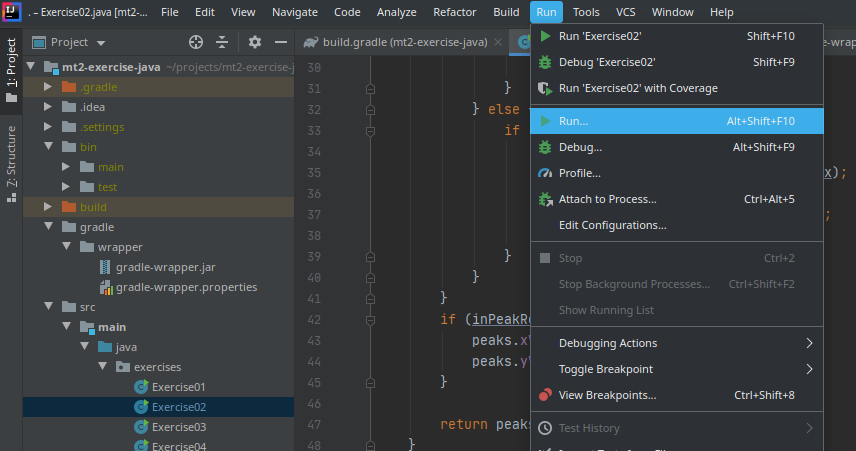

+++
date= 2020-04-29
title = "Set Program Arguments in IntelliJ"

[extra]
author="Stephan Seitz"
+++

# Set Program Arguments in IntelliJ

Select **Run...** in the menu **Run**.

Select **Edit configurations...**

Fill in the form with main class `exercises.Exercise02` and your file name of the file that you want to open (`e.g. <where_you_saved_your_data_set>/MLII/1 NSR/100m (0).mat`) as programm arguments in **quotes**!

