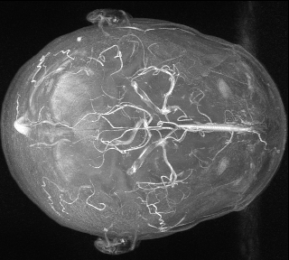
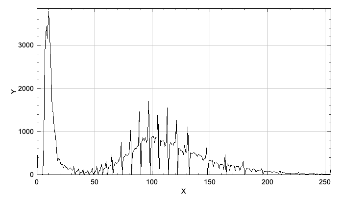

+++
date= 2022-01-10T08:04:00Z
title = "Project Work 4 – Otsu's method"

[extra]
author = "Paul Stöwer"
+++

# Otsu's method

In the previous task we implemented a simple segmentation method. However we still need to pass a threshold manually and evaluate it by ourselves.
To conquer that, we will implement Otsu's method in our `PostProcessing` class:
```java

public static int Otsu(Image image)

```

## Histogram

The method finds the optimal threshold for bimodal histograms. Therefore we need to add another helper method to our `PostProcessing` class:

```java

public static Signal Histogram(Image image)

```

We can describe the Histogram as a `Signal` from our Framework with the size of all possible pixel values of a grey scale images. 
<br>Before saving the pixel counts of each pixel value to the histogram, the image needs to be normalized to the grey scale pixel values 0-255. Create a function for that:

```java

public static Image normalizeToGreyScale(Image image)

```
<br>You can normalize the image with the formula: $I_N=(I-Min)\frac{newMax-newMin}{Max-Min}+newMin$. 
<br> *Hint: Make sure that you have even pixel values!*

Now you can iterate over your normalized input image and increase the entry of the histogram according to the pixel value of the image. Due to the fact that the histogram is `Signal` we can use the `show()`) method to display it: 

 <p style="text-align: center;">
<table><tr>
<td>  </td>
<td>  </td>
</tr>
<tr>
<th>MIP Image of Volume1</th> 
<th>Histogram of the Image</th> 
</tr>
</table>
 <p>

## Otsu's method

The method tries to maximize the following function to find the best threshold: $\sigma_b^2(\theta)=P_1(\theta)P_2(\theta)(\mu_1(\theta)-\mu_2(\theta))^2$


[Source](https://upload.wikimedia.org/wikipedia/commons/3/34/Otsu%27s_Method_Visualization.gif)

Use the following formulas to calculate the different parts of the equation, where $h(i)$ is the normalized histogram:

* $P_1(\theta)=\sum_{i=0}^\theta h(i)$
* $P_2(\theta)= 1-P_1(\theta)=\sum_{i=\theta+1}^{L-1}h(i)$
* $\mu_1= \frac{1}{P_1(\theta)}\sum_{i=0}^\theta (i+1)h(i)$
* $\mu_2= \frac{1}{P_2(\theta)}\sum_{i=\theta+1}^{L-1}(i+1)h(i)$

For the implementation you can orientate yourself at the following steps:

* Think about the possible values for $\theta$ in an gray scale image
* Create the necessary amount of float arrays for the specific size
* Calculate $P(\theta)$ and $\mu(\theta)$ according to the formulas
* Now calculate $\sigma_b^2$ for the different $\theta$ and save the values in an float array
* Find the index of the maximum in $\sigma_b^2$ 


You have now found the optimal threshold for the input image!

Consider the following points in your report:

* Describe the method of Otsu: 
	- What is the goal of the method? 
	- How does it solves the problem?
		+ Which role does the histogram of the image play?
		+ Describe the method with the formulas
		+ Include at least one segmented picture with the found threshold
* Cite the original publication of the method from the year 1979.

This section should be half a page to one page long.

[Previous: Post-Processing](./postprocessing)

[Next: Statistical Evaluation](./evaluation)
