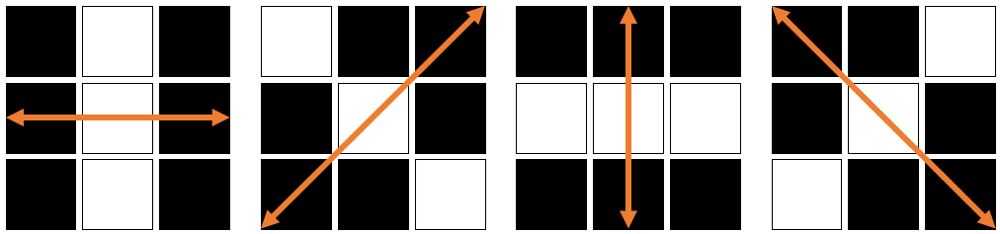

+++
date= 2024-06-24T12:00:00Z
title = "Project Work 5 - Canny Edge"
[extra]
author= "Mischa Dombrowski, Zhengguo Tan, Jinho Kim"
+++
# Overview

0) [Introduction](../introduction)
1) [Thresholding](../thresholding)
2) [Segmentation](../segmentation)
3) [Otsu's Method](../otsu)
4) [Edge Detection](../edgedetection) 
5) [Canny Edge](../cannyedge) 
6) [Outlook and Conclusion](../conclusion)

# 5: Canny-Edge

The Canny-Edge algorithm is one of the more advanced algorithms to perform edge detection. Unlike primitive approaches, like those you implemented in Task 4, Canny's algorithm leads to clearly defined edges (only one pixel in width) and a significant reduction in false dectections (meaning regions of sharp brightness-transition, which are not edges of interest). 
This is achieved through the following process: 

1. Blurring the image (__Gaussian Blur__) to reduce noise
2. Determining the __image-gradient__ using the Sobel-kernel (&rarr; Task 4)
3. Determining the __gradient-direction__ for each pixel
4. Performing __Non-Maximum-Suppression__ along the gradient-direction
5. Performing __Hysteresis-Thresholding__ to select edges of intrest 

These steps will be explained further later on.

---

## 5.1: Blurring and Gradient

The first part of this section can be implemented directly in the `run`-method of the `Task_5_CannyEdgeDetection`-class.

To do:

1. Convert the input-image to a `FloatProcessor` and apply a __gaussian blur__.

   __Note__: 
   The $\sigma$-parameter is one of values you can play around with later on to improve your results. A good starting point would be the value __2__
2. Create 3 new `FloatProcessors` to store the image-gradient and the derivatives. Use the methods you implemented in Task 4 to apply a __Sobel__-operator and to calculate the gradient.
   
To calculate the direction of each pixel, you will now implement a new method.
The formula for calculating the gradient-direction at a given pixel is:
> $\Theta$ = _atan2_(G<sub>y</sub> , G<sub>x</sub>)

>__Note__: 
> The gradient-direction provides information about the angle or direction of an edge within the image. At any given point the edge will be __perpendicular__ to the gradient direction. This will become important when it comes to performing __Non-Maximum-Suppression__ (NMS). 
> An example: 
> <center></center>
><center> white pixels &#8793; edge; &nbsp; arrow &#8793; gradient-direction </center> 
><br/>
>
>During NMS the goal is to reduce edges to a single-pixel-line. This is acieved by searching for local intensity-maxima __in the Gradient-Direction__, so that edge-information is preserved but the blurryness of primitive edge-detection tools is removed.
> 
> The atan2-method used to determine the direction returns the angle $\Theta$, that results from converting a cartesian coordinate __(x,y)__ to radiands __(r,$\Theta$)__. The angle theta is therefore returned in __radiands__ and you will need to convert it to degrees. 
>
> __Important:__ 
> The atan2-method expects coordinates in a standard cartesian coordinate-system (x&rarr; / y&uarr;). Since you are working with images, the y-axis is defined differently (x&rarr; / y&darr;) and you will therefore need to call the formula like this: `Math.atan2(-y,x)`

The getDir-method will determine the gradient-direction for each pixel and then round it to one of the following values: __0°, 45°, 90°, 135°__. These stem from the fact that an image is a discrete set of pixels and therefore we can only differentiate between these directions. 

<center></center>

<center>Gradient-directions: 0°, 45°, 90°, 135°</center>

To do:

1. Create a new method:
   ```java
   public ByteProcessor getDir (FloatProcessor X_Deriv, FloatProcessor Y_Deriv){}
   ```
2. Create a `ByteProcessor` to store the directions
3. Create an `int`-array:
   ```java
   int[] angles = {0,45,90,135,180};
   ```
   (180° is equivalent to 0° but needs to be considered as a seperate case)
4. Iterate through the input-FloatProcessors and calculate the direction for each pixel (__in degrees__)
5. Search for the closest match in the angles-array and store the final direction in the output-ByteProcessor. 

   __Note__:
   Negative values are simply "mapped" to the corresponding positive value (for example -45° &#8793; 135° or -90° &#8793; 90°). You can do this by simply checking if the value is negative and then adding __180°__. If the closest match is 180° the direction is set to 0°
6. Return the final ByteProcessor

---

## 5.2: Non-Maximum-Suppression

As explained previously, NMS aims to extract thin (single-pixel) edges from the blurry image-gradient-data. This is done by checking each pixel in relation to its two neighbouring pixels (along the gradient-direction). If the pixel is the highest of the three, it is kept as part of the edge. If not, it is discarded (set to 0). 

To do:

1. Create a new method:
   ```java
   public FloatProcessor nonMaxSuppress(FloatProcessor Grad, ByteProcessor Dir) {}
   ```
2. Create a new `FloatProcessor` to store the resulting image

3. Iterate through the gradient-image. Check the direction for each pixel and then evaluate wether or not it is a local maximum __in gradient-direction__.
4. If it is a local maximum, store the value in the output-FloatProcessor
5. Return the final FloatProcessor

---

## 5.3: Hysteresis Thresholding

Hysteresis Thresholding is a special form of thresholding, which uses two threshold-values instead of one (upper and lower). Similar to standard thresholding, if a pixels value falls above the upper threshold, it is kept as part of the image. If however the pixel value falls below the upper threshold but above the lower threshold, the pixel is only kept as part of the image, if it is directly connected to a pixel above the upper threshold. Any pixel below the lower threshold is disregarded. 

To do: 

1. Create a new method: 
   ```java
   public ByteProcessor hysteresisThreshold (FloatProcessor In, int upper, int lower){}
   ```
2. Since you are working with a FloatProcessor and the values a pixel can have are not the easiest to work with, you can instead convert your input-values to percentages of the maximum value within the image. To do so, simply add: 
   ```java
   float tHigh = ((float)In.getMax()*upper)/100f;
   float tLow = ((float)In.getMax()*lower)/100f;
   ```
   You can then use tHigh and tLow as your threshold values, while being able to define them through low integer numbers. As a starting point you can for example use __15__ as upper and __5__ as lower. Feel free to experiment around with these. 
3. Create an output-`ByteProcessor` to store the final image 
4. Iterate through the input image and check the threshold condition for each pixel. Set pixels above the upper limit to white in the output image 
5. In order to check, wether a pixel above the lower threshold is connected to an existing edge, you will need to iterate through the image again and check the connections repeatedly, because a pixel can become connected to the edge through any number of adjacent pixels. 
To avoid mistakes here, the following code, as well as the included `hasNeighbours()`-method will be provided. You can simply add this code after you performed the first iteration through the image.  
   ```java

   boolean changed = true;
   while (changed) {
      changed = false;
         for (int x = 0; x < In.getWidth(); x++) {
            for (int y = 0; y < In.getHeight(); y++) {
               if (In.getPixelValue(x, y) >= tLow && hasNeighbours(Out, x, y) && Out.getPixel(x,y)==0) {
                        Out.set(x, y, 255);
                        changed = true;
                    }
                }
            }
        }
   ```

   (__Out__ refers to the output-image. If you named it differently, you can obviously change the code accordingly)

1. Return the output image

---

Now all you need to do is to perform the `getDir`,`nonMaxSuppress` and `hysteresisThreshold` steps in sequence within your `run`-method.

Add a simple __user-dialog__, which allows you to select values for $\sigma$, the upper threshold and the lower threshold.  

---
## 5.4: Project-Report

The part of your report concerning Task_5 should contain the following:

+ A short description of what Canny-Edge-Detection aims to do and how it works
+ In which ways it is superior to the more primitive approaches
+ Images you generated with your code. How do the parameters influnce your results? 

[Next](../conclusion)
