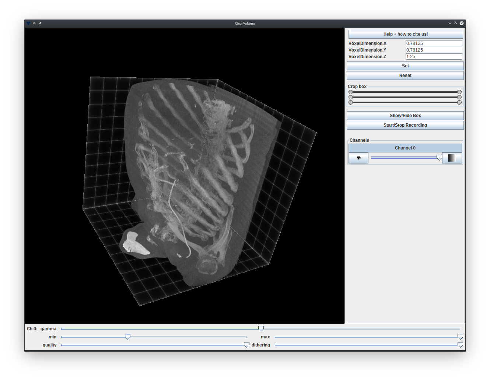
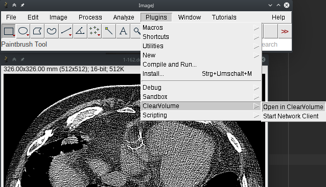
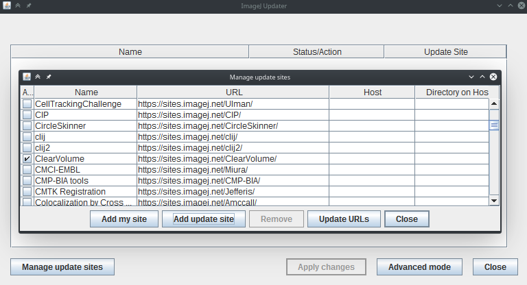

+++
date= 2020-06-03
title = "ClearVolume Intregration"

[extra]
author = "Stephan Seitz"
+++

[ClearVolume](http://clearvolume.github.io/) looks like this



You can integrate it into your development enviroment by adding this
line to your `gradle.build`.

```groovy
implementation 'sc.fiji:imglib-clearvolume:1.4.2'
```

You need to start ImageJ with (instead of `(new ij.ImageJ()).exitWhenQuitting(true);`)

```java
    net.imagej.ImageJ ij = new net.imagej.ImageJ();
    ij.launch();
```

I guess, this only works if you are running Java 1.8 (at least on my Linux machines)!



What will always work, is to install [Fiji](https://fiji.sc/) and
activate `ClearVolume` under *Help > Update... > Manage update sites* and
select "Clear Volume"



Fiji also has many other PlugIns to view volumes.

[Back to volumes](../volume)
