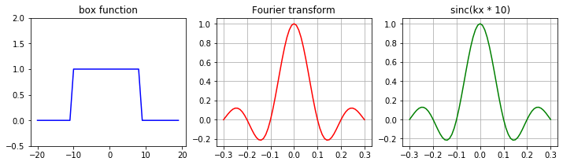

+++
date= 2022-06-20T08:00:20Z
title = "Project Work Optional"
[extra]
author= "Zhengguo Tan"
+++

## MRI is a Fourier machine

MRI acquires data in the frequency domain (also known as $k$-space), and the relationship between such $k$-space data and image contents reads,

$$ s(k_x, k_y) = \int \rho(x, y) e^{-i \pi (k_x \cdot x + k_y \cdot y)} \text{d}x \text{d}y $$

It is worth noting from this equation that,

* the image content $\rho$ is discretized into a two-dimensional (2D) matrix with its spatial coordinates $x$ and $y$.

* the MR signal $s$ is sampled at the $k$-space points $(k_x, k_y)$, and is an integral over all discrete points $(x, y)$ in image domain.

* the MR signal is sampled is a point-by-point manner, which is an important reason why MRI is slow.

In short, Fourier transform plays an important role in MRI. The exploration of Fourier transform properties has fostered many crucial MRI developments and innovations.

**Task Optional.1:** The equation above shows how a 2D image $\rho(x,y)$ can be formed in MRI. Can this equation be extended to 3D acquisition? In other words, instead of acquiring one 2D plane, can we use MRI to acquire 3D volume such as to cover a whole organ (like brain)? May you try to write down the equation for 3D Fourier transform? What may be the difficulties in reconstructing 3D volume images? Think about computational time and organ motion during acquisition.

## Simple example: one-dimensional (1D) Fourier transform

In this hands-on example, we will focus on 1D signal and its corresponding Fourier transform. Therefore, the above equation reduces to

$$ s(k_x) = \int \rho(x) e^{-i \pi k_x \cdot x} \text{d}x $$

In the regime of digital signal processing, we deal with discretized signal,

$$ s(k_x) = \sum_x \rho(x) e^{-i \pi k_x \cdot x} $$

Therefore, given the dicretized signal $\rho(x)$, we can compute its corresponding Fourier transform $s(k_x)$ at any $k$-space point $k_x$.

**Task Optional.2:** Suppose we have a rectangular signal,

$$\rho(x) = 1$$

for $x \in [-10, 9]$ and $x$ is an integer. That is, $x=-10,-9,-8,-7,\cdots,9$.

Therefore, the Fourier transform of $\rho(x)$ at $k_x = 0$ is simply

$$ s(0) = \sum_{x=-10}^{9} 1 e^{-i \pi 0 \cdot x} = 20 $$

If we define $k_x \in [-0.3, 0.3]$ with a step size of $0.01$. That is, $k_x = -0.30, -0.29, -0.28, \cdots, 0.30$. To compute $s(k_x)$, we provide the following ```Java``` code:
```Java
import org.apache.commons.math3.analysis.function.Sinc;

public class project_box1d {

    public static void main(String[] args) {

        double kx_min = -0.3;
        double kx_max = 0.3;
        double kx_step = 0.01;
        for (double kx = kx_min; kx <= kx_max; kx += kx_step) {

            double real_s = 0.; // real part
            double imag_s = 0.; // imaginary part

            int x_num = 0;
            for (int x = -10; x < 10; ++x) {
                real_s += Math.cos(Math.PI * kx * x);
                imag_s += /*  */;
                x_num++;
            }

            real_s /= x_num;
            imag_s /= x_num;

            var sinc = new Sinc(true);
            double sinc_s = sinc.value(kx * 10);

            System.out.println("integral: " + String.format("%.2f", real_s/x_num) + "; sinc: " + String.format("%.2f", sinc_s));
        }
    }
}
```

* Please fill in the missing codes to compute the imaginary part of $s$.

* Try to run your solution in Java.

* Are the values between ```real_s``` and ```sinc_s``` the same? If so, may you explain why?

To potential prepare you for scientific computing, we also provide the ```Python``` solution:

```Python
# %% Import packages
import numpy as np
import matplotlib.pyplot as plt

# %% Compute the signal integral (Fourier transform)
x = np.arange(-10, 10, 1)

kx = np.arange(-0.3, 0.3 + 1E-6, 0.01)

s = np.zeros_like(kx, dtype=np.complex64)

for n in range(len(kx)):
    s[n] = np.sum(np.exp(-1j * np.pi * kx[n] * x)) / len(x)

# %% scatter plots
fig, ax = plt.subplots(1, 3, figsize=(12, 3))

x1 = np.arange(0, len(x)*2, 1)
y1 = np.zeros_like(x1)
y1[len(x)//2 : len(x) + len(x)//2 - 1] = 1

ax[0].plot(x1 - len(x1) // 2, y1, '-b')
ax[0].set_ylim([-0.5, 2])
ax[0].set_title('box function')

ax[1].plot(kx, np.real(s), '-r')
ax[1].set_xticks(np.arange(np.min(kx), np.max(kx), 0.1))
ax[1].grid()
ax[1].set_title('Fourier transform')

ax[2].plot(kx, np.sinc(kx*10), '-g')
ax[2].set_xticks(np.arange(np.min(kx), np.max(kx), 0.1))
ax[2].grid()
ax[2].set_title('sinc(kx * 10)')

plt.show()
```
You should be able to get the following plots:



* What happen if you change the scaling factor of the sinc function. For instance, instead of using ```np.sinc(kx*10)```, how does the green curve look like if you change $10$ to $1$?
