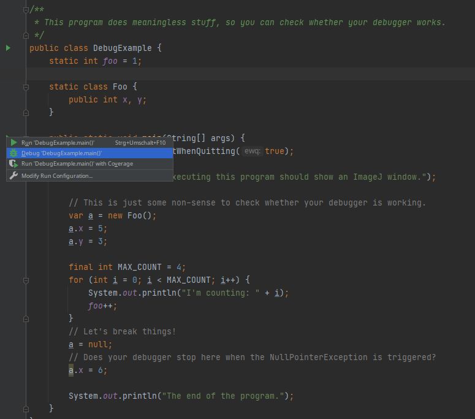

+++
date= 2021-04-19
title = "Exercise 0"

[extra]
author="Stephan Seitz"
+++


# Getting Started

**No submission necessary**


This is just a test to make sure your Java installation is working before the actual exercises start.
The actual exercises start **April 26th**.

If you encounter any problem please create a post in the channel **"Java and Project Installation"** on Microsoft Teams.
There will be a video conference for questions regarding the installtion of Java and ImageJ on this channel on **April 23th 10h**.
If everything is working for you, you just need to wait for next week when the actual exercises start.

## ImageJ

The image processing program we want to use during this semester is called ImageJ.
It was developed at the US National Institutes of Health and is used nowadays especially in research 
for medical and biological images.

If you want to, you can download a stand-alone version of the program [here](https://fiji.sc/).
This is not necessary for the exercises.

## Getting started

ImageJ can also be used as a Java library.
We already created a Java project that uses ImageJ.
You can download it from [https://github.com/mt2-erlangen/exercises-ss2021](https://github.com/mt2-erlangen/exercises-ss2021)
and import with the IDE of your choice:


 - [Instructions for Eclipse](../import_eclipse)
 - [Instructions for IntelliJ](../import_intellij)


## Run Your First ImageJ Program

You should now be able to execute the file `src/main/java/exercises/Exercise00.java`.


The following code is opening the ImageJ main window and exits the running program when the window is closed.

```java
public class Exercise00 {

    public static void main(String[] args) {
        (new ij.ImageJ()).exitWhenQuitting(true)

    }
}
```

 When you use IntelliJ, you can just open the file `Exercise00` and then click on the green
 arrow:

 

## Debugging

<i>Everything here should just be a recap of what you know about debugging from AuD. Feel free to skip if you know how debugging works!</i>

To do the exercises during this semester, you will often need to use the debug mode to find errors in your code.
Please make sure that you know how to run your program in debug mode, since you might not have seen it before (Shame on you AuD!).
Please always try to debug an issue first before you ask a tutor for help!

To debug an application just click on the bug symbol! You can try this with file `src/main/java/exercises/DebugExample.java`.
</td>

</td>

Also set some breakpoints (where the program should stop) by clicking on the space left to the line numbers.

<figure>
</td>
<figcaption><i>A Breakpoint. The program will stop here in debug mode.</i></figcaption>
</figure>


You should also know how to make the debugger stop on an exception (to see what's wrong when the program is crashing).
There is a bug in program! When you run it, you should see a crash:


IntelliJ suggests to create a break point. Click `Create breakpoint`!


Confirm with `Done`.


When you run the program again in debug mode it will stop at the line where the error happened.
This will help you to find out what is wrong at that point.

Also Eclispe will stop automatically and indicate what the problem is (if it doesn't please upgrade to the newest version of Eclispe):


Very useful is also the calculator symbol, that let's you evaluate expressions.
If you don't know, what is wrong in a line, you can tell the calculator to the termine the value of `a` or `a.x` to determine which one
is `null` (or of `very.complicated.expression[2]` when things get more complicated and a variable is not shown in the list below).


In Eclipse, the calculator are a pair of glasses (make sure you are in debug perspective, menu: `Window > Perspective > Open Perspective > Debug`).


Now you should be well prepared for the actual exercises!
