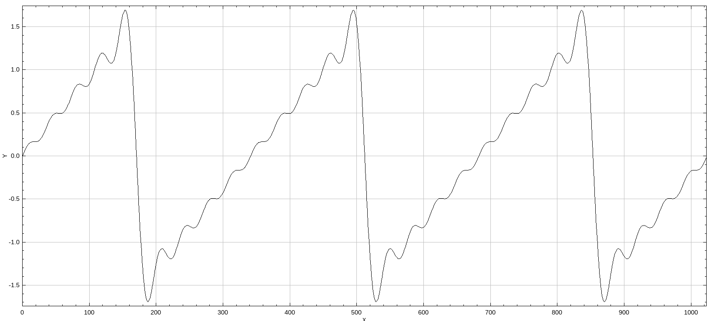

+++
date= 2022-05-09
title = "Exercise 1"

[extra]
author= "Mischa Dombrowski, Stephan Seitz"
+++


# Signals and Waves

**Submission deadline: 22.05.22 23:59h**

Please ensure that all files you created also contain **your name and your IDM ID**
and also your partner's name and IDM ID if you're not working alone.

Each exercise has **10 points**. You have to achieve **30 of 60 points in six homework exercises** to pass the module.

### Preperation 

Please start by going through exercise 0 first if you haven't done so, yet. 
The files you downloaded in the previous exercise are necessary to run the current exercise. 

### Signals

For this exercise you will need to download two files provided by us and place them in your project. 

The files Exercise01.java and DisplayUtils.java can be downloaded on StudOn: [https://www.studon.fau.de/studon/goto.php?target=fold_4523518](https://www.studon.fau.de/studon/goto.php?target=fold_4523518).
Copy the files to  `src/main/java/exercises/Exercise01.java` and `src/main/java/lme/DisplayUtils.java`


<P align="right"><i>3 Points</i>

As a first step, we will implement the class `Signal` 
which should hold a signal of finite length.
Create the file `src/main/java/mt/Signal.java`.

```java
// <your name> <your idm>
// <your partner's name> <your partner's idm> (if you submit with a group partner)
package mt;

import lme.DisplayUtils;
import ij.gui.Plot;

public class Signal {

}
```

Signal should have the following members

```java
    protected float[] buffer; // Array to store signal values
    protected String name;    // Name of the signal
```

Implement two constructors for `Signal`

```java
    public Signal(int length, String name)     // Create signal with a certain length (set values later)
    public Signal(float[] buffer, String name) // Create a signal from a provided array
```

Implement the following getter methods for `Signal`
    
```java
    public int size()        // Size of the signal
    public float[] buffer()  // Get the internal array 
    public String name()     // Get the name of the signal
```

Next, we want to visualize our Signal in the method `show`. You can use provided function `lme.DisplayUtils.showArray`.
To test it, create a `Signal` with arbitray values in the main method of `src/main/java/exercises/Exercise01.java` and call its `show` method.

```java
    public void show() {
        DisplayUtils.showArray(this.buffer, this.name, /*start index=*/0, /*distance between values=*/1);
    }
```

### Waves

<P align="right"><i>4 Points</i>

As a first step, we will implement the classes `CosineWave` and `SineWave`
which should hold a signal of finite length. `CosineWave` and `SineWave` inherit from `Signal`.
Create two files `src/main/java/mt/CosineWave.java`/`src/main/java/mt/SineWave.java`.

The two classes should represent the following two signals:

$$a\left[i\right] = \cos\left(\frac{k}{N}\cdot 2\pi\right) $$

$$b\left[i\right] = \sin\left(\frac{k}{N}\cdot 2\pi\right) $$

$N$ should be the length (number of samples) of the signal and $k$ is parameter. Add $k$ and $N$ to the constructors of the two classes.

Construct some objects of the two classes in `src/main/java/exercises/Exercise01.java`. How does $k$ influence the shape of the signal?

### The Perfect Wave

<P align="right"><i>3 Points</i>

Professor Kainz said that you can create any signal just using sine and cosine waves.
Try to generate this signal by adding and scaling some sine and cosine waves (only needs to be similar).

[](../coolwave3.png)

Add to methods to the signal class in order to add and multipy signals.
The methods should not modify the original signal but create a new signal with meaningful name.

```java
    // Adds the signal with another one elementwise
    // Check that both signals have the same size! You can throw an error otherwise.
    public Signal plus(Signal other)

    // Multiplies the signal with a scalar
    public Signal times(float scalar)
```

How many sine and cosine waves with what coefficients do you need?
You can solve this exercise by trial and error. Maybe some part of the lecture is also helpful...

<iframe allowfullscreen frameborder="0" scrolling="no" marginheight="0" marginwidth="0"width="680.54" height="443" type="text/html" src="https://www.youtube.com/embed/zHDZ5yKiQQE?autoplay=0&fs=1&iv_load_policy=3&showinfo=1&rel=0&cc_load_policy=0&start=269&end=0&origin=https://youtubeembedcode.com"></iframe>

And another one?

*PS: I wouldn't trust the factor $\frac{2}{5\pi}$ in the video.
Just omit the $\pi$. It's already fixed in your slides on studOn.*

## Submitting

Please ensure that all files you created also contain your name and your IDM ID and also your partner's name and IDM ID if you're not working alone.
You only need to submit the code. No need to submit answers to the questions in the text.

Then, compress your source code folder `src` to a zip archive (`src.zip`) and submit it via StudOn!
