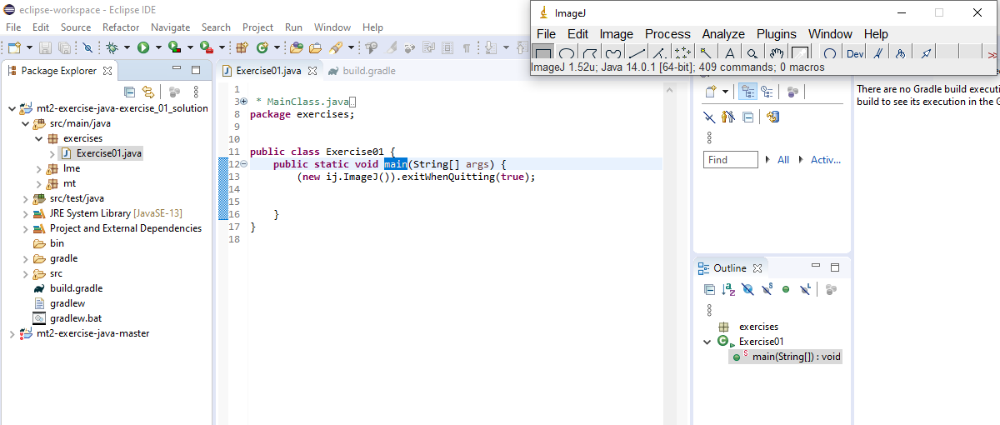
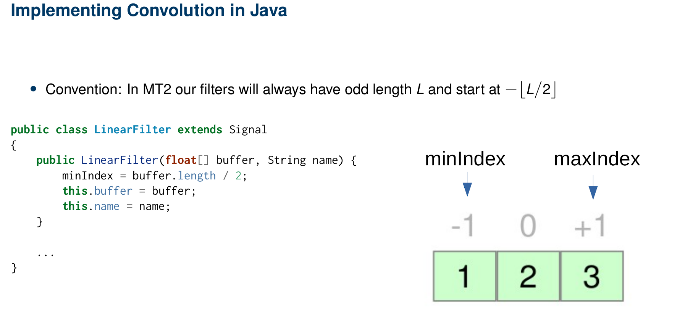

+++
date= 2020-04-27
title = "Exercise 1"

[extra]
author="Stephan Seitz"
+++


# Signals and Convolution

**Submission dead line: 11.05.20 23:59h**

Please ensure that all files you created also contain **your name and your IDM ID** and also your partner's name and IDM ID if you're not working alone.

Each exercise has **10 points**. You have to achieve **30 of 60 points in six homework exercises** to pass the module.

## ImageJ

The image processing program we want to use during this semester is called ImageJ.
It was developed at the US National Institutes of Health and is used nowadays especially in research 
for medical and biological images.

If you want to, you can download a stand-alone version of the program [here](https://fiji.sc/).

## Getting started

ImageJ can also be used as a Java library.
We already created a Java project that uses ImageJ.
You can download it from [https://github.com/mt2-erlangen/exercises-ss2020](https://github.com/mt2-erlangen/exercises-ss2020) and import with the IDE of your choice:


 - [Instructions for Eclipse](../import_eclipse)
 - [Instructions for IntelliJ](../import_intellij)

## Tasks
<!--Standard project layout-->
<!--http://maven.apache.org/guides/introduction/introduction-to-the-standard-directory-layout.html-->
You should now be able to execute the file `src/main/java/exercises/Exercise01.java`




The following code is opening the ImageJ main window and exits the running program when the window is closed.
```java
public class Exercise01 {
    public static void main(String[] args) {
        (new ij.ImageJ()).exitWhenQuitting(true);

    }
}
```

### Signal.java

<P align="right"><i>4 Points</i>

As a first step, we will implement the class `Signal` 
which should hold a signal of finite length.
Create the file `src/main/java/mt/Signal.java`.

```java
// <your name> <your idm>
// <your partner's name> <your partner's idm> (if you submit with a group partner)
package mt;

import lme.DisplayUtils;
import ij.gui.Plot;

public class Signal {

}
```

Signal should have the following members

```java
    protected float[] buffer; // Array to store signal values
    protected String name;    // Name of the signal
    protected int minIndex;   // Index of first array element (should be 0 for signals)
```

Implement two constructors for `Signal`

```java
    public Signal(int length, String name)     // Create signal with a certain length (set values later)
    public Signal(float[] buffer, String name) // Create a signal from a provided array
```

Implement the following getter methods for `Signal`
    
```java
    public int size()        // Size of the signal
    public float[] buffer()  // Get the internal array 
    public int minIndex()    // Get lowest index of signal (that is stored in buffer)
    public int maxIndex()    // Get highest index of signal (that is stored in buffer)
```

Next, we want to visualize our Signal in the method `show`. You can use provided function `lme.DisplayUtils.showArray`.
To test it, create a `Signal` with arbitray values in the main method of `Exercise01` and call its `show` method.

```java
    public void show() {
        DisplayUtils.showArray(this.buffer, this.name, /*start index=*/0, /*distance between values=*/1);
    }
```

In our black board exercises, we agreed that we want to continue our signals with zeros where we don't have any values stored.
If we access indices of our `Signal` with values smaller than `minIndex()` or larger `maxIndex()` we want to return `0.0f`.
If the users accesses an index between `minIndex()` and `maxIndex()` we want to return the corresponding value stored in our array.


Implement the method `atIndex` and `setAtIndex`. Please be aware that `minIndex` can be smaller than 0 for subclasses of Signal.
If `setAtIndex` is called with an invalid index (smaller than `minIndex` or greater than `maxIndex`), it's ok for the program to crash.
This should not happen for `atIndex`.

```java
    public float atIndex(int i)
    public void setAtIndex(int i, float value)
```

You can check the correctnes of `atIndex`/`setAtIndex` with the test `testAtIndex` in file `src/test/java/SignalTests.java`.

### LinearFilter.java

<P align="right"><i>3 Points</i>

 Implement `LinearFilter` in file `src/main/java/LinearFilter.java` as a subclass of `Signal`.
 `LinearFilter` should work like `Signal` except its `minIndex` should be at `- floor(coefficients.length/2)` as in the exercise slides.

 

`LinearFilter` should have an constructor that checks that coefficients is an array of odd size or throws an error otherwise (any error is ok).
```java
    public LinearFilter(float[] coefficients, String name)
```
and a method that executes the discrete convolution on another `Signal input` and returns an output of same size.
 ```java
    public Signal apply(Signal input);
 ```

 You should be able to directly use the formula from the exercise slides (f is the input signal, h our filter, $L$ the filter length)

 $$K = \lfloor L/2 \rfloor$$
 $$g[k] = \sum_{\kappa=-K}^{K} f[k-\kappa] h[ \kappa ] \cdot$$

 or with our `minIndex`/`maxIndex` methods for each index $k$ of the output signal.

 $$g[k] = \sum_{\kappa=h.\text{minIndex}}^{h.\text{maxIndex}} f[k-\kappa] h[\kappa] \cdot$$

 

You can test your convolution function with the tests provided in `src/test/java/LinearFilterTests.java`.

Good test cases are:

- `{0,0,1,0,0}`: this filter should not change your signal at all
- `{0,1,0,0,0}`: this filter should move your signal one value to the right
- `{0,0,0,1,0}`: this filter should move your signal one value to the left

## Questions

<P align="right"><i>3 Points</i>

In this task we want to convolve a test `Signal` with three different linear filters.
Filter the signal $f[k]$  `Signal(new float[]{0, 0, 0, 0, 0, 0, 0, 0, 0, 1, 1, 1, 1, 1, 1, 1, 1, 0, 0, 0, 0, 0, 0, 0, 0, 0}, "f(k)")`
with filters

 - $h_1[k]$: `{1.0f/3 ,1/3.f ,1/3.f}`,
 - $h_2[k]$: `{1/5.f, 1/5.f , 1/5.f, 1/5.f, 1/5.f}`,
 - $h_3[k]$: `{0.5f, 0, -0.5f}`.

Save the images of the input signal and filtered results (recommended filetype: `png`).
Create a PDF document (e.g. with Word or LibreOffice) with those images in which you describe briefly how the filters modified the input signal and why.

## Submitting

Please ensure that all files you created also contain your name and your IDM ID and also your partner's name and IDM ID if you're not working alone.

Then, compress your source code folder `src` to a zip archive (`src.zip`) and submit it and your PDF document via StudOn!
