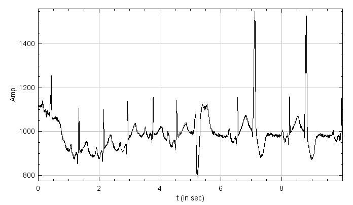
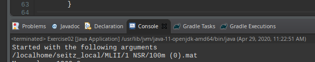
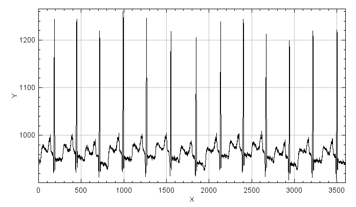
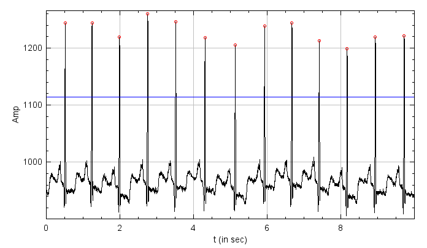

+++
date= 2020-04-05
title = "Exercise 2"

[extra]
author="Stephan Seitz"
+++

<!--files = glob.glob('**/*mat', recursive=True)-->

<!--import scipy.io -->
 
<!--for f in files: -->
<!--data = scipy.io.loadmat(f) -->
<!--scipy.io.savemat(f, data) -->
     

** This is just a draft and may be changed until the official release of this exercise **

# Statistical Measures

In this exercise, we want to have a look on how we can analyze signals using simple statistical measures.
We will use a freely available ECG data set with the goal to distinguish healthy from unhealthy patients.



You can find the original data set [here](https://data.mendeley.com/datasets/7dybx7wyfn/3)
but we recommend to use a post-processed version available on studOn.


## Gradle Build System

In Medizintechnik II we use the build system [Gradle](https://gradle.org/).
Gradle is especially popular for Android projects since it's easy to add new software dependencies that will be automatically
downloaded.

In our case, the published data set is saved as Matlab `*.mat` files.
To read those files, an external dependency was already added to our `build.gradle` file.

```groovy
    implementation 'us.hebi.matlab.mat:mfl-core:0.5.6'
```

does the magic and automatically downloaded a [\*.mat file reader](https://github.com/HebiRobotics/MFL).
In case, you need to add external software to your own projects you can use [this search engine](https://search.maven.org/).

## Tasks

# Loading one of File of the Data Set

`Exercise02.java` ([available here](https://github.com/mt2-erlangen/exercises-ss2020/blob/master/src/main/java/exercises/Exercise02.java)) should alread contain some code for parsing the program parameters:

```java
    public static void main(String[] args) throws IOException {
	(new ij.ImageJ()).exitWhenQuitting(true);

	System.out.println("Started with the following arguments:");
	for (String arg : args) {
	    System.out.println(arg);
	}

	if (args.length == 1) {
	    File file = new File(args[0]);
	    if (file.isFile()) {
		// A file should be opened 


	    } else if (file.isDirectory()) {
		// A directory should be opened 


	    } else {
		System.err.println("Could not find " + file);
	    }

	} else {
	    System.out.println("Wrong argcount: " + args.length);
	    System.exit(-1);
	}
    }
```

Launch `Exercise02` with the one of the files of the data set as an argument (e.g. `<where_you_saved_your_data_set>/MLII/1 NSR/100m (0).mat`)!

- [How to do that in Eclipse](../set_args_eclipse)
- [How to do that in IntelliJ](../set_args_intellij)

Your program should print now the file name you selected:



**Remember to never put file names directly in your code. Your program will then only work on your machine!**

Let's open this file!

```java
if (file.isFile()) {
    // A file should be opened 
    var mat = Mat5.readFromFile(file).getMatrix(0);
    Signal heartSignal = new mt.Signal(mat.getNumElements(), "Heart Signal");
    for (int i = 0; i < heartSignal.size(); ++i) {
	    heartSignal.buffer()[i] = mat.getFloat(i);
    }
    heartSignal.show();


} else if (file.isDirectory()) {
```


You should now see the signal. However this plot does not have any labels with physical units attached.
We will change that later.





# Extension of Signal.java

To analyze this and other signals, we will extend our `Signal` class.
Please implement the following methods that calculate some descriptive properties of the signal:

```java
    public float min()         //< lowest signal value
    public float max()         //< largest signal value
    public float sum()        //< sum of all signal values
    public float mean()       //< mean value of the signal
    public float variance()   //< variance of the signal
    public float stddev()     //< standard deviation of the signal
```
Test the methods in your main function and check whether the calculated values seem plausible
by looking at your plot and printing the calculated values.

# Physical Dimensions

In the last exercise, we treated signals as pure sequence of numbers without any physical dimensions.
But for medical measurements physical dimensions are important.
We want to extend our plot to look like this with the horizontal axis labeled with seconds:



To do this we will add a new member to our signal that's describing the physical distance between two samples

```java
    protected float spacing;
```

Add also a setter and getter method

```java
    public void setSpacing(float spacing) 
    public float spacing() 
```

Read in the [discription of the data](http://dx.doi.org/10.17632/7dybx7wyfn.3) set the sampling frequency of the signal
and use it to calculate the spacing between two samples. Set this property `setSpacing` in the main method.

Next, we want to change `show()` to regard our spacing and to accept a `ij.gui.Plot` so that we can set the axis of our plot.

```java
    public void show(Plot plot) {
	DisplayUtils.showArray(buffer, plot, /*start of the signal=*/0.f, spacing);
    }
```

Because we are lazy, we can still keep the original usage of `show()`

```java
    public void show() {
	    DisplayUtils.showArray(buffer, name, , /*start of the signal=*/0.f, spacing);
    }
```

Please create an instance of `ij.gui.Plot` in the main method of `Exercise02` with descriptive labels for both axis and use if for `heartSignal.show(...)`.
<!--You can find a complete description of this class [here](https://imagej.nih.gov/ij/developer/api/ij/gui/Plot.html).-->
```java
// Constructs a new Plot with the default options.
Plot plot = new Plot("chosee title here", "choose xLabel here", "choose yLabel here")
heartSignal.show(plot);

//... add here more plotting stuff

plot.show()
```


# Determine the Heart Frequency

Create a file  `src/main/java/lme/HeartSignalPeaks.java` with following content
```java
package lme;

import java.util.ArrayList;

public class HeartSignalPeaks {
	public ArrayList<Double> xValues = new ArrayList<Double>();
	public ArrayList<Double> yValues = new ArrayList<Double>();
}
```

We now want to find the peaks of the heart signal. We do that by finding local maxima within region that are above a certain
threshold (here in blue).
Find a good value of this threshold so that all peaks are above this value.
You may use `mean()`, `max()`, `min()` to calculate it.
You can see your threshold by ploting it:

```java
    plot.setColor("blue");
    plot.add("lines", new double[] { 0, /* a high value */10000 }, new double[] { threshold, threshold });
```


Implement the following method that finds all peaks of the signal.

```java
    public static HeartSignalPeaks getPeakPositions(mt.Signal signal, float threshold)
```
You could do that by a normal maximum search over your
signal values saving the x (`max`) and the y value (`argmax`) of the current maximum.
Determine with to variable whether the current values is above or below your threshold.
Whenever you encounter a value that is below there threshold while the previous was above add
your intermediate result to instance of `HeartSignalPeaks` (or better said to `peaks.xValues` and `peaks.yValues`) and reset your
intermediate result.

You can plot the peaks you have found:

```java
    plot.setColor("red");
    plot.addPoints(peaks.xValues, peaks.yValues, 0);
```

Next, create a Signal with the difference in time between succesive peaks.
```java
    public static mt.Signal calcPeakIntervals(HeartSignalPeaks peaks)
```

You can use that signal to determine the mean cycle duration (`peakIntervals.mean()`), the mean heart frequency (`(1. / intervals.mean())`) and
beats per minute (`60. * 1. / intervals.mean()`). Print those values!


 <!--https://data.mendeley.com/datasets/7dybx7wyfn/3-->

<!--```-->
 <!--Plawiak, Pawel (2017), “ECG signals (1000 fragments)”, Mendeley Data, v3 http://dx.doi.org/10.17632/7dybx7wyfn.3 -->
 <!--```-->
<!--For research purposes, the ECG signals were obtained from the PhysioNet service (http://www.physionet.org)-->
<!--from the MIT-BIH Arrhythmia database. -->
<!--The created database with ECG signals is described below. -->
<!--1) The ECG signals were from 45 patients: 19 female (age: 23-89) and 26 male (age: 32-89).-->
<!--2) The ECG signals contained 17 classes: normal sinus rhythm, pacemaker rhythm, and 15 types-->
<!--of cardiac dysfunctions (for each of which at least 10 signal fragments were collected).-->
<!--3) All ECG signals were recorded at a sampling frequency of 360 [Hz] and a gain of 200 [adu / mV]. 4)-->
<!--For the analysis, 1000, 10-second (3600 samples) fragments of the ECG signal (not overlapping) were randomly selected.-->
<!--5) Only signals derived from one lead, the MLII, were used.-->
<!--6) Data are in mat format (Matlab).-->
