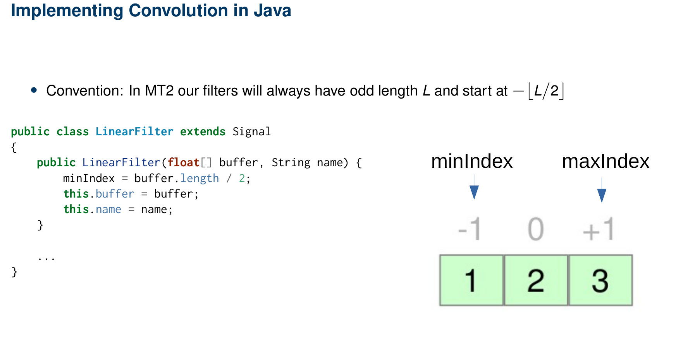
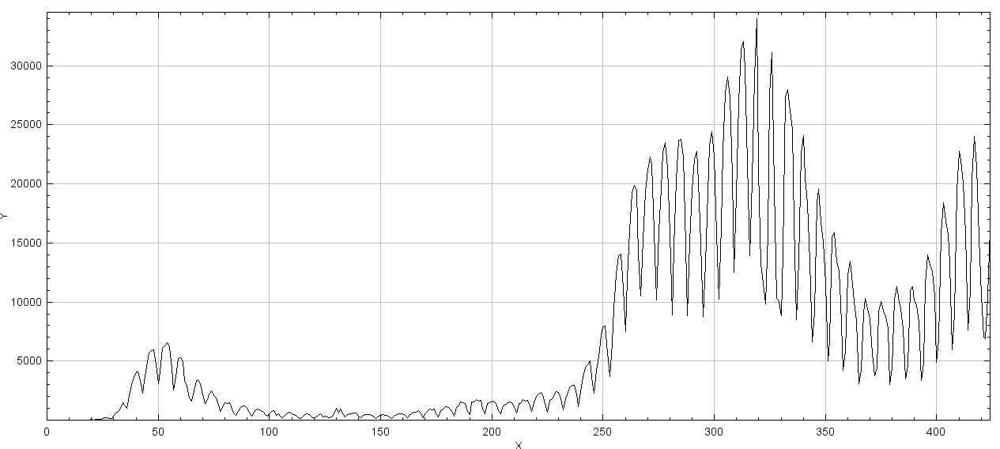
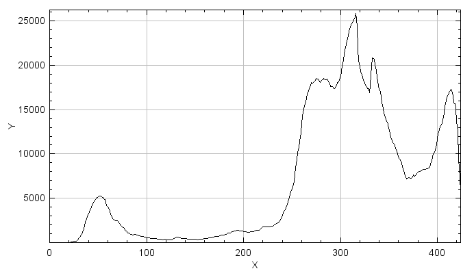
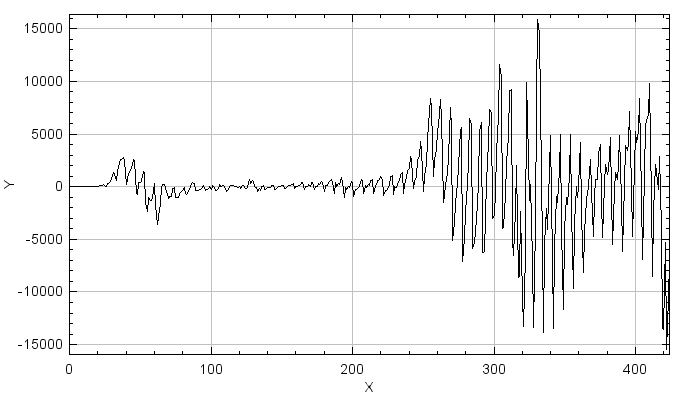

+++
date= 2021-04-06
title = "Exercise 2"

[extra]
author="Stephan Seitz"
+++

# Will Corona Ever End?

**Submission deadline: 17.05.21 23:59h**

Please ensure that all files you created also contain **your name and your IDM ID**
and also your partner's name and IDM ID if you're not working alone.

Each exercise has **10 points**. You have to achieve **30 of 60 points in six homework exercises** to pass the module.

## Infinite Signals!

<P align="right"><i>3 Points</i>

Right now our Signal class only represent a signal of finite length.
But in many algorithms that have values at all integer positions.

In our black board exercises, we agreed that we want to continue our signals with zeros where we don't have any values stored.
If we access indices of our `Signal` with values smaller than `minIndex()` or larger `maxIndex()` we want to return `0.0f`.
If a user accesses an index between `minIndex()` and `maxIndex()` we want to return the corresponding value stored in our array.


Implement the method `atIndex` and `setAtIndex` and `minIndex`/`maxIndex` for `Signal`.
Please be aware that `minIndex` can be smaller than 0 for subclasses of Signal.
If `setAtIndex` is called with an invalid index (smaller than `minIndex` or greater than `maxIndex`), it's ok for the program to crash.
This should not happen for `atIndex`.

```java
    public float atIndex(int i)
    public void setAtIndex(int i, float value)
```

You can check the correctness of `atIndex`/`setAtIndex` with the test `testAtIndex` in file `src/test/java/SignalTests.java`.

## LinearFilter

<P align="right"><i>3 Points</i>

 Implement `LinearFilter` in file `src/main/java/LinearFilter.java` as a subclass of `Signal`.
 `LinearFilter` should work like `Signal` except its `minIndex` should be at `- floor(coefficients.length/2)` as in the exercise slides.

 

`LinearFilter` should have a constructor that checks that coefficients is an array of odd size or throws an error otherwise (any error is ok).
```java
    public LinearFilter(float[] coefficients, String name)
```
and a method that executes the discrete convolution on another `Signal input` and returns an output of same size.
 ```java
    public Signal apply(Signal input);
 ```

 You should be able to directly use the formula from the exercise slides (f is the input signal, h our filter, $L$ the filter length)

 $$K = \lfloor L/2 \rfloor$$
 $$g[k] = \sum_{\kappa=-K}^{K} f[k-\kappa] \cdot h[ \kappa ]$$

 or with our `minIndex`/`maxIndex` methods for each index $k$ of the output signal.
 $$g[k] = \sum_{\kappa=h.\text{minIndex}}^{h.\text{maxIndex}} f[k-\kappa] \cdot h[\kappa] $$

Be sure that you use `atIndex` to access the values of `input` and the filter.

 

You can test your convolution function with the tests provided in `src/test/java/LinearFilterTests.java`.

Good test cases are:

- `{0,0,1,0,0}`: this filter should not change your signal at all
- `{0,1,0,0,0}`: this filter should move your signal one value to the **left**
- `{0,0,0,1,0}`: this filter should move your signal one value to the **right**


## Get the Current RKI Data

<P align="right"><i>4 Points</i>

To see whether the Corona situation will ever improve we want to have a look at newest data from RKI institute.
Open the file 


```java
	public static void main(String[] args) throws MalformedURLException, IOException {
		// <your name> <your idm>
		// <your partner's name> <your partner's idm> (if you submit with a group partner)
		JSONObject response = readJsonFromUrl("https://api.corona-zahlen.org/germany/history/cases");

    }
```

`response` will contain a [JSONObject](https://stleary.github.io/JSON-java/org/json/JSONObject.html) from the `org.json` library
(it was installed by adding `implementation 'org.json:json:20201115'` to your `build.gradle`).
It contains the newest data from the Robert-Koch-Institute with the following JSON schema

```json
{
  "data": [
    {
      "cases": 1,
      "date": "2020-01-07T00:00:00.000Z"
    },
    {
      "cases": 1,
      "date": "2020-01-19T00:00:00.000Z"
    },
    {
      "cases": 1,
      "date": "2020-01-23T00:00:00.000Z"
    },
    {
      "cases": 1,
      "date": "2020-01-25T00:00:00.000Z"
    },
    {
      "cases": 2,
      "date": "2020-01-28T00:00:00.000Z"
    },
    {
      "cases": 2,
      "date": "2020-01-29T00:00:00.000Z"
    },
    ...
}
```

Yes, on `2020-01-07` the situation was still pretty good. But what is the situation right now?

Create a `Signal` from the `JSONObject` with the number of cases for each day! Display the signal with
its `show()` method.



Well this looks very wavy... Let's filter this signal!

Apply the following filters on your signal:

$$ f_1 = \left[ \frac{1.0}{7.0}, \frac{1.0}{7.0}, \frac{1.0}{7.0}, \frac{1.0}{7.0}, \frac{1.0}{7.0}, \frac{1.0}{7.0}, \frac{1.0}{7.0}\right]
$$ f_2 = \left[ 1.0, 0.0, 0.0, 0.0, 0.0, 0.0, -1.0\right]





What happens when you apply $f_1$ and then $f_2$? What happens when you first apply $f_2$ and then $f_1$? 

## Submitting

Please ensure that all files you created also contain your name and your IDM ID and also your partner's name and IDM ID if you're not working alone.
You only need to submit the code. No need to submit answers to the questions in the text.

Then, compress your source code folder `src` to a zip archive (`src.zip`) and submit it and your PDF document via StudOn!
