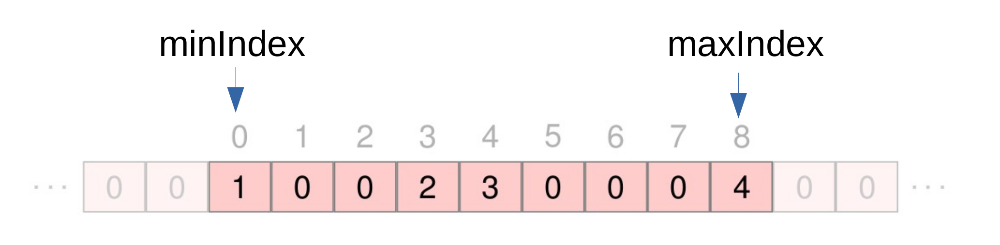
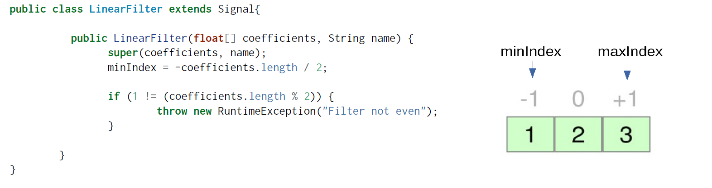
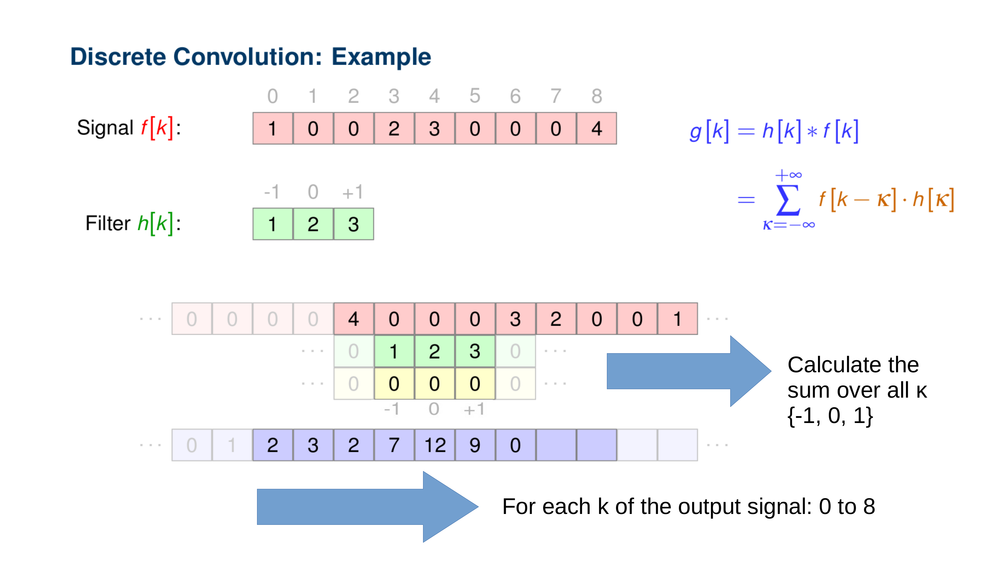

+++
date= 2022-05-12
title = "Exercise 2"

[extra]
author= "Mischa Dombrowski, Stephan Seitz"
+++

# Will Corona Ever End?

**Submission deadline: 29.05.22 23:55h**

Please ensure that all files you created also contain **your name and your IDM ID**
and also your partner's name and IDM ID if you're not working alone.

Each exercise has **10 points**. You have to achieve **30 of 60 points in six homework exercises** to pass the module.

## Correction of the repository

Before starting this weeks exercise, please empty the folder `src/test/java/mt/` from the downloaded tree you have been provided in exercise 0. Building your tests will not work otherwise.

## Padded Signals

<P align="right"><i>3 Points</i>

As of now our Signal class only represents a signal of defined finite length.
Next, we are going to extend our signal class to allow access areas outside of the defined support.

The signals will be padded with zeros in areas where we don't have any values stored.
So, if we access indices of our `Signal` with values smaller than `minIndex()` or larger `maxIndex()` we want to return `0.0f`.
If a user accesses an index between `minIndex()` and `maxIndex()` we want to return the corresponding value stored in our array.



Implement the method `atIndex` and `setAtIndex` and `minIndex`/`maxIndex` for `Signal`.
Please be aware that `minIndex` can be smaller than 0 for subclasses of Signal.
If `setAtIndex` is called with an invalid index (smaller than `minIndex` or greater than `maxIndex`), it's ok for the program to crash.
This should not happen for `atIndex`.

`Signal` should add the following member

```java
protected int minIndex; //Index of first array element (should be 0 for signals)
```

Implement the methods explained above for `Signal`	

```java
public int minIndex() // Get lowest index of signal (that is stored in buffer)
 public int maxIndex()	// Get highest index of signal (that is stored in buffer)	
 public float atIndex(int i) // Get signal at index i
 public void setAtIndex(int i, float value) // Set signal at index i
```

You can check the correctness of `atIndex` with the test `testAtIndex`. You can download the corresponding file from [StudOn](https://www.studon.fau.de/fold4531348.html) and move it to `src/test/java/mt/SignalTests.java`.

## LinearFilter

<P align="right"><i>3 Points</i>

 Implement `LinearFilter` in file `src/main/java/mt/LinearFilter.java` as a subclass of `Signal`.
 `LinearFilter` should work like `Signal` except its `minIndex` should be at <br> 
 `- (coefficients.length/2)` as in the exercise slides.

 

`LinearFilter` should have a constructor that checks that coefficients is an array of odd size or throws an error otherwise (any error is ok).
```java
    public LinearFilter(float[] coefficients, String name)
```
and a method that executes the discrete convolution on another `Signal input` and returns an output of same size.
 ```java
    public Signal apply(Signal input);
 ```

 You can implement the formula for the discrete convolution from the exercise slides (f is the input signal, h our filter, $L$ the filter length) by rewriting

 $$K = \lfloor L/2 \rfloor$$
 $$g[k] = \sum_{\kappa=-K}^{K} f[k-\kappa] \cdot h[ \kappa ]$$

 with our `minIndex`/`maxIndex` methods for each index $k$ of the output signal:
 $$g[k] = \sum_{\kappa=h.\text{minIndex}}^{h.\text{maxIndex}} f[k-\kappa] \cdot h[\kappa] $$

Be sure that you use `atIndex` to access the values of `input` and the filter.

 

You can test your convolution function with the tests provided on  [StudOn](https://www.studon.fau.de/fold4531348.html) by placing them into `src/test/java/LinearFilterTests.java` and `src/main/java/lme/Algorithms.java`. 

Good test cases are:

- `{0,0,1,0,0}`: this filter should not change your signal at all
- `{0,1,0,0,0}`: this filter should move your signal one value to the **left**
- `{0,0,0,1,0}`: this filter should move your signal one value to the **right**


## Get the Current RKI Data

<P align="right"><i>4 Points</i>

To see whether the Corona situation will ever improve we want to have a look at newest data from RKI institute.
Open the file 

```java
// <your name> <your idm>
// <your partner's name> <your partner's idm> (if you submit with a group partner)
public static void main(String[] args) throws MalformedURLException, IOException {
    JSONObject response = readJsonFromUrl("https://api.corona-zahlen.org/germany/history/cases");

}
```

`response` will contain a [JSONObject](https://stleary.github.io/JSON-java/org/json/JSONObject.html) from the `org.json` library
(it was installed by adding `implementation 'org.json:json:20201115'` to your `build.gradle`). The template for `Exercise 2` to use the function above can be downloaded from [here](https://www.studon.fau.de/fold4531348.html). Place the file in `src/main/java/exercises/`. <br>
It contains the newest data from the Robert-Koch-Institute (via [https://github.com/marlon360/rki-covid-api](https://github.com/marlon360/rki-covid-api)) with the following JSON schema:

```json
{
  "data": [
    {
      "cases": 1,
      "date": "2020-01-07T00:00:00.000Z"
    },
    {
      "cases": 1,
      "date": "2020-01-19T00:00:00.000Z"
    },
    {
      "cases": 1,
      "date": "2020-01-23T00:00:00.000Z"
    },
    {
      "cases": 1,
      "date": "2020-01-25T00:00:00.000Z"
    },
    {
      "cases": 2,
      "date": "2020-01-28T00:00:00.000Z"
    },
    {
      "cases": 2,
      "date": "2020-01-29T00:00:00.000Z"
    },
    //...
  ]
}
```


Create a `Signal` from the `JSONObject` with the number of cases for each day! Display the signal with
its `show()` method.


Well this looks very wavy... Let's filter this signal!

Apply the following filters on your signal by defining the filters with your `LinearFilter` class and using the `apply(signal)` method:

$$ h_1 = \left[ \frac{1.0}{7.0}, \frac{1.0}{7.0}, \frac{1.0}{7.0}, \frac{1.0}{7.0}, \frac{1.0}{7.0}, \frac{1.0}{7.0}, \frac{1.0}{7.0}\right] $$


$$ h_2 = \left[ 1.0, 0.0, 0.0, 0.0, 0.0, 0.0, -1.0 \right]$$


What happens when you apply $h_1$ and then $h_2$? What happens when you first apply $h_2$ and then $h_1$? `show()` both combinations.
What do the individual filters calculate?

## Submitting

Please ensure that all files you created also contain your name and your IDM ID and also your partner's name and IDM ID if you're not working alone.
You only need to submit the code. No need to submit answers to the questions in the text.

Then, compress your source code folder `src` to a zip archive (`src.zip`) and submit it via StudOn!
