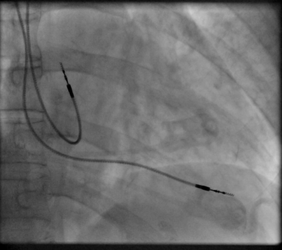

+++
date= 2022-05-23
title = "Exercise 3"

[extra]
author= "Mischa Dombrowski, Paul Stöwer"
+++

**Submission deadline: 05.06.22 23:55h**

Please ensure that all files you created also contain **your name and your IDM ID**
and also your partner's name and IDM ID if you're not working alone.

Each exercise has **10 points**. You have to achieve **30 of 60 points in six homework exercises** to pass the module.

# Images and 2D Waves

In this exercise, we finally work with images. It's time to update the file `src/main/java/lme/DisplayUtils.java` [to the newest version](https://github.com/mt2-erlangen/exercises-ss2021/blob/master/src/main/java/lme/DisplayUtils.java).

This should provide you the following methods to work with images:

```java
    // Open a file
    public static mt.Image openImage(String path) 

    // Download and open a file from the internet
    public static mt.Image openImageFromInternet(String url, String filetype) 

    // Save an image to a file
    public static void saveImage(mt.Image image, String path) 

    //  Show images
    public static void showImage(float[] buffer, String title, int width) 
    public static void showImage(float[] buffer, String title, long width, float[] origin, double spacing, boolean replaceWindowWithSameName)
    
    // Calculate a Fourier transform for an image
    public  static void FFT(float[] buffer, String title, long width, float[] origin, double spacing)

```

# mt/Image.java

<P align="right"><i>4 Points</i>

*The code for this section should go to `src/main/java/mt/Image.java`*

Our goal is to share as much code with our `mt.Signal` class. So `mt.Image` will be a subclass of `mt.Signal`.

```java
// <your name> <your idm>
// <your partner's name> <your partner's idm> (if you submit with a group partner)
package mt;

import lme.DisplayUtils;

public class Image extends Signal {


}
```

`mt.Image` has five members (apart from the ones inherited by `mt.Signal`).

```java
    // Dimensions of the image
    protected int width; 
    protected int height; 

    // Same as Signal.minIndex but for X and Y dimension
    protected int minIndexX;
    protected int minIndexY;

    // For a later exercise (no need to do anything with it in exercise 3)
    protected float[] origin = new float[]{ 0, 0 };
```


And two constructors:

```java
    // Create an image with given dimensions
    public Image(int width, int height, String name)

    // Create an image with given dimensions and also provide the content
    public Image(int width, int height, String name, float[] pixels)
```

As shown in the exercise slides, we will store all the pixels in one array, like we did in `Signal`.
The array should have the size `width * height`.
`minIndexX`,`minIndexY` should be 0 for normal images.


<!--**TODO: Nice image here. With width and height and buffer_size=width * height**-->

Call the constructors of the super class `Signal` in the constructors of `Image`.
You can call the constructor of a super class by placing `super(...)` with the respetive arguments in the first line of the constructor of the subclass.
The constructor `public Image(int width, int height, String name, float[] pixels)` does not need to create its own array (take `pixels` for `buffer`).
But you can check whether `pixels` has the correct size.

Let's also provide some getters!

```java
    // Image dimensions
    public int width()
    public int height()

    // Minimum and maximum indices (should work like Signal.minIndex/maxIndex)
    public int minIndexX()
    public int minIndexY()
    public int maxIndexX()
    public int maxIndexY()
```

`atIndex` and `setAtIndex` should work like in `Signal` except that they now have two coordinate indices.
`atIndex` should return `0.0f` if either the `x` or `y` index are outside of the image ranges.

```java
    public float atIndex(int x, int y)
    public void setAtIndex(int x, int y, float value) 
    
    //We need a method to set our buffer for the show() function
    public void setBuffer(float[] buffer)
	
```

Remember how we calculated the indices in the exercise slides. You have to apply that formula in `atIndex`/`setAtIndex`.


<!--**TODO: Nice image here. With width and height and buffer_size=width * height**-->

Add the method `show` to display the image
```java
    public void show() {
        DisplayUtils.showImage(buffer, name, width(), origin, /*spacing()*/ 1.0f, /*Replace window with same name*/true);
    }
```


Open the image `pacemaker.png` in a file  `src/main/java/exercise/Exercise03`:

```java
// <your name> <your idm>
// <your partner's name> <your partner's idm> (if you submit with a group partner)
package exercises;

import mt.Image;

public class Exercise03 {
    public static void main(String[] args) {
        (new ij.ImageJ()).exitWhenQuitting(true);

        Image image = lme.DisplayUtils.openImageFromInternet("https://mt2-erlangen.github.io/pacemaker.png", ".png");
        image.show();

    }
}
```

The image is from [our open access book](https://www.springer.com/gp/book/9783319965192).



You can check the correctness of `atIndex` with the `ImageTest`in the file [src/test/java/ImageTests.java](https://github.com/mt2-erlangen/exercises-ss2021/blob/main/src/test/java/mt/ImageTests.java). 

# 2D Waves

<P align="right"><i>4 Points</i>

We implemented a 1D Sin and Cos function in `Exercise01`. Now we want to build the 2D functions in `SineWave2d` and `CosineWave2d`. Create the two files `src/main/java/mt/SineWave2d` and `src/main/java/mt/CosineWave2d`. They will be a subclass of `mt.Image`.

Additionally we are building a class `Vector2d`, which sets the frequency and orientation of our waves. Create therefore the file  `src/main/java/mt/Vector2d`.

The class has two members `k_x`and `k_y` and a simple constructor.

```java

package mt;

public class Vector2d {
    float kx,ky;

    public Vector2d(float kx, float ky){
        ...

    }
    
}    
```

To use the vector in the calculation of our Sine and Cosine waves, we need to implement a function `dot` to form the dot product of two vectors:

$$ a \cdot b = \sum_{i=1}^{n} a_i b_i$$

```java
public float dot(Vector2d other)


```
The vector and the waves can be visualized like in the lecture:

<iframe width="560" height="315" src="https://www.youtube.com/embed/jujbTM78pzo?start=1292" title="YouTube video player" frameborder="0" allow="accelerometer; autoplay; clipboard-write; encrypted-media; gyroscope; picture-in-picture" allowfullscreen></iframe>

The setup for the 2D wave functions will be the following:


```java

package mt;

public class SineWave2d extends Image {
    
}    
```
The `min` and `max` indices of the wave functions should be set to $-[\frac{Width}{2}]$, $[\frac{Width}{2}]$ and $-[\frac{Height}{2}]$, $[\frac{Height}{2}]$.

Both classes have a constructor in which you need set the pixel intensity in the buffer with the hep of the vector k:

```java
    public CosineWave2d(Vector2d k, int width, int height, String name)
    public SineWave2d(Vector2d k, int width, int height, String name)
    
```

To get the intensity of each pixel of the 2D Wave Image we can use the following formulas:

$$IntensityCos\left[x,y\right] = \cos\left((\frac{x}{Width}\cdot k_x+\frac{y}{Height}\cdot k_y) \cdot 2\pi\right) $$

$$IntensitySin\left[x,y\right] = \sin\left((\frac{x}{Width}\cdot k_x+\frac{y}{Height}\cdot k_y) \cdot 2\pi\right) $$

# Adding up waves and looking at the Fourier Transform
<P align="right"><i>2 Points</i>

To add up multiple signals we implement a similar methods like in `Exercise 1`.

```java
public Image add(Image image)
```

The method `add` should add up two images element wise. Return the addition with a new image. Be careful with the `min` and `max` indices of the images. Check if the images differ in size and throw an exception otherwise. <br>
Can you create an Image with checkerboard like patterns, by adding up multiple waves?

 <p style="text-align: center;"><p>
 
 Additionally we want to look at the Fourier transformation of our waves. As you saw in the lecture, the Fourier transform analysis the frequency spectrum of our signal. <br>
 Add the function `fft` to the `mt.image` class, which calls a function from `DisplayUtils.java`:
 
 ```java
    public void fft(){
        DisplayUtils.FFT(buffer, name, width(), origin, /*spacing()*/ 1.0f);
    }
```

The function can be called just like the `show()`function. Be careful with the image size. The FFT of imageJ works best for our signals with image sizes of $2^n$ ($64x64$,$256x256$,....). <br>
Can you tell to which wave functions these frequency spectrum belong?

 <p style="text-align: center;">
<table><tr>
<td>  </td>
<td>  </td>
</tr></table>
 <p>

How does the Fourier transform of our first picture `pacemaker.png` look like?

<br>
<br>

In the end you can use the Demo below to test some behavior of 2D Sine and Cosine Waves with different and multiple $k_x , k_y$ parameters. 
<br>
<br>

<!--Defined in svelte folder-->
<script
    defer
    src="/wave-demo-2d/bundle.js"
    ></script>

<div id="wave-demo-2d" ></div>

## Submitting

Please ensure that all files you created also contain your name and your IDM ID and also your partner's name and IDM ID if you're not working alone.
You only need to submit the code. No need to submit answers to the questions in the text.

Then, compress your source code folder `src` to a zip archive (`src.zip`) and submit it via StudOn!
