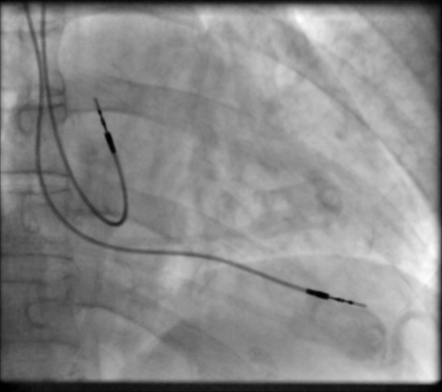

+++
date= 2021-05-17
title = "Exercise 4"

[extra]
author="Paul Stöwer"
+++

**Submission deadline: 30.05.21 23:55h**

Please ensure that all files you created also contain **your name and your IDM ID**
and also your partner's name and IDM ID if you're not working alone.

Each exercise has **10 points**. You have to achieve **30 of 60 points in six homework exercises** to pass the module.

# 2D Convoultion and Image Filters

In this exercise, we are using our image class from `exercise 3` to build the 2D convolution, which you already implement for the 1D case in `exercise 2`. 


# mt.Image Filter

<P align="right"><i>4  Points</i>:


Like in Exercise 2, we want to be able to convolve our image signal.
Infact, we will learn a lot of new ways to process images.
Often, we need to create an output image of same size.
Let's create an interface (`src/main/java/mt/ImageFilter.java`) for that, so we only need to implement this once.

```java
package mt;

public interface ImageFilter {
    default mt.Image apply(mt.Image image) {
        Image output = new Image(image.width(), image.height(), image.name() + " processed with " + this.name());
        apply(image, output);
        return output;
    }

    default void apply(mt.Image input, mt.Image output) {
        throw new RuntimeException("Please implement this method!");
    }

    String name();
}
```

Ok. Now the convolution. The class has already a method `normailze` that we will need later. It uses a method `sum()`, which we need to implement in our `Signal` class. The method sums up all values of our signal:

```java
public float sum() //< sum of all signal values 
    
```

*The code for the convolution should go to `src/main/java/mt/LinearImageFilter.java`*


```java
// <your name> <your idm>
// <your partner's name> <your partner's idm> (if you submit with a group partner)
package mt;

public class LinearImageFilter extends Image implements ImageFilter {

    public void normalize() {
	double sum = sum();
	for (int i = 0; i < buffer.length; i++) {
	    buffer[i] /= sum;
	}
    }
}
```

Create a constructor for it. Recall how we implemented `LinearFilter`!
`minIndexX` and `minIndexY` need to be set to $-\lfloor L_x/2 \rfloor$ and $-\lfloor L_y/2 \rfloor$ when $L_x$ is the
filter's width and $L_y$ the filter's height.
```java
    public LinearImageFilter(int width, int height, String name)
```


Convolution in 2-d works similar to convolution in 1-d.<!-- [Compare with the formula from exercise 01](@/exercise_1.md#linearfilter-java)-->

 $$K_x = \lfloor L_x/2 \rfloor$$
 $$K_y = \lfloor L_y/2 \rfloor$$
 $$g[x,y] = \sum_{y'=-K_y}^{+K_y} \sum_{x'=-K_x}^{+K_x} f[x-x', y-y'] \cdot h[ x', y' ] $$
 $$g[x,y] = \sum_{y'=\text{h.minIndexY}}^{\text{h.maxIndexY}} \sum_{x'=\text{h.minIndexX}}^{\text{h.maxIndexX}} f[x-x', y-y'] \cdot h[ x', y' ] $$

 Remember to use `atIndex` and `setAtIndex` to get and set the values.
 Implement the convolution in the method `apply`.
 The `result` image was already created by our interface `ImageFilter`.

```java
    public void apply(Image image, Image result)
```


<P align="right"><i>Source: https://github.com/vdumoulin/conv_arithmetic</i>

 Now it's almost time to test. We just need to add another method to our `Signal` class:

```java
// Needs: import java.util.Random
public void addNoise(float mean, float standardDeviation) {
Random rand = new Random();
for (int i = 0; i < buffer.length; i++) {
	   buffer[i] += mean + rand.nextGaussian() * standardDeviation;
	}
 }

```
Now you can use the file [`src/test/java/mt/LinearImageFilterTests.java`](https://github.com/mt2-erlangen/exercises-ss2021/blob/master/src/test/java/mt/LinearImageFilterTests.java).

## Gauss Filter

<P align="right"><i>2 Points</i>

*The code for the Gauss filter should go to `src/main/java/mt/GaussFilter2d.java`.*

The Gauss filter is a `LinearImageFilter` with special coefficients (the filter has the same height and width).

```java
// <your name> <your idm>
// <your partner's name> <your partner's idm> (if you submit with a group partner)
package mt;

public class GaussFilter2d extends LinearImageFilter {
    
}
```

It has the following constructor

```java
    public GaussFilter2d(int filterSize, float sigma)
```

In the constructor, set the coefficients according to the unormalized 2-d normal distribution with standard deviation $\sigma$ (`sigma`).
`Math.exp` is the exponetial function.  Use `setAtIndex`: $x$ should run from `minIndexX` to `maxIndexX` and $y$ from `minIndexY` to `maxIndexY`.

$$ h[x,y] = \mathrm{e}^{-\frac{x^2+y^2}{2 \sigma^2}}$$


Call `normalize()` at the end of the constructor to ensure that all coefficients sum up to one.

Test your Gauss filter in `Exercise04.java`.
Use arbitray values for `sigma` and `filterSize`.
The Gauss filter will blur your input image clearly if you chose a large value for sigma.


There is also a unit test file that you can use: [`src/test/java/mt/GaussFilter2dTests.java`](https://github.com/mt2-erlangen/exercises-ss2020/blob/master/src/test/java/mt/GaussFilter2dTests.java)

## More Filters!

<P align="right"><i>4 Points</i>

Lets try implement even more filters, to see in how many ways we can use our `LinearImageFilter` class!
<br>
<br>
*The code for the Average filter should go to `src/main/java/mt/Averagefilter2d.java`.*

The **Average filter** is a `LinearImageFilter` with special coefficients (the filter has the same height and width).

```java
// <your name> <your idm>
// <your partner's name> <your partner's idm> (if you submit with a group partner)
package mt;

public class AverageFilter2d extends LinearImageFilter {
    
}
```
It has the following constructor

```java
    public AverageFilter2d(int filterSize)
```

Use `setAtIndex`: $x$ should run from `minIndexX` to `maxIndexX` and $y$ from `minIndexY` to `maxIndexY`. The filter takes the average around its neighbours.

$$ h[x,y] = \frac{1}{filterSize}$$


*The code for the Derivative filter should go to `src/main/java/mt/Derivativefilter2d.java`.*

The **Derivative filter** is a `LinearImageFilter` and has always a fixed size of $3$.

```java
// <your name> <your idm>
// <your partner's name> <your partner's idm> (if you submit with a group partner)
package mt;

public class DerivativeFilter2d extends LinearImageFilter {
    
}
```
It has the following constructor, which uses a boolean to termine its direction. The standart should be in x direction.

```java
    public DerivativeFilter2d(boolean transpose)
```
The filter computes the derivative of each point in either x or y direction.

$$ \partial x = [-1,0,1] , \partial y = [-1,0,1]^T$$

<br>
<br>
The last filter we implement is a sharpening filter.

*The code for the Sharpening filter should go to `src/main/java/mt/Sharpeningfilter2d.java`.*

The **Sharpening filter** is a `LinearImageFilter` with a kernel size of $3x3$.

```java
// <your name> <your idm>
// <your partner's name> <your partner's idm> (if you submit with a group partner)
package mt;

public class SharpeningFilter2d extends LinearImageFilter {
    
}
```
It has the following constructor

```java
    public SharpeningFilter2d(float focus)
```

Use `setAtIndex`: $x$ should run from `minIndexX` to `maxIndexX` and $y$ from `minIndexY` to `maxIndexY`. The filter takes the negative average of its neighbourhood and enhances its current position by the value of `focus`.

$$ h[x,y] = -\frac{(focus-1)}{8}$$
$$ h[0,0] = focus $$

My filter results look like this:

 <p style="text-align: center;">
<table><tr>
<td>  </td>
<td>  </td>
<td>  </td>
</tr>
<tr>
<th>Gauss Filter</th> 
<th>Derivate Filter in x driection</th> 
<th>Derivate Filter in y driection</th> 
</tr>
<tr>
<td>  </td>
<td>  </td>
</tr>
</tr>
<tr>
<th>Average Filter </th> 
<th>Sharpening Filter</th> 
</tr>
</table>
 <p>

Can you reproduce them?

## Submitting

Please ensure that all files you created also contain your name and your IDM ID and also your partner's name and IDM ID if you're not working alone.

Then, compress your source code folder `src` to a zip archive (src.zip) and submit it on studOn.

