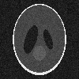
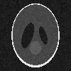
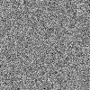
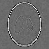
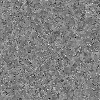

+++
date= 2020-05-25
title = "Exercise 5"

[extra]
author="Stephan Seitz"
+++

# Submission

**Submission deadline: 08.06.20 23:55h**

Please ensure that all files you created also contain **your name and your IDM ID** and also your partner's name and IDM ID if you're not working alone.

Each exercise has **10 points**. You have to achieve **30 of 60 points in six homework exercises** to pass the module.

# Quanitfying Errors

<P align="right"><i>3 Points</i>

In [Exercise03](../exercise-3), we have seen that we can use linear low-pass filters, like the Gauss filter, to reduce 
the amount of noise in images. Let's test that!

Add two static methods to the `Image` class:

```java
public static float meanSquaredError(Image a, Image b);
public static float psnr(Image a, Image b, float maxValue); // maxValue is 255 for PNG images
```
<!--Take adavatage of the fact that you already implemented a `minus` method.-->
Static also means that you will use them like `float mse = Image.meanSquaredError(imageA, imageB);`.

Open a test image and add some noise using `addNoise` in `exercise.Exercise05` (`src/main/java/exercise/Exercise05`).

```java
    (new ij.ImageJ()).exitWhenQuitting(true);
    Image original = lme.DisplayUtils.openImageFromInternet("https://mt2-erlangen.github.io/shepp_logan.png", ".png");

    
    Image noise = new Image(image.width(), image.height(), "Noise");
    noise.addNoise(0.f, 10.f);

    Image noisyImage = original.minus(noise); // You might also implement your own `plus` ;-)
```

Apply a Gauss filter (choose a good `filterSize` and `sigma`) on the noise image and compare the result with the original image.
Can the error be reduced in comparision to the unfiltered noisy image? Also take a look on the error images that you can
calculate using your `minus` method of the class `Image`.

- *Hint: You can use a for-loop to try out different values for `sigma`*.
- *Hint: You do not need to submit written answers to the questions in the text. Just do the correponding experiments!*

# Non-Linear Filters

<P align="right"><i>3 Points</i>

A quality criterion for medical images are sharp edges.
However, though the Gauss filter reduces the noise it also blurs out those edges.
In this exercise, we try to mitigate that problem using non-linear filters.

Non-linear filters calculate similar to a convolution each pixel value in the output from a neighborhood of the
input image. Remember the sliding window from exercise 3? Non-linear filters do exactly the same.


<P align="right"><i>Source: https://github.com/vdumoulin/conv_arithmetic</i>

Create a class `mt.NonLinearFilter` in the file `src/main/java/mt/NonLinearFilter.java`:

```java
// Your name here <your idm>
// Your team partner here <partner's idm>
package mt;

import lme.WeightingFunction2d;
import lme.NeighborhoodReductionFunction;

public class NonLinearFilter implements ImageFilter {

    // Name of the filter
    protected String name; 
    // Size of the neighborhood, 3 would mean a 3x3 neighborhood
    protected int filterSize;
    // Calculates a weight for each neighbor
    protected WeightingFunction2d weightingFunction = (centerValue,neighborValue,x,y) -> 1.f;
    // Calculates output value from neighbors and weights
    protected lme.NeighborhoodReductionFunction reductionFunction;

    public NonLinearFilter(String name, int filterSize) {
        this.filterSize = filterSize;
        this.name = name;
    }

    @Override
    public String name() {
        return name;
    }
}
```

As you can see, `NonLinearFilter` uses two interfaces. You can copy them into your `src/main/java/lme/` folder.

```java
// in file `src/main/java/lme/WeightingFunction2d.java`
package lme;

@FunctionalInterface // Does nothing. But Eclipse is happier when it's there.
public interface WeightingFunction2d {
    // Assigns  a neightbor shiftX, shiftY a weight depending on its value and the value of the center pixel
    float getWeight(float centerValue, float neighborValue, int shiftX, int shiftY);
}
```
and
```java
// in file `src/main/java/lme/NeighborhoodReductionFunction.java`
package lme;

@FunctionalInterface
public interface NeighborhoodReductionFunction {
    // Calculates the output pixels from the values of the neighborhood pixels and their weight
    float reduce(float[] values, float[] weights);
}
```

Implement the method `apply` for `NonLinearFilter`.

```java
    @Override
    public void apply(Image input, Image result)
```

The method should calculate each output pixel from a neighborhood. So

- Create an array to hold the values of the neighborhood pixels. How many neighborhood pixels are there?
- Loop over each output pixel
    - Fill the array of neighborhood pixels with values from the input image (needs two inner loops)
    - Use `this.reductionFunction.reduce` to determine the value of the output pixel.
    - Save the value to the output image (using `setAtIndex`).

Overall, the method should look very similar to your `LinearImageFilter.apply` method.

To test your method, implement a `MedianFilter` in a file `src/main/mt/MedianFilter.java` as a subclass of `LinearImageFilter`.

```java
// Your name here
// Team partner's name here
package mt;

import java.util.Arrays;

public class MedianFilter extends NonLinearFilter {
	public MedianFilter(int filterSize) {
            // TODO:
            super(...);
            reductionFunction = ...;
	}
}
```
The `MedianFilter` is a `LinearImageFilter` with
`reductionFunction` `(values, weights) -> { Arrays.sort(values); return values[values.length / 2]; }`
(it sorts the values and takes the one in the middle).
All you need to do is to call the `super` constructor and set `reductionFunction`.

Does the median filter also reduce the noise in the image?

## Bilateral Filter

<P align="right"><i>2 Points</i>

Next, we will implement the `BilateralFilter`.

```java
package mt;

public class BilateralFilter extends NonLinearFilter {
    GaussFilter2d gaussFilter;

    public BilateralFilter(int filterSize, float spatialSigma, float valueSigma){
        ...
    }
}
```

The bilateral assign a weight to each neightborhood pixel.
So modify your `NonLinearFilter.apply` method that it also creates a `weights` array and uses `weightingFunction.getWeight` to
fill it. `reductionFunction` should now also be called with the `weights` array.

The bilateral has to parameters $\sigma_{\text{value}}$ and $\sigma_{\text{spatial}}$.
For large values of $\sigma_{\text{spatial}}$ the bilateral filter behaves like a Gauss filter.
Initialize `gaussFilter` in the constructor. Set `weightingFunction` so that the weights $w_s$ of the Gauss filter are returned.
Set `reductionFunction`. It should multiply each of the `values` with its weight and then results up.

Your `BilateralFilter` should now behave like a Gauss filter. Does it pass the test in `GaussFilter2dTests` when you
use `BilateralFilter` instead of `GaussFilter2d`?


### Edge-Preserving Filtering

<P align="right"><i>2 Points</i>

To make our bilateral filter edge preserving, we have to use also $\sigma_{\text{value}}$.
The value weight $w_v$ is calculated as follows

$$ w_v = \exp\left(-\frac{\left(\mathtt{centerValue}-\mathtt{value}\right)^2}{2 \sigma_{\text{value}}^2}\right) $$

Just multiply with this value $w_v$ in `weightingFunction`. The total weight of a pixel will then be $w_v \cdot w_s$.

Now we have the problem that our weights will no longer add up to one! To solve this problem divide by the sum of `weights`
in the `reductionFunction`.


Can you reduce the error even more using the bilateral filter? My results look like this.

 <table style="width:100% text-align: center;">
  <tr>
    <th><a href="../shepp_logan_original.png" ></a></th>
    <th><a href="../shepp_logan_noisy.png" ></a></th>
    <th><a href="../shepp_logan_gauss.png" ></a></th>
    <th><a href="../shepp_logan_bilateral.png" ></a></th>
  </tr>
  <tr>
    <th>Original</th>
    <th>Noisy</th>
    <th>Gauss filtered</th>
    <th>Bilateral filtered</th>
  </tr>
  <tr>
    <th></th>
    <th><a href="../error_noise.png" ></a></th>
    <th><a href="../error_gauss.png" ></a></th>
    <th><a href="../error_bilateral.png" ></a></th>
  </tr>
  <tr>
    <th></th>
    <th>Original Error</th>
    <th>Error Gauss</th>
    <th>Error Bilateral</th>
  </tr>
</table> 

<!--Java unzip: https://www.journaldev.com/960/java-unzip-file-example-->
<!--https://services.cancerimagingarchive.net/services/v3/TCIA/query/getImage?SeriesInstanceUID=1.3.6.1.4.1.14519.5.2.1.2857.5885.605148569068237074211642729801-->

<!--```java-->
<!--public float power();    // Mean of the squared signal values-->
<!--public float powerDb();  // 10 * Math.log(power)-->
<!--```-->

<!--The power of a signal is calculated like the mean value. Except that you calculate the mean of the squared singal values.-->
<!--You can calculate the mean squared error like that-->

<!--```java-->
<!--Image errorImage = original - noisy;         // original and noisy are of type mt.Image-->
<!--float meanSquaredError = errorImage.power(); //-->
<!--```-->

<!--```java-->
<!--public float power();    // Mean of the squared signal values-->
<!--public float powerDb();  // 10 * Math.log(power)-->
<!--```-->
