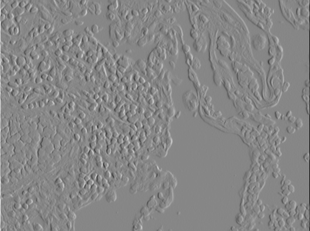
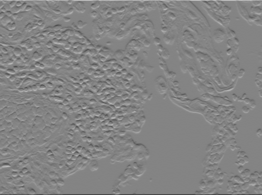
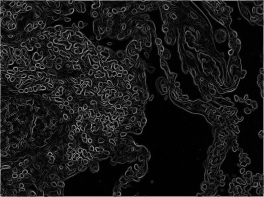
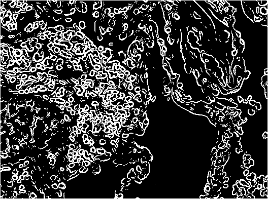
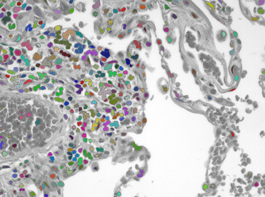
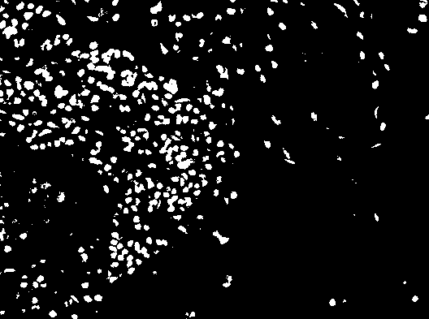
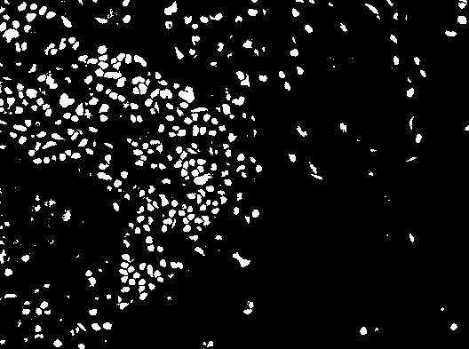
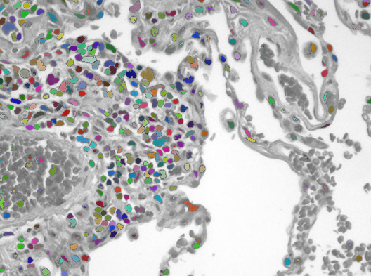

+++
date= 2020-06-01
title = "Exercise 6"

[extra]
author="Stephan Seitz"
+++


**Submission deadline: 29.06.20 23:55h**

In the last exercise, we want to have a look at edge detection and segmentation.

## Edge Detection
<P align=right> <i>7 Points</i>


Open a test image in a new file `src/main/java/exercise/Exercise06.java`.

```java
// Your name
// Team parnter name
package exercises;

import lme.DisplayUtils;
import mt.LinearImageFilter;

public class Exercise06 {
    public static void main(String[] args) {
	(new ij.ImageJ()).exitWhenQuitting(true);
	mt.Image cells = lme.DisplayUtils.openImageFromInternet("https://upload.wikimedia.org/wikipedia/commons/8/86/Emphysema_H_and_E.jpg", ".jpg");

    }
}
```

We will use the [Sobel Filter](https://en.wikipedia.org/wiki/Sobel_operator), to estimate gradient of the image.
The Sobel Filter uses two filter kernels. One to estimate the x-component of the gradient and one for the y-component.


Create two `LinearImageFilter`s with those coeffients. You can use `filterX.setBuffer(new float[]{...})`
or `setAtIndex` to do that.
Filter the original image with both of them!

<table>
    <tr>
	<td></td>
	<td></td>
    </tr>
    <tr>
	<th>X component of gradient $\delta_x$</th>
	<th>Y component of gradient $\delta_y$</th>
    </tr>
</table>

You should now have two intermediate results that can be interpreted as the x-component $\delta_x$
and y-component $\delta_y$of the estimated gradient for each pixel.


Use those two images to calculate the norm of the gradient for each pixel!

$$ \left|\left| \nabla I \right|\right| =\left|\left| \left(\delta_x,\\ \delta_x \right) \right|\right| = \sqrt{ \delta_x^2 + \delta_y^2}$$




Find a good threshold and set all gradient magnitude values to zero that are above this values and all other to `1.f` to
obtain an image like this with a clear segmentation in edge pixels and non-edge pixels.



## Segmentation

<P align=right> <i>3 Points</i>


<P align=right> <i>Source: https://commons.wikimedia.org/wiki/File:Emphysema_H_and_E.jpg (cc-by-2.0)</i>

For histologic examinations colored subtances called stains are used to enhance the constrast
of different portions of the tissue.

Use a suitable threshold to segment the individual sites with high contrast (0 background, 1 contrasted cells).
You can use one of method to overlay your segmentation with the original image.

```java
    // In lme.DisplayUtils
    public static void showSegmentedCells(mt.Image original, mt.Image segmented) 
    // You may also try showSegmentedCells(cells, segmentation, true); with the newest version DisplayUtils
```




## Separting the Cells
*This is optional and not required for the exercise.*

You may notice that by just choosing a threshold you may not be able to separate each individual structure.



There's a trick to improve your segmentation using [the watershed method](https://en.wikipedia.org/wiki/Watershed_%28image_processing%29). 
Click on the following menu items while displaying your 0/1 segmentation.

-  *Image > Type > 8-bit*
-  *Process > Binary > Watershed*



You can also "click" on menu items in your program code.

```java
    IJ.run("8-bit");
    IJ.run("Watershed");
    DisplayUtils.showSegmentedCells(...);
```



Also other morphologic operations from the "Binary" menu may help to improve the segmentation.

<!--## Morphologic Operations-->


<!--<P align=right> <i>5 Bonus points</i>-->

<!--[><]-->
<!---->

