+++
date= 2022-06-20T08:00:10Z
title = "Project Work 3 - Image Reconstruction"
[extra]
author= "Jinho Kim, Zhengguo Tan, Bruno Riemenschneider"
+++

# Overview

1) [Introduction](../introduction) *(Tafelübung 24. Juni)*
2) [*k*-Space](../kspace)
3) Image Reconstruction *(Tafelübung 08. Juli)*
4) [Filters](../filters) *(Tafelübung 15. Juli)*
5) [Outlook and Conclusion](../conclusion)

# 3. Image Reconstruction

In the last section, you made an acquired $k$-space Java-manipulatable. Now, we want to actually work with it. To reconstruct an MR image from it, we need to use an inverse Fourier transform. The method for the Fourier transform itself is provided by us, but you need to implement the workflow, which also involves shifting the buffer array, as explained below. By the end of the section, you will have implemented a framework to reconstruct an image from $k$-space and to calculate a $k$-space from an image.

## 3.1 FFT and FFT Shift

### 3.1.1 What is an FFT / iFFT?

The Discrete Fourier transform is an extremely important tool in all engineering contexts. One of the reasons why it had such
great success as an analysis tool and also as an MRI reconstruction tool is a very pragmatic one: it has an extremely fast and efficient
implementation algorithm: the Fast Fourier Transform (FFT).\
One of the computational particularities of the FFT is that it uses a representation of the $k$-space where the so-called
DC component - the value in $k$-space that refers to $k=0$ - is at the index 0 of the transformed array. In MRI, however,
the DC component is located at the center of the acquired data. So we first need to rearrange $k$-space in order for the FFT
algorithm to do its work.

To be precise, the DFT / FFT describes the measurement process of the MRI process (getting the spatial frequencies from the measured object).
The inverse operation of that, which you need to reconstruct the image from the spatial frequencies is the inverse DFT / iDFT
or inverse FFT / iFFT. They only differ by a minus sign in the equation, but let's stick to proper wording.


### 3.1.2 $k$-space and the FFT Shift

As stated above, MRI $k$-space is measured with its low-frequency components in the middle of the matrix (see Fig 2.3).
For the sake of simplicity, let's first look at a 1D representation by looking at one line of the 2D matrix
in the middle of the $k$-space.

<p align="center">
  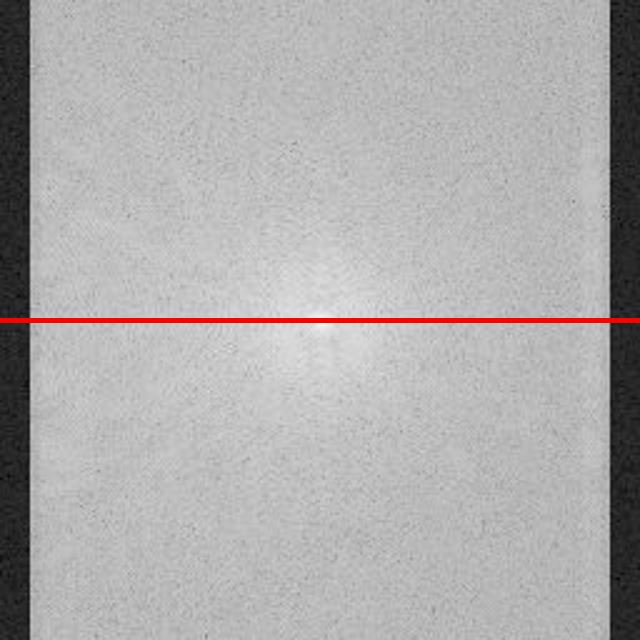
  &nbsp;&nbsp;&nbsp;&nbsp;&nbsp;&nbsp;&nbsp;&nbsp;&nbsp;&nbsp;&nbsp;&nbsp;&nbsp;&nbsp;
  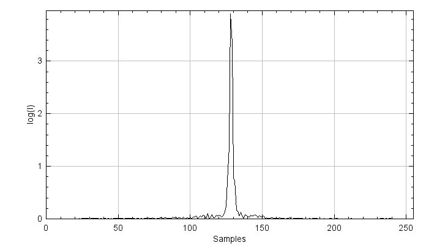
</p>
<p align="center">
  <b>Figure 3.1.</b> A magnitude  image of <i>k</i>-space (left) and its corresponding signal intensity along the
red-line direction (right). X represents the sample index and Y the magnitude of the signal. This applies for all plots below.
</p>

Figure 3.1 shows signal intensities concentrate in the middle of the spectrum, which is the DC component,
as given by the nature of the MRI acquisition. From a technical point of view, however,
the DC component should be shifted to the first index before applying an iFFT. Let's not go too deep into Fourier transform
theory here and the specifics of the FFT algorithm. Just keep in mind, (i)FFT wants the DC component at index 0, MRI measures
the DC component at index $\frac{N}{2}$

The so-called *FFT shift* is a construct that is often used (not only in MRI). It simply shifts samples in one half of
the spectrum to the other half. Figure 3.2 shows an example of the *1D FFT shift*. A full spectrum lies in an index range of $[0, N-1]$, where $N$ represents the vector length.
Samples in a range of $[0, \frac{N}{2}-1]$ are then shifted to the other half spectrum of $[\frac{N}{2}, N]$ and vice versa.


<p align="center">
  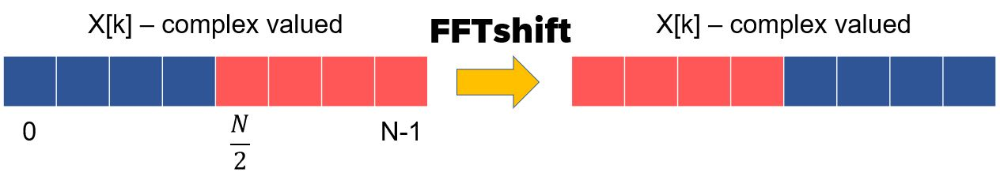  
</p>
<p align="center">
  <b>Figure 3.2.</b> A graphical representation of the <i>FFT shift</i>.  
</p>


## 3.2 Apply FFT Shift to the 1D Problem

To get a better understanding of the FFT shift, you will start in 1D and implement a new class ```ComplexSignal```.

```java
package project;

import mt.Signal;
import java.util.Objects;

public class ComplexSignal {
    protected mt.Signal real;    //Image object to store real part
    protected mt.Signal imag;    //Image object to store imaginary part
    protected String name;      //Name of the image
}
```

Create constructors and getters. Remember: class objects, ```real```, ```imag```, and ```name```,
must be set in the constructor. Since ```Signal``` class contains two types of constructors,
there will be two types of constructors in ```ComplexSignal``` class as well. Since the FFT works for only the signal
length of 2 to the power of n, we consider the signal length only as 2 to the power of n.
This will apply to the 2D problem as well.

```java
public ComplexSignal(int length, String name)
public ComplexSignal(float[] signalReal, float[] signalImag, String name)

public float[] getReal() // get the buffer of the real
public float[] getImag() // get the buffer of the imag
public String getName()
public int getSize()
```
Generate a sinusoid wave composed of five sine waves with different frequencies in the ```generateSine()``` method.
Frequencies for five sine waves are $[\text{numWaves}, 2 \times \text{numWaves}, \cdots, 5 \times \text{numWaves}]$,
and the number of samples is equal to the size of the ```ComplexSignal```. You can refer to the previous exercise 1 for this.
Since the generated sinusoid wave is float type, you will set *the real part* of the ```ComplexSignal``` as the sine wave
and *the imaginary parts* to zeros. You can use ```setAtIndex()``` to assign corresponding values to the real and imaginary parts.


```java
public void generateSine(int numWaves)
```

You can plot your sinusoid wave using the given method ```DisplayUtils.showArray()```. In this case, the signal legnth is $256$

<p align="center">
  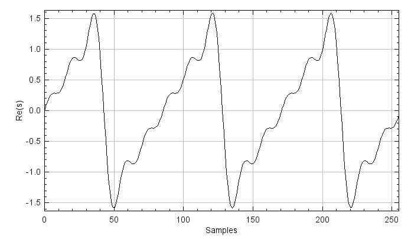
  &nbsp;&nbsp;&nbsp;&nbsp;&nbsp;&nbsp;&nbsp;&nbsp;&nbsp;&nbsp;&nbsp;&nbsp;&nbsp;&nbsp;
  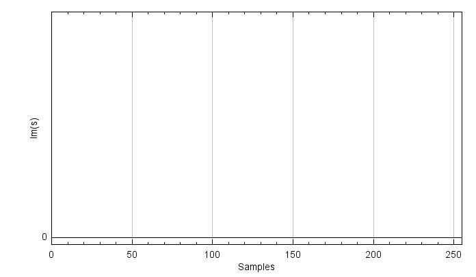
</p>
<p align="center">
  <b>Figure 3.3.</b> The real(left) and imaginary(right) parts of the sinusolidal wave composed of five different sine waves.
</p>

To show the magnitude of the signal, you need to implement ```calculateMagnitude()``` and ```getMagnitude()``` for displaying with ```DisplayUtils.showArray()```. You can use ```atIndex()``` and ```setAtIndex()``` for ```calculateMagnitude()```.

```java
private Signal calculateMagnitude(ComplexSignal input)
public float[] getMagnitude()
```
<p align="center">
  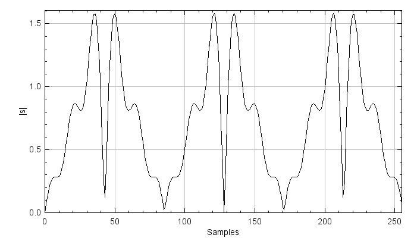
</p>
<p align="center">
  <b>Figure 3.4.</b> The manitude of the complex sinusoid signal.
</p>

Now, you will apply an FFT to the signal using the given method ```FFT1D()``` from ```ProjectHelpers.java``` and plot the magnitude signal. For this, you have to comment out methods related to ```ComplexSignal()``` in ```ProjectHelpers.java```, such as ```FFT1D()```, ```toComplex()```, ```fromComplex()```, and ```fft()```.

<p align="center">
  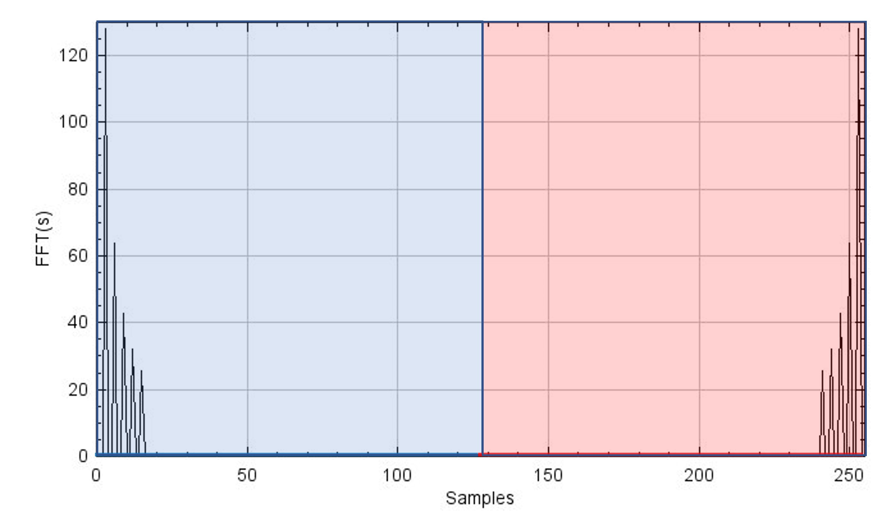
</p>
<p align="center">
  <b>Figure 3.5.</b> The magnitude of <i>FFT</i>. Since the complex sinusoid signal is composed of five different sine waves, there are five peaks at the low-frequency part.
</p>


Once you have created the FFT result, it is time to implement the FFT shift.  
If you shift the FFT signal to the right by one sample, the most right signal comes to the most left index: it's a cyclical shift.
Take your time to understand this, referring to Figure 3.2. If you think of the input and the output of the FFTshift,
half of the left and right parts are swapped with each other. In other words, you can implement the ```fftShift1d()```
method using a ```swap()``` method, which only swaps the left and right half of the array.
You will need to use ```setAtIndex()``` and ```AtIndex()```.
Additionally, as signals are complex numbers, you must consider both the real and imaginary parts.

```java
public void fftShift1d()
private Signal swap(Signal input)
```

You can plot the *FFT shift* result and play around with the result, shifting the signal back and forth using
```fftShift1d()``` multiple times.

<p align="center">
  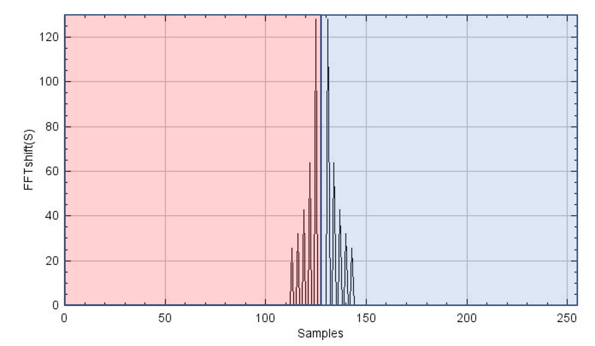
  &nbsp;&nbsp;&nbsp;&nbsp;&nbsp;&nbsp;&nbsp;&nbsp;&nbsp;&nbsp;&nbsp;&nbsp;&nbsp;&nbsp;
  
</p>
<p align="center">
  <b>Figure 3.6.</b> <i>FFTshift</i> is carried out once(left) and twice(right) to the <i>FFT</i> result. The right figure shows the same as Figure 3.5, meaning that if <i>FFTshift</i> is applied twice, the signal comes back to the original position. This property is important when you reconstruct <i>k</i>-space.
</p>

## 3.3 Expand FFT shift to 2D in ComplexImage

Expanding the concept of the FFT shift from the 1D problem to the 2D problem is not so complicated. It is the result
of doing an FFT shift along the first dimension and then the second.

<p align="center">
  
</p>
<p align="center">
  <b>Figure 3.7.</b> Graphical example of the 2D <i>FFT shift</i>. One quadrant is swapped with another quadrant in the diagonal direction. This is due to the fact of swapping one sample along the x and y directions.
</p>

You need to consider that swapping one sample is carried out along both x and y directions in the 2D problem, meaning that one quadrant is swapped with another in the diagonal direction. We move the working ```java``` script to the ```ComplexImage.java```. You will add new methods called ```fftShift()``` and ```swapQuadrants()```

 ```java
public void fftShift()
private Image swapQuadrants(Image input)
```

In ```fftShift()```, you will use ```swapQuadrants()``` to swap samples and ```setBuffer()```,
which is a member method of the ```Image``` class, to set swapped samples to the buffer. Always consider that you are
dealing with complex numbers, using both ```real``` and ```imag```.
You can expand your implementation in the 1D case to the 2D problem for ```swapQuadrants()```.

Display the result of your 2D FFT shift.

<p align="center">
  
  &nbsp;&nbsp;&nbsp;&nbsp;&nbsp;&nbsp;&nbsp;&nbsp;&nbsp;&nbsp;&nbsp;&nbsp;&nbsp;&nbsp;
  
</p>
<p align="center">
  <b>Figure 3.8.</b> <i>k</i>-spaces before(left) and after(right) applying <I>FFTshift</i>.
Low-frequency components are shifted to the edge after applying <i>FFTshift</i>,
and vice versa. To match <i>k</i>-space size to 2 to the power of n to carry out <i>FFT</i>,
both edges are zero-padded, and such appear as black strips.
</p>

## 3.4 Reconstruct MR image
Now, we are ready to reconstruct an MR image. The overview of the MR reconstruction process is depicted in Figure 3.9.
One key point here is that after applying an FFT shift to the $k$-space or the image once,
you have to apply the FFT shift one more time after applying the (i)FFT to bring it back to its original signal.
Play around with (i)FFTs and the shifts and you will see.


```InverseFFT2D()``` and ```FFT2D()``` methods are provided in ```ProjectHelpers.java```.

<p align="center">
  
</p>
<p align="center">
  <b>Figure 3.9.</b> An overview of the MR reconstruction process.
</p>

Reconstruct the MR image from the measured $k$-space data.
Show image magnitude, image phase, image real part, and image imaginary part as  below.

<p align="center">
  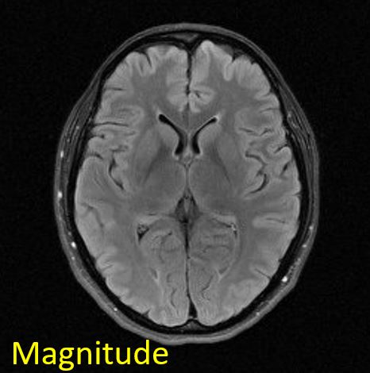
  &nbsp;&nbsp;&nbsp;&nbsp;&nbsp;&nbsp;&nbsp;&nbsp;&nbsp;&nbsp;&nbsp;&nbsp;&nbsp;&nbsp;
  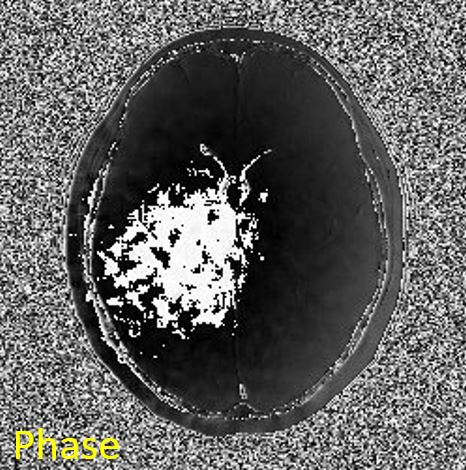
  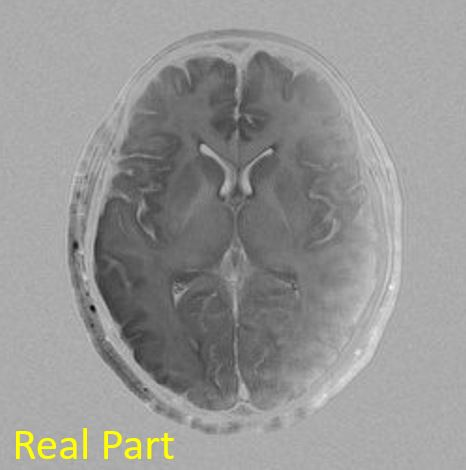
  &nbsp;&nbsp;&nbsp;&nbsp;&nbsp;&nbsp;&nbsp;&nbsp;&nbsp;&nbsp;&nbsp;&nbsp;&nbsp;&nbsp;
  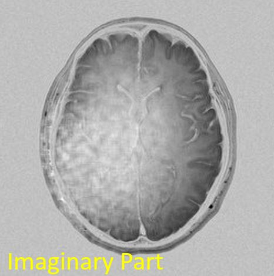
</p>
<p align="center">
  <b>Figure 3.10.</b> Reconstructed images. Image titles are presented at the left top corner of the each figure.
</p>

Then, let's check if a forward FFT works fine with the reconstructed image. The original $k$-space should be reproduced from the FFT on the reconstructed image.

<p align="center">
  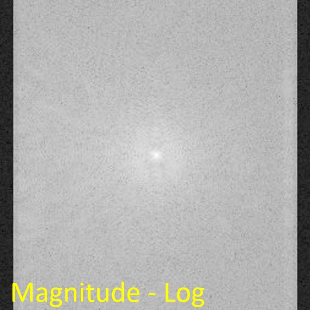
  &nbsp;&nbsp;&nbsp;&nbsp;&nbsp;&nbsp;&nbsp;&nbsp;&nbsp;&nbsp;&nbsp;&nbsp;&nbsp;&nbsp;
  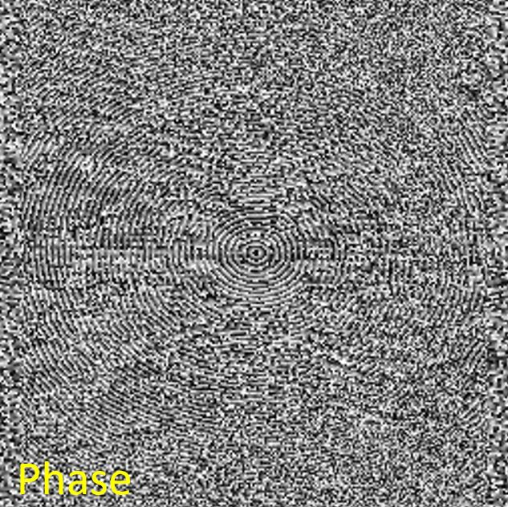
</p>
<p align="center">
  <b>Figure 3.11.</b> Reproducted <i>k</i>-space from the reconstructed image. The reproducted <i>k</i>-space shows as the same as the original <i>k</i>-space.
</p>

In your Project report, you should:

* Explain why an FFT shift needs to be carried out on $k$-space before and after the iFFT is applied.
What is the purpose of the FFT shift? Where are low-frequency components located in $k$-space?
What happens if you only apply the FFT shift before, but not after performing the iFFT on the $k$-space?
(explain this with figures)
* Interpret the reconstruction results. Which image do radiologists view and diagnose among images of
magnitude, phase, real part, and imaginary part?
Can $k$-space be reproduced from the reconstructed image like the original $k$-space?
If so, what is the procedure for that? Please explain the reasons why or why not.

[Next task: Filters](../filters)
