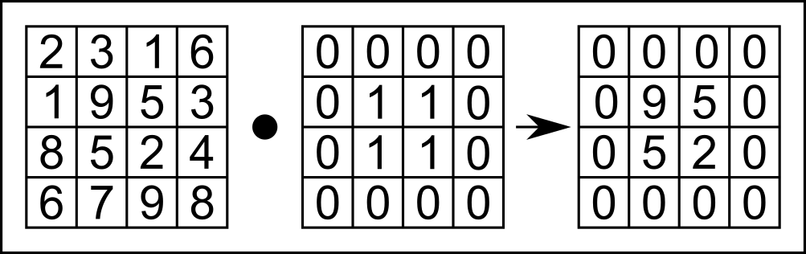
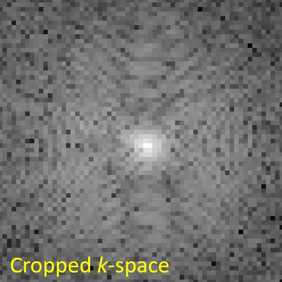
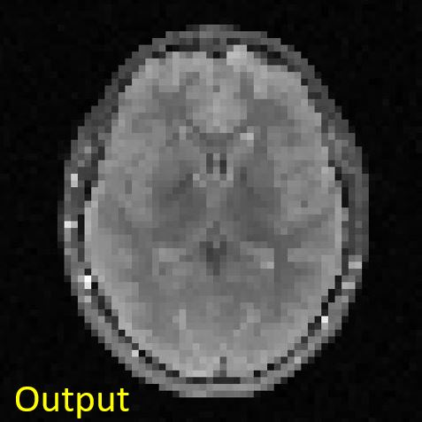

+++
date= 2022-06-20T08:00:15Z
title = "Project Work 4 - Filters"
[extra]
author= "Zhengguo Tan, Jinho Kim, Bruno Riemenschneider"
+++

# Overview

1) [Introduction](../introduction) *(Tafelübung 24. Juni)*
2) [*k*-Space](../kspace)
3) [Image Reconstruction](../fftshift) *(Tafelübung 08. Juli)*
4) Filters *(Tafelübung 15. Juli)*
5) [Outlook and Conclusion](../conclusion)


# 4. Filters

In your exercises, you have learned the process of filtering an image. In this section, we'll look at the relation between image and $k$-space with respect to applying a filter or multiplication operation on one of them. Feel free to use and 
look at the code base from exercise 4 to get inspired.

We'll first decrease the resolution (sharpness) of the image by manipulating the image itself or the $k$-space. Then, 
we're going to decrease the array size (sometimes also called resolution, this term is ambiguous) in 2 different ways.

## 4. 1 Sinc Filter and Box Multiplication

### 4.1.1 Sinc Filter Applied on Image

The [sinc function](https://en.wikipedia.org/wiki/Sinc_function) is defined in two forms,

1. unnormalized: $ \mathrm{sinc} (x) = \frac{\mathrm{sin}(x)}{x} $

2. normalized: $ \mathrm{sinc} (x) = \frac{\mathrm{sin}(\pi x)}{\pi x} $

Please implement a 2D sinc filter such that it is working as a filter in $x$ and a filter in $y$ direction independently.
This means that during filtering you can multiply a sinc in $x$ and a sinc in $y$ direction 
(as opposed to using a 2D distance from the point that the filter is applied to, e.g.). 

According to exercise 4, implement
the class in ```SincFilter2d.java```. This filter has two parameters: ```filterSize``` and ```downScale```. Suppose 
we have input $x$, with $x$ being an integer and $x \in [-\mathrm{filterSize}/2, \mathrm{filterSize}/2)$, 
the output is: $$y = \mathrm{sinc}(x/\mathrm{downScale})$$

```Java
package project;

import mt.LinearImageFilter;
import org.apache.commons.math3.analysis.function.Sinc;

public class SincFilter2d extends LinearImageFilter{

    public SincFilter2d(int filterSize, float downScale) {

        super(filterSize, filterSize, "Sinc2d (" + filterSize + ", " + downScale + ")");

        var s = new Sinc(true);

        /* your code here, get inspiration in exercise 4 if you don't remember */
        
        normalize();
    }
}
```

You can evaluate the sinc function from the used library with the ```s.value()``` method.

You should now apply the ```SincFilter2d``` filter to the complex MR image. But how? The filter is real valued, and 
the convolution operation with a certain filter is a linear operation. Consequently, you can apply the real filter
to the real and imaginary part of your signal to be filtered separately.\
Please implement a class ```LinearComplexImageFilter``` which does exactly that: applying a filter to real and imaginary
part separately. Your application of the filter will look like the following:

```Java
SincFilter2d realFilter = new SincFilter2d(31, 4.0f);
var complexFilter = new LinearComplexImageFilter(realFilter);
ComplexImage filteredImage = complexFilter.apply(mrImage);
```

Please show the filtered MR image (magnitude is enough) and its corresponding $k$-space! Please describe the difference 
between the original and the filtered $k$-space. Look at both in logarithmic scale, so that you can see the differences.
Mind that the intensity differences you can see on a logarithmic scale are huge, so if you use ```log10```, a difference
of 1 is actually a factor of 10 difference.

### 4.1.2 Box Function Applied to $k$-Space

So far, you should have implemented a filter for the complex image and used the ```apply``` function. 
This operation is related to the Fourier transform of the image by the so-called convolution theorem, but let's not dive
into theory here..

Now let's manipulate $k$-space data and observe how it changes the image. We're choosing a box multiplication, 
which instead performs point-wise multiplication between the input $k$-space matrix and a box function, as shown in Figure 4.1.

<p align="center">
  
</p>
<p align="center">
  <b>Figure 4.1.</b> Illustration of point-wise multiplication of a box function, 
which performs point-wise multiplication between the example <i>k</i>-space array (left) and the box function (middle).
</p>

To implement 2D box multiplication, we implement the ```setOuterToZero()``` method in ```ComplexImage.java```. 
For practical implementation, we're suggesting the method of setting certain lines to zero, then certain columns. 
You will need to use the ```SetAtIndex()``` method for this.

```Java
public void setOuterToZero(int lines, int axis)
```
Here, the parameter ```lines``` defines the zero-padding size of the box function (in Figure 4.1, this was set to 1), 
and the parameter ```axis``` defines on which axis the box filter is applied (0 is the "first" axis, $x$, and 1 is the
second axis, $y$).

With this function, you can set everything but the center of the ```kSpace``` buffer to 0:
```Java
kSpace.setOuterToZero(96,0); // kx-direction
kSpace.setOuterToZero(96,1); // ky-direction
```

Figure 4.2 shows a schematic of the use of the parameter ```lines```=96 as used in our code example. 
The black "$0$"-areas in Figure 4.2 show where you should set $k$-space to $0$.

<p align="center">

</p>
<p align="center">
<b>Figure 4.2.</b> A schematic of $k$-space after running the setOuterToZero() method.
Shown here is the parameter lines = 96 in both dimensions as used in our code example, as well as the k-Space 
after application of the method.
</p>

Apply the code shown above in your ```Project.java```.
Please show the zeroed $k$-space and its corresponding image! 
Is the image similar to the sinc-filtered image? If so, why?


## 4.2 Reducing the Image Size 

We'd like you to understand the conceptional difference between the "sharpness" of an image, which is determined by the
information content it represents (visible in $k$-space, e.g.), and it's array size, which also represents the amount
of information that can be represented.

### 4.2.1 Cropping $k$-Space

When the (array) size of $k$-space is reduced, so is the (array) size and resolution of the reconstructed image, as the
(i)DFT / (i)FFT always connects 2 spaces of equal length.
We can perform this operation by cropping $k$-space to its center frequencies.

For this experiment, you will add another constructor to the ```ComplexImage``` class in order to extract a cropped $k$-space
from the full acquired array. 
This third constructor works only when the size of the cropped image is smaller than that of the original image.

```java
/*
    Params:
        width:        Width of the cropped image
        height:       Height of the cropped image
        name:         Name of the cropped image
        bufferReal:   Buffer of the real of the original image
        bufferImag:   Buffer of the imaginary of the original image
        inputWidth:   Width of the original image
        inputHeight:  Height of the original image
*/
public ComplexImage(int width, int height, String name, float[] bufferReal, float[] bufferImag, int inputWidth, int inputHeight)
```

To set the buffer of the cropped $k$-space from the center area of the original $k$-space, you need to implement a new 
method ```setBufferFromCenterArea()``` in the ```Image``` class in ```Image.java```. This method can then be called by
the constructor. 

```java
public void setBufferFromCenterArea(int width, int height, float[] buffer, int inputWidth, int inputHeight)
```

You need to create two integer variables, ```offsetWidth``` and ```offsetHeight```, 
to calculate the index where the original $k$-space is cropped. Once you find where to be cropped, 
set the value where you find to the cropped $k$-space using ```setAtIndex()```. Figure 4.3 shows parameters in a geometrical way to better understand them.

<p align="center">
  
</p>
<p align="center">
  <b>Figure 4.3.</b> Visualization of suggested use of parameters. The blue-edged image is the original <i>k</i>-space, and the red-edged image is the cropped <i>k</i>-space.
</p>


As said above, when you are done with implementing the method ```setBufferFromCenterArea()``` in the ```Image``` class, utilize this 
method in the third constructor of the ```ComplexImage``` class to set the cropped $k$-space from the original.

Show the cropped $k$-space as well as a reconstructed image from that $k$-space, see Figure 4.4.
<p align="center">
  
  &nbsp;
    
</p>
<p align="center">
  <b>Figure 4.4.</b> Cropped <i>k</i>-space (top) and MR Reconstructed image (bottom). 
Since the grid size of <i>k</i>-space gets small, the resolution of the reconstructed image decreases as well.
</p>

### 4.2.2 Max Pooling

This subsection deals with another operation that can be used to create low-resolution images. Beware! This is usually not
the way of choice for decreasing image resolution if you want to maintain image information to be shown. However, this 
is a method often used (at this time, at least) in deep learning algorithms that decrease and increase the images they
work on for feature extraction.

The method is on of several pooling operations. In this case, **max pooling**, which is a pooling operation that extracts
the maximum value of patches (blocks) of an image (or feature map) and uses it to create a downsampled (pooled) image 
(or feature map). [(source: max pooling explained)](https://paperswithcode.com/method/max-pooling#:~:text=Max%20Pooling%20is%20a%20pooling,used%20after%20a%20convolutional%20layer.)

<p align="center">
  
</p>
<p align="center">
  <b>Figure 4.5.</b> Illustration of the Max-Pooling operation we are implementing. The maximum value of each 2x2 block/patch
is extracted. (source: <a href="https://production-media.paperswithcode.com/methods/MaxpoolSample2.png">Max-Pool</a>)
</p>

Figure 4.5 shows a small example of max pooling. Here, the image patch (block) has a width and height of $2$, 
defined as ```block_width``` and ```block_height```, respectively. The algorithm:

1. The max-pooling operation extracts the maximum value of the red block, yielding $20$;

2. This $2x2$ block then moves horizontally to the yellow block. The step length of this horizontal move is $2$. 
    This parameter is defined as ```stride_width``` in the implementation;

3. After looping over all blocks in the horizontal direction, the max pooling operation moves vertically and starts again 
   in the left-most, which finds the purple block. The step length of this vertical moving is also $2$ in this example and is defined as ```stride_height```.

4. Loop through all horizontal blocks in every vertical move until the end of the input matrix (feature map). In this example, the final block is the green one.

To help you implement max pooling, we provide its core structure. To begin with, you can copy the following code block and save it as ```MaxPooling2d.java```:

```Java
package mt;

public class MaxPooling2d {

    protected int block_width = 0;
    protected int block_height = 0;
    protected int stride_width = 0;
    protected int stride_height = 0;
    protected String name = "MaxPooling2d";

    public MaxPooling2d(int block_width, int block_height, int stride_width, int stride_height) {

        this.block_width = block_width;
        this.block_height = block_height;
        this.stride_width = stride_width;
        this.stride_height = stride_height;
    }

    public Image apply(Image input) {
    
    /* your code here */

    }
}
```

Secondly, we provide a test function ```test_MaxPooling2d.java``` to help you test your implementation.


Please fill in the above blanks ```/* */``` and run the ```test_MaxPooling2d.java``` function. Please report whether you get the expected output:
    ```Java
    {{173, 173, 146},
     {173, 173, 146}}
    ```

Please explain what happens in the case of incomplete blocks in the boundary. For instance, change the pooling parameters in ```test_MaxPooling2d.java```:
    ```Java
    MaxPooling2d mp = new MaxPooling2d(2, 2, 1, 2);
    ```

Please apply the function ```MaxPooling2d``` to the brain MR image and show the output image you get.
```Java
// MaxPooling2d
float[] mag = mrImage.getMagnitude();
Image mrMagImage = new Image(mrImage.getWidth(), mrImage.getHeight(), "magnitude of mrImage");
mrMagImage.setBuffer(mag);

MaxPooling2d mp = new MaxPooling2d(4, 4, 4, 4);

Image mrMagImage_MP = mp.apply(mrMagImage);
```

You should get something like this:
 <p style="text-align: center;">
<table><tr>
<td>  </td>
<td>  </td>
</tr></table>
 <p>
<b>Figure 4.5.</b> Input and output images to the max-pooling operation. The input image is of size [256, 256], whereas the output image is of size [64, 64].
</p>


In your Project report, you should:
* Explain the properties of high-frequency and low-frequency components in $k$-space. What components are relevant for the image contrast? What about the image details?
* Explain the effect of the 2D Sinc filter on the MR image and on $k$-space. What can be seen in $k$-space?
* Explain the effect on the MR image when setting high-frequency parts of $k$-space to zero and compare the result with that of the 2D Sinc filter.
* Explain how to improve the resolution of the MR image. What is the trade-off for that? Scan time? Cost?
* Compare reconstructed images of cropping $k$-space and Max pooling in terms of image contents. Which result is closer to the original reconstructed image? Why do you think so?

[Next task: Conclusion](../conclusion.md)