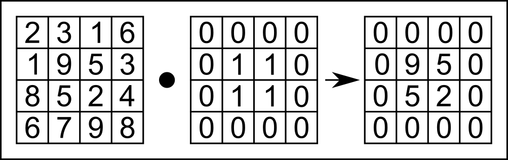
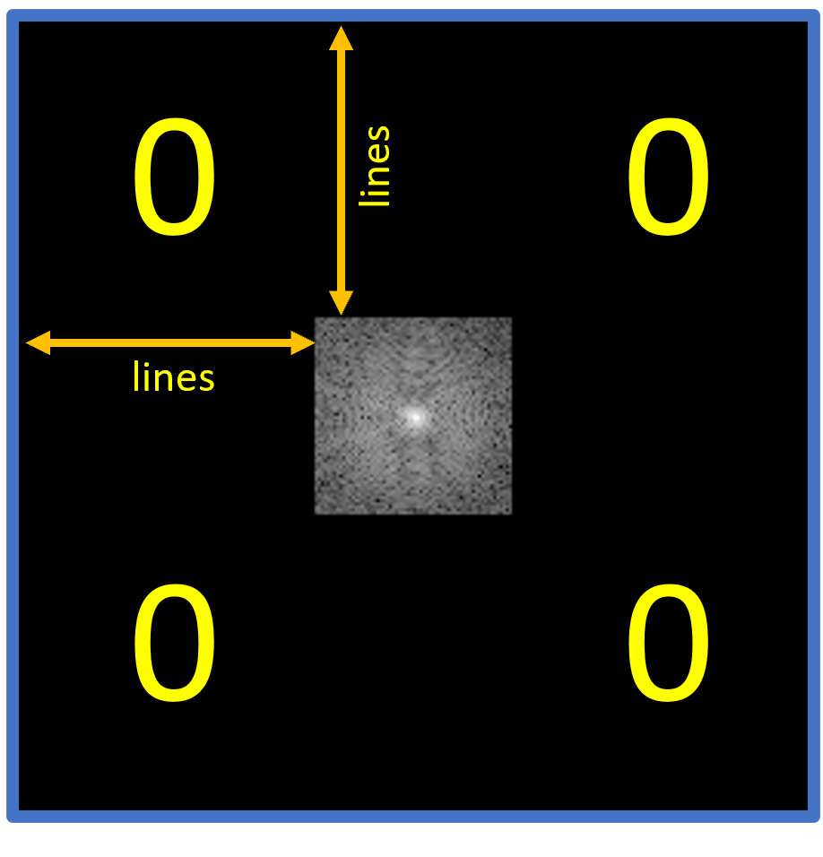
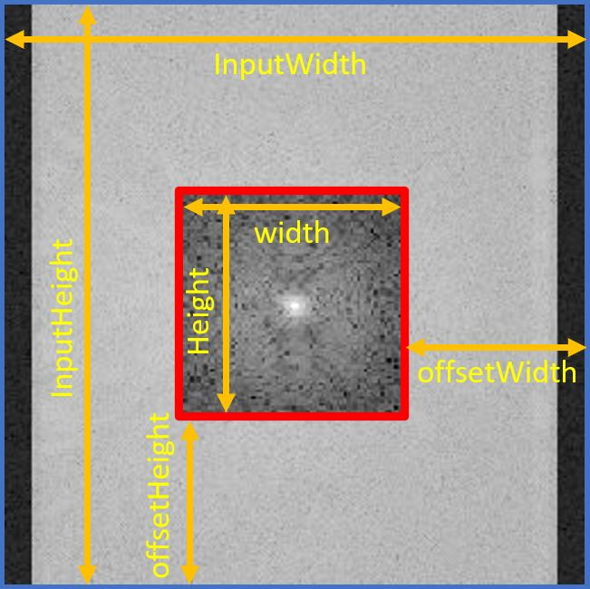
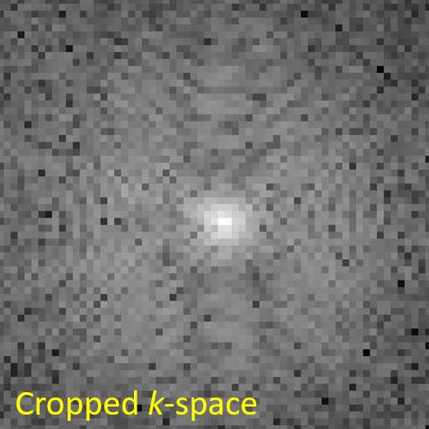
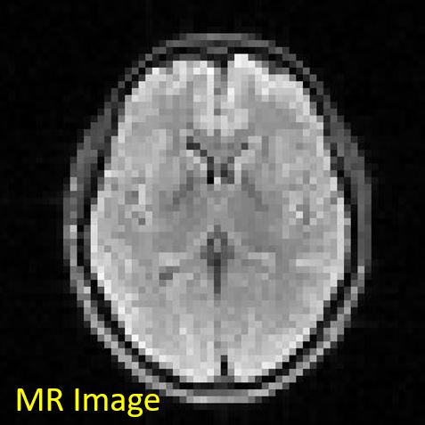
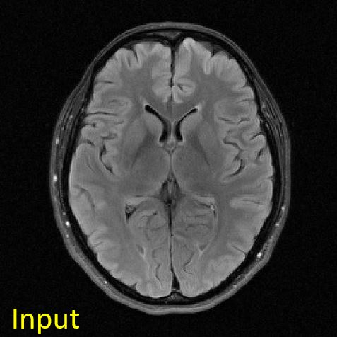
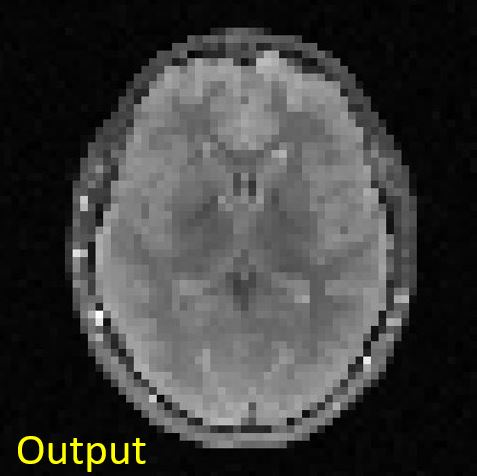

+++
date= 2022-06-20T08:00:00Z
title = "Project Work 4"
[extra]
author= "Zhengguo Tan, Jinho Kim, Bruno Riemenschneider"
+++

# Overview
 
1) [Introduction](./introduction.md) *(Tafelübung 24. Juni)*
2) [*k*-Space](./kspace.md)
3) [Image Reconstruction](./fftshift.md) *(Tafelübung 08. Juli)*
4) Filters *(Tafelübung 15. Juli)*
5) [Outlook and Conclusion](./conclusion.md)


# 4. Filters

## 4. 1 Box / Sinc filter
### 4.1.1 Sinc filter applied onto image

The [sinc function](https://en.wikipedia.org/wiki/Sinc_function) is defined in two forms,

1. unnormalized: $ \mathrm{sinc} (x) = \frac{\mathrm{sin}(x)}{x} $

2. normalized: $ \mathrm{sinc} (x) = \frac{\mathrm{sin}(\pi x)}{\pi x} $

Please implement a 2D sinc filter as ```SincFilter2d.java```. This filter has two parameters: ```filterSize``` and ```downScale```. Suppose we have input $x$, with $x$ being an integer and $x \in [-\mathrm{filterSize}/2, \mathrm{filterSize}/2)$, the output is: $$y = \mathrm{sinc}(x/\mathrm{downScale})$$

```Java
package project;

import mt.LinearImageFilter;
import org.apache.commons.math3.analysis.function.Sinc;

public class SincFilter2d extends LinearImageFilter{

    public SincFilter2d(int filterSize, float downScale) {

        super(filterSize, filterSize, "Sinc2d (" + filterSize + ", " + downScale + ")");

        var s = new Sinc(true);

        for (int y = minIndexY; y < minIndexY + height(); ++y) {

            for (int x = minIndexX; x < minIndexX + width(); ++x) {
                /* */
            }
        }
        normalize();
    }
}
```

Please apply the ```SincFilter2d``` filter to the complex MR image. Please report the filtered MR image and its corresponding $k$-space. Please describe the difference between the original and the filtered $k$-space.

```Java
SincFilter2d filter = new SincFilter2d(31, 4.0f);
var complexFilter = new LinearComplexImageFilter(filter);
ComplexImage filteredImage = complexFilter.apply(mrImage);
```

### 4.1.2 Box filter applied onto $k$-space
​
So far, you have learned to implement image filters and use the ```apply``` function in ```LinearImageFilter.java```. The basic mechanism is to perform convolution between the image and the filter.
​
Now we switch to the box filter for $k$-space data, which instead performs pointwise multiplication between the input $k$-space matrix and the box filter, as shown in Figure 4.1.
​
<p align="center">
  
</p>
<p align="center">
  <b>Figure 4.1.</b> Illustration of box filtering, which performs pointwise multiplication between (Left) the example <i>k</i>-space array and (middle) the box filter. 
</p>
​

​
Please implement 2D box filtering. In practice, we want to implement the ```setOuterToZero()``` method in ```ComplexImage.java```. Think about which index should be set to zero. You will need to use the ```SetAtIndex()``` method for this. 
```Java
public void setOuterToZero(int lines, int axis)
```
Here, the parameter ```lines``` defines the zero-padding size of the box filter, and the parameter ```axis``` defines on which axis the box filter is applied. 

With this function, you can perform box filtering on ```kSpace```:
```Java
kSpace.setOuterToZero(96,0); // kx-direction
kSpace.setOuterToZero(96,1); // ky-direction
```

Figure 4.2 shows the geometrical overview of the parameter ```lines``` in two axes as well as the result of ```setOuterToZero()``` applied to ```kSpace```. $0$ in the Figure 4.2 means where you should set to $0$

<p align="center">

</p>
<p align="center">
<b>Figure 4.2.</b> The overview of the setOuterToZero() method 
</p>

Apply it onto the $k$-space matrix ```kSpace``` in ```Project.java```.
​
Please report the filtered $k$-space and its corresponding image. Is the image the same as the sinc-filtered image? If so, why?
​

## 4.2 Crop the center of the $k$-space
When the grid size of $k$-space is reduced, so does the resolution of the reconstructed image. We can simulate this by cropping $k$-space. For this experiment, you will add another constructor to the ```ComplexImage``` class for the cropped $k$-space. This third constructor works only when the size of the cropped image is smaller than that of the original image.

```java
/*
    Params:
        width:        Width of the cropped image
        height:       Height of the cropped image
        name:         Name of the cropped image
        bufferReal:   Buffer of the real of the original image
        bufferImag:   Buffer of the imaginary of the original image
        inputWidth:   Width of the original image
        inputHeight:  Height of the original image 
*/
public ComplexImage(int width, int height, String name, float[] bufferReal, float[] bufferImag, int inputWidth, int inputHeight)
```

To set the buffer of the cropped $k$-space from the center area of the original $k$-space, you need to implement a new method ```setBufferFromCenterArea()``` in the ```Image``` class in ```Image.java```. You need to create two integer variables, ```offsetWidth``` and ```offsetHeight```, to calculate the index where the original $k$-space is cropped. Once you find where to be cropped, set the value where you find to the cropped $k$-space using ```setAtIndex()```. Figure 4.3 shows parameters in a geometrical way to better understand them. 

<p align="center">
  
</p>
<p align="center">
  <b>Figure 4.3.</b> Visualization of parameters. The blue-edged image is the original <i>k</i>-space, and the red-edged image is the cropped <i>k</i>-space.
</p>

```java
public void setBufferFromCenterArea(int width, int height, float[] buffer, int inputWidth, int inputHeight)
```

When you are done with implementing the method ```setBufferFromCenterArea()``` in the ```Image``` class, utilize this method in the third constructor of the ```ComplexImage``` class to set the cropped $k$-space from the original. 

Show the cropped $k$-space as well as a reconstructed image like Figure 4.4.
<p align="center">
  
  &nbsp;&nbsp;&nbsp;&nbsp;&nbsp;&nbsp;&nbsp;&nbsp;&nbsp;&nbsp;&nbsp;&nbsp;&nbsp;&nbsp;
    
</p>
<p align="center">
  <b>Figure 4.4.</b> Cropped <i>k</i>-space(left) and MR Reconstructed image(right). Since the grid size of <i>k</i>-space gets small, the resolution of the reconstructed image decreases as well. 
</p>

## 4.3 Max Pooling
Alternatively, you can decrease the image resolution directly via pooling operation. For instance, **max pooling** is a pooling operation that calculates the maximum value for patches (blocks) of a feature map and uses it to create a downsampled (pooled) feature map. [(source: max pooling explained)](https://paperswithcode.com/method/max-pooling#:~:text=Max%20Pooling%20is%20a%20pooling,used%20after%20a%20convolutional%20layer.)

<p align="center">
  
</p>
<p align="center">
  <b>Figure 4.5.</b> Illustration of the Max-Pooling operation. (source: <a href="https://production-media.paperswithcode.com/methods/MaxpoolSample2.png">Max-Pool</a>)
</p>

Figure 4.5 shows an intuitive example of max pooling. Here, the image patch (block) has a width and height of $2$, defined as ```block_width``` and ```block_height```, respectively. Chronologically,

1. The max-pooling operation firstly applies to the red block, yielding its maximal value $20$;

2. This $[2, 2]$ block then moves horizontally to the yellow block. The step length of this horizontal moving is $2$. This parameter is defined as ```stride_width``` in the implementation;

3. After looping over all blocks in the horizontal direction, the max pooling operation moves vertically and starts again in the left-most, which finds the purple block. The step length of this vertical moving is also $2$ in this example and is defined as ```stride_height```.

4. Loop through all horizontal blocks in every vertical move until the end of the input matrix (feature map). In this example, the final block is the green one.

To help you implement max pooling, we provide its core structure. To begin with, you can copy the following code block and save it as ```MaxPooling2d.java```:

```Java
package mt;

public class MaxPooling2d {

    protected int block_width = 0;
    protected int block_height = 0;
    protected int stride_width = 0;
    protected int stride_height = 0;
    protected String name = "MaxPooling2d";

    public MaxPooling2d(int block_width, int block_height, int stride_width, int stride_height) {

        this.block_width = block_width;
        this.block_height = block_height;
        this.stride_width = stride_width;
        this.stride_height = stride_height;
    }

    public Image apply(Image input) {

        int out_width = (input.width() - this.block_width) / this.stride_width + 1;

        int out_height = (input.height() - this.block_height) / this.stride_height + 1;

        Image output = new Image(out_width, out_height, input.name + " processed with " + this.name);

        int input_indy = 0;
        int input_indx = 0;

        int output_indy = 0;
        int output_indx = 0;

        // loop over the 2D image vertically
        while (input_indy < input.height()) {

            int y_start = input_indy;
            int y_end = input_indy + this.block_height;

            // block boundary
            if (y_end > input.height())
                break;

            // loop over the 2D image horizontally
            while (input_indx < input.width()) {

                int x_start = input_indx;
                int x_end = input_indx + this.block_width;

                // block boundary
                if (x_end > input.width())
                    break;

                // update the maximal value within block (patch)
                float omax = Float.NEGATIVE_INFINITY;
                for (int yi = y_start; yi < y_end; ++yi) {
                    for (int xi = x_start; xi < x_end; ++xi) {

                        float ival = input.atIndex(xi, yi);
                        omax = /* */;
                    }
                }

                output.setAtIndex(output_indx, output_indy, omax);

                input_indx += /* */;
                output_indx++;
            }

            input_indy += /* */;
            output_indy++;

            // re-start the x indices
            /* */
            /* */
        }

        return output;
    }
}
```

Secondly, we provide a test function ```test_MaxPooling2d.java``` to help you test your implementation.


Please fill in the above blanks ```/* */``` and run the ```test_MaxPooling2d.java``` function. Please report whether you get the expected output:
    ```Java
    {{173, 173, 146},
     {173, 173, 146}}
    ```

Please explain what happens in the case of incomplete blocks in the boundary. For instance, change the pooling parameters in ```test_MaxPooling2d.java```:
    ```Java
    MaxPooling2d mp = new MaxPooling2d(2, 2, 1, 2);
    ```

Please apply the function ```MaxPooling2d``` to the brain MR image and report the output image you get.
```Java
// MaxPooling2d
float[] mag = mrImage.getMagnitude();
Image mrMagImage = new Image(mrImage.getWidth(), mrImage.getHeight(), "magnitude of mrImage");
mrMagImage.setBuffer(mag);

MaxPooling2d mp = new MaxPooling2d(4, 4, 4, 4);

Image mrMagImage_MP = mp.apply(mrMagImage);
```

You should get something like this:
<p align="center">

&nbsp;&nbsp;&nbsp;&nbsp;&nbsp;&nbsp;&nbsp;&nbsp;&nbsp;&nbsp;&nbsp;&nbsp;&nbsp;&nbsp;

</p>
<p align="center">
<b>Figure 4.5.</b> Input and output images to the max-pooling operation. The input image is of size [256, 256], whereas the output image is of size [64, 64].
</p>


In your Project report, you should:
* Explain the properties of high-frequency and low-frequency components in $k$-space. What components are relevant for the image contrast? What about the image details?
* Explain the effect of the 2D Sinc filter on the MR image and on $k$-space. What can be seen in $k$-space?
* Explain the effect on the MR image when setting high-frequency parts of $k$-space to zero and compare the result with that of the 2D Sinc filter.
* Explain how to improve the resolution of the MR image. What is the trade-off for that? Scan time? Cost?
* Compare reconstructed images of cropping $k$-space and Max pooling in terms of image contents. Which result is closer to the original reconstructed image? Why do you think so?

[Next task: Conclusion](./conclusion.md)