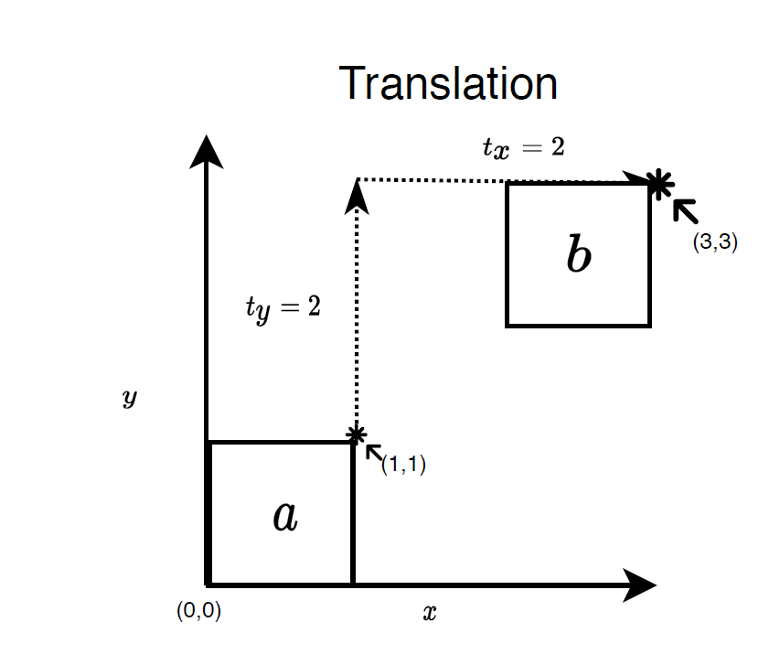
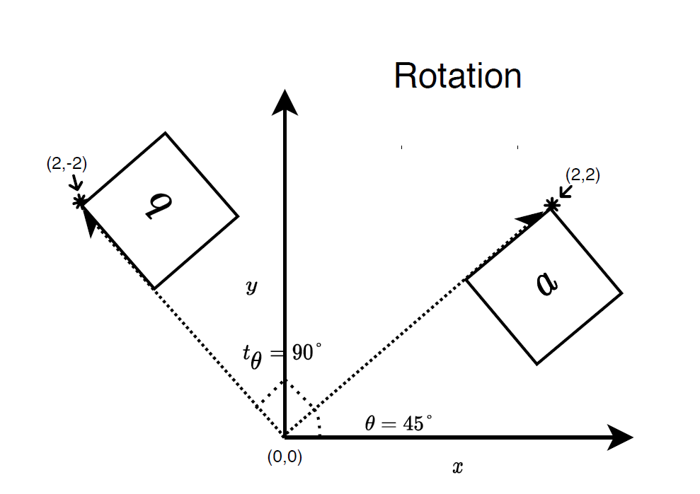
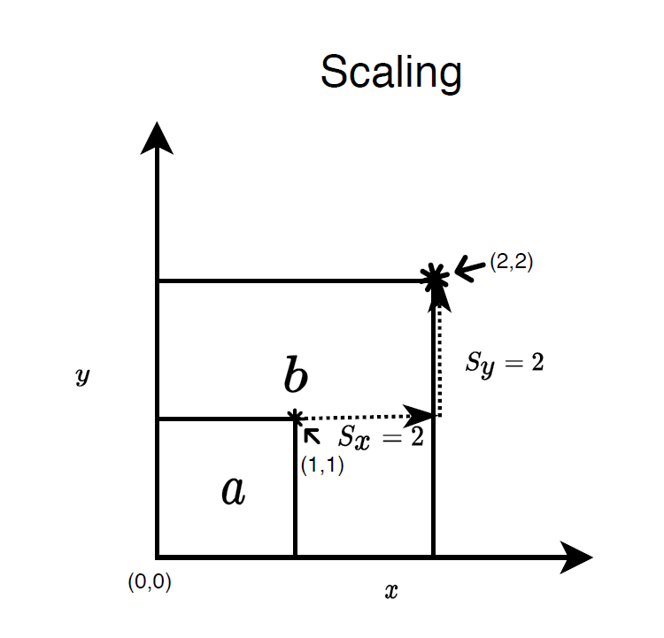
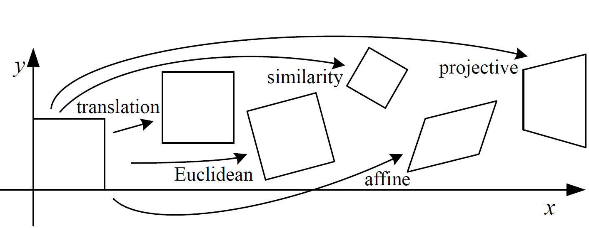
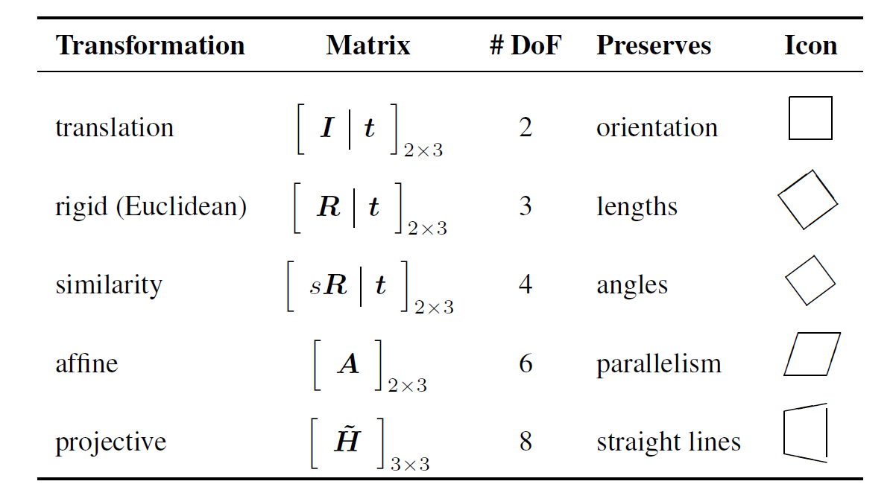
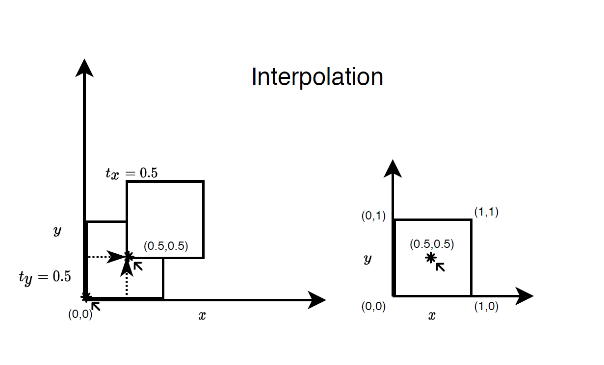
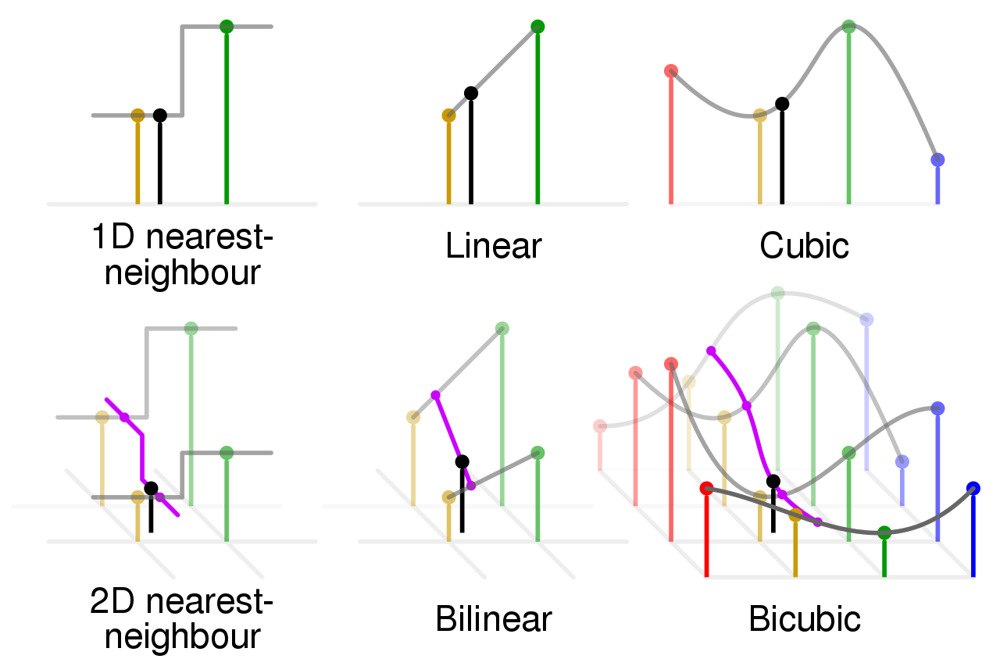
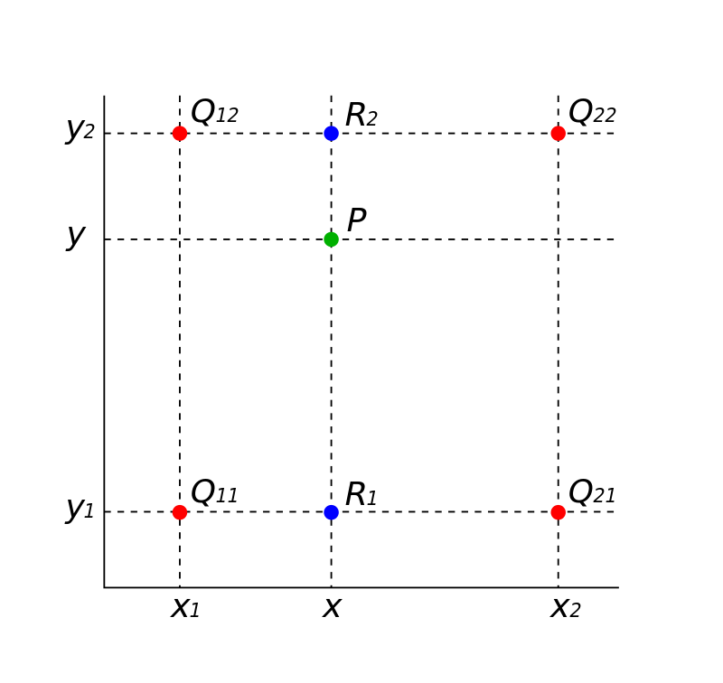

+++
date= 2020-05-18
title = "Image transformation theory"

[extra]
author="Srikrishna Jaganathan"

+++

# Theoretical background

## Image Transformation

### Overview of image transformations

* Translation
* Rigid or Euclidean (Rotation, translation)
* Similarity (Rotation, translation, scaling)
* Affine
* Projective

Consider a point $\mathbf{x}=(x,y)$ in the 2D space. Then
we can define translation, rotation and scaling
using the following equations which maps the points from $\mathbf{x} \to \mathbf{x}'$ where $\mathbf{x}' = (x',y)'$ is the new transformed coordinates.

#### Translation

***

We can define the translation in $x$ and $y$ direction as below

* $x' =  x + t_x$
* $y' =  y + t_y$.

This can also be written in vector notation as follows:

* $\mathbf{x}' = \mathbf{x} + \mathbf{t}$ where  $\mathbf{t} = (t_x, t_y)$

#### Rotation

***
We can define the translation in $x$ and $y$ direction as below

* $x' =  x cos\theta + y sin\theta$
* $y' =  -x sin\theta + y cos\theta$

<!-- This can also be compactly rewritten as a matrix notation

* $\mathbf{x}' = \mathbf{R}\mathbf{x}$
where
$\mathbf{R} = \begin{matrix}
cos\theta & sin\theta \\
-sin\theta & cos\theta\\
\end{matrix}$ -->

#### *Scaling*

***

We can define the translation in $x$ and $y$ direction as below

* $x' =  sx$
* $y' =  sy$.

<!-- In vector notation $\mathbf{X}' = s\mathbf{X}$ -->

*** 
We can also chain the different transformations and compute the transformed coordinate using a single equation

$$x' =  s (x \cos\theta + y \sin\theta ) + t_x$$
$$y' =  s(-x \sin\theta + y \cos\theta) + t_y$$

***

<!-- #### Diving deeper into transformations

***
*Disclaimer!* The following is not required for implementing the tasks but its provided to give an complete overview of 2D image transformations in general. Feel free to skip this and directly go below for the tasks.
***

##### Transformations in matrix notation

We can chain the different transformations if we
represent the transformation in matrix notation as follows

We first write down the equations for rotation, scaling and translation in the combined form for $x,y$ separately

$$x' =  s (x cos\theta + y sin\theta ) + t_x$$
$$y' =  s(-x sin\theta + y cos\theta) + t_y$$

This equations can be rewritten in matrix form if we append an additional one to our points in 2D space like $(x,y) \to (x,y,1)$. This representation of points in 2D space with an $1$ appended as the last value is known as homogeneous coordinates. Now we can combine all the transformations in matrix form:

$$
\begin{matrix}
x' \\
y' \\
1 \\
\end{matrix} =
s
\begin{matrix}
	cos\theta & sin\theta & t_x \\
	-sin\theta & cos\theta & t_y\\
\end{matrix}

\begin{matrix}
	x \\
	y\\
	1 \\
\end{matrix}
$$

$$
\mathbf{\tilde{x}}'= [sR | t ]_{\tiny{2,3}}
\mathbf{\tilde{x}}
$$

The matrix $[sR|t]$ is known as transformation matrix $T$. We can extend the transformation matrix by appending an additional row at the end of the matrix with $[0,0,1]$. Now we have an $3,3$ transformation matrix that allows
us to express all the planar transformations in a compact matrix notation.

The extended transformation matrix for rigid transformation is given below.

$$
\begin{matrix}
x' \\
y' \\
1 \\
\end{matrix} =
s
\begin{matrix}
	cos\theta & sin\theta & t_x \\
	-sin\theta & cos\theta & t_y\\
	0 & 0 & 1 \\
\end{matrix}

\begin{matrix}
	x \\
	y\\
	1 \\
\end{matrix}
$$

$$
\mathbf{\tilde{x}}'= \begin{matrix}
\mathbf{sR} &  \mathbf{t}\\
\mathbf{0} & 1 \\
\end{matrix}
\mathbf{\tilde{x}}
$$

*** -->

#### Illustration of different transformation

[Image Source : Szeliski, Richard. Computer vision: algorithms and applications](http://szeliski.org/Book/) 

[Image Source : Szeliski, Richard. Computer vision: algorithms and applications](http://szeliski.org/Book/) 

For more details about image transformations, you can 
also check out the [computer vision book](http://szeliski.org/Book/) by Richard Szeliski. 
A free pdf is available on the website.

## Image interpolation

Let us consider an example image
transformation. Initially we have an unit square with its left corner placed at the origin (0,0). Assume that we have image intensity values at the
corners of the unit square at a = (0,0), b =(0,1),
c = (1,1), d = (0,1).

We apply a small translation $\mathbf{t} = (0.5,0.5)$ to the square. As you can see in the image, now our left corner point is at $a' = (0.5,0.5)$.
Since we don't have the value at this point we are forced to approximate the value from the information available to us. This is the main
reason for implementing image interpolation function as image transformations can always lead to coordinates for which we don't have any value and we approximate the value using the neighbourhood information.

The way in which we use the neighbouring information governs the quality of the interpolated image. The different types of interpolation are as follows:

* Nearest neighbour
* Bilinear
* Bi-cubic

### Illustration of different types of interpolation 

The image below shows how the different types of interpolation works. The discrete points are the places where we know the function value and
the lines connecting these points represents the interpolated function values.

[Image Source : Wikipedia](https://en.wikipedia.org/wiki/Bilinear_interpolation)

We will implement only bilinear interpolation
for our Image class.
Lets dive a bit deeper into the bilinear
interpolation and look at the how the values are interpolated using this method.

### Bilinear interpolation

[Image Source : Wikipedia](https://en.wikipedia.org/wiki/Bilinear_interpolation)

Consider the above image where the red dots ($Q_{ij}$) indicate the discrete points where we know the function value. We want to approximate the function value at point $P$.

Consider the points(red dots) in the  above image:

$$Q_{11} = (x_1,y_1), Q_{21} = (x_2,y_1)$$

$$ Q_{12} = (x_1,y_2), Q_{22} = (x_2,y_2)$$

Assume that each of these points $Q_{ij}$ corresponds to an image pixel with intensity values.

Now we need to find the image intensity value at point $P= (x,y)$ which is in between the points $Q_{ij}$

Let us consider one coordinate at
a time (i.e. $x_i$ or $y_i$) for interpolation.
Here we intially interpolate along the $x$-axis.
So now our aim is to find values at $P(x,y_i)$.
(i.e. find intermediat values $R_i (x,y_i)$. We have two values of $y_i$ so we can find two intermediate values.)

We can obtain two such values by interpolating along
$Q_{11}, Q_{21}$ and find out the intermediate value as $R_1$ and between $Q_{12}, Q_{22}$ and find out the intermediate value $R_2$.Look at the image of how we just interpolate along the line.

We can directly use the linear interpolation equation to find out the values of $f(R_1)$ and $f(R_2)$

$$ \frac{f(x) - f(x_1)}{x-x_1} = \frac{f(x_2) - f(x_1)}{x_2 - x_1} $$

Once we have the values at $R_1 = (x,y_1)$ and $R_2 = (x,y_2)$ we can again use the same linear interpolation formula along the $y$-axis and find the function value $f(P)$ at $P=(x,y)$.

This way we can interpolate(approximate) any values (x,y) if we know the neighbouring values. However when we actually implement the method we also need to find out the neighbouring values on our own as they are not provided.
