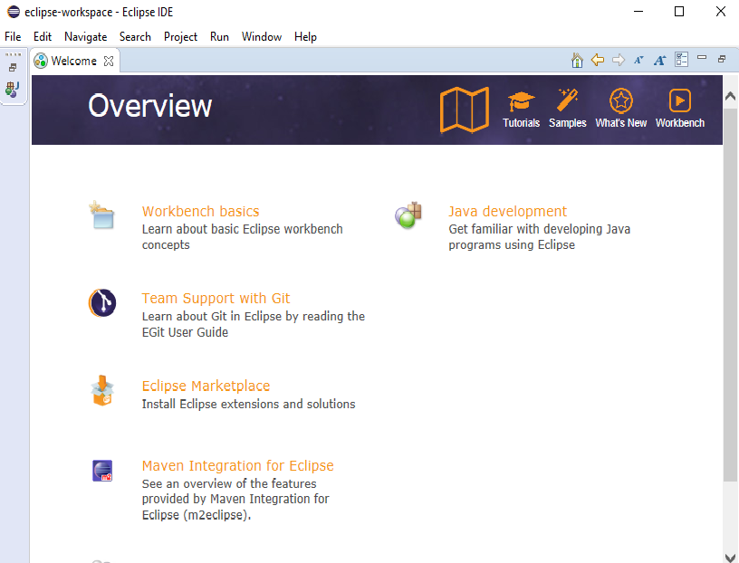
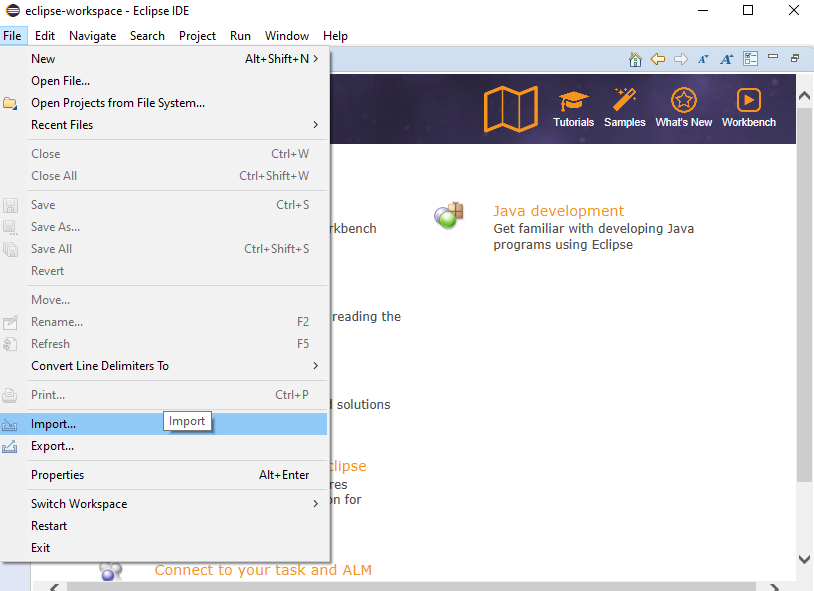
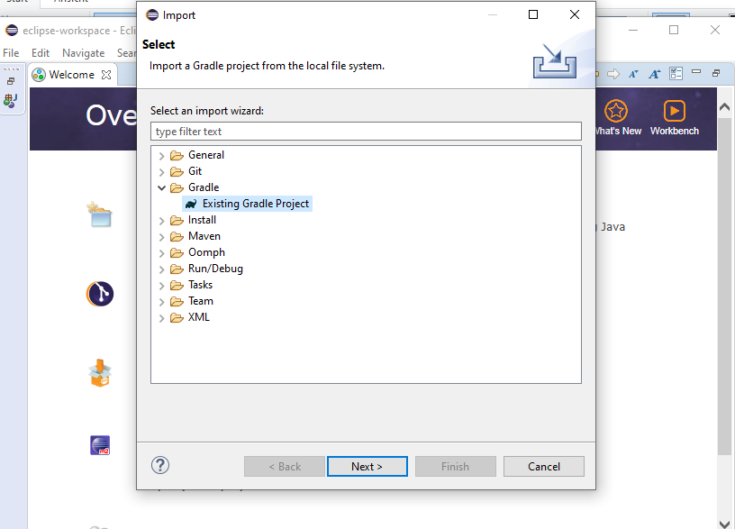
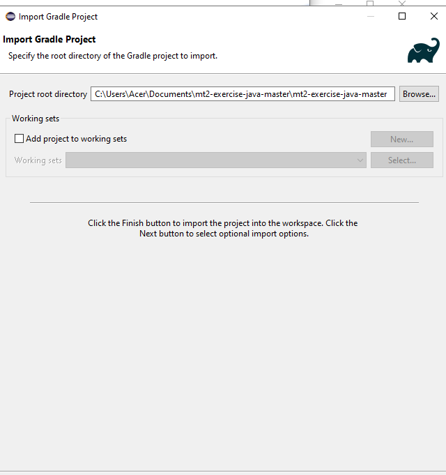
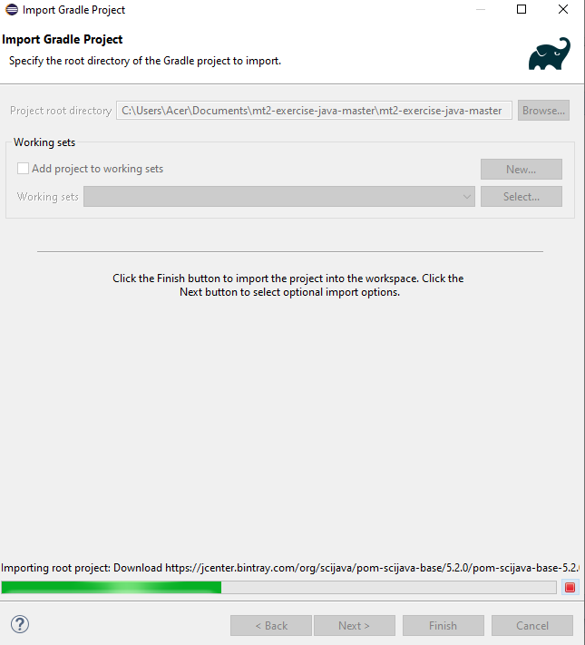
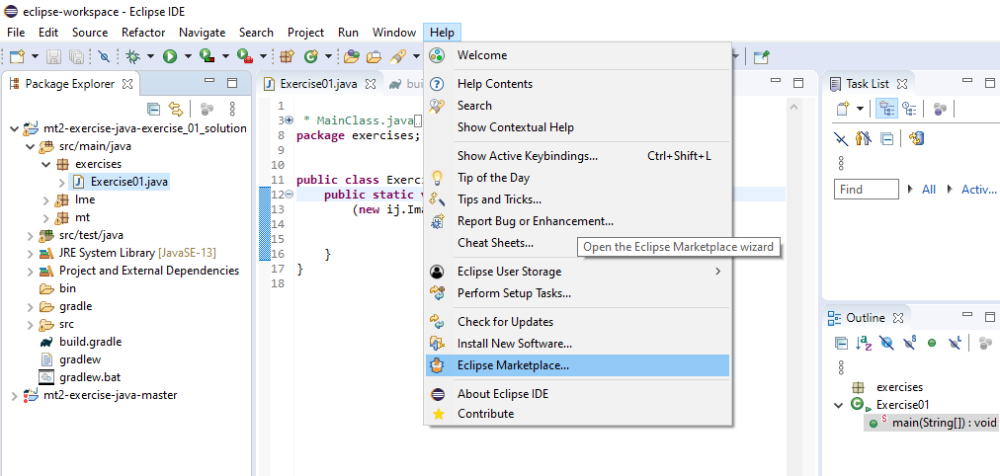
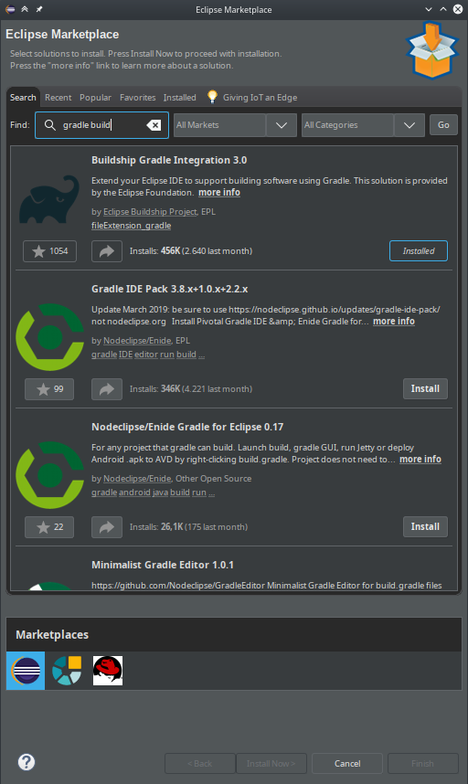
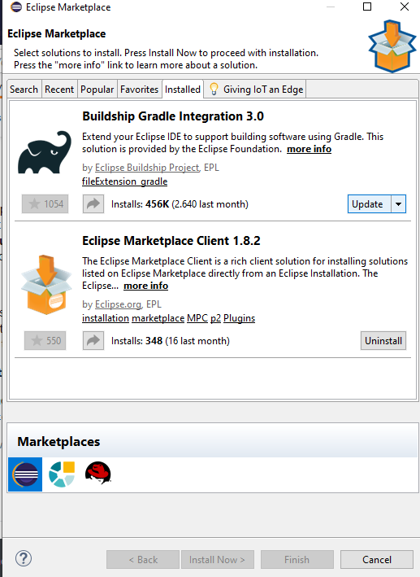
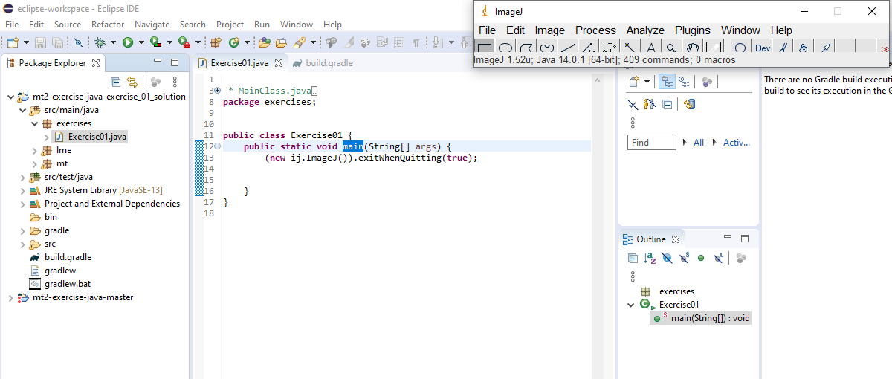

+++
date= 2020-04-21
title = "Import a Gradle project with Eclipse"

[extra]
author="Stephan Seitz"
[page]
page.title="Import with Eclipse"
+++

- On Windows, [download the latest Java version (14.1) from Oracle](https://www.oracle.com/java/technologies/javase-jdk14-downloads.html).
  On Ubuntu Linux, you can install `sudo apt install openjdk-14-jdk`

- Install Eclipse from [https://www.eclipse.org/downloads/](https://www.eclipse.org/downloads/)

- Open Eclipse 

    

- Import...

    

- Existing Gradle Project...

    

- Chose path of the downloaded project and click `Next`

    

- Grab a coffee while it's downloading ImageJ

    

- Try to run Exercise01

    

- You are seeing red squiggles, you found a bug in a Eclipse plugin. Upgrade it in the Eclipse Marketplace! 

    

- Search for `gradle build`! Then, click on the `Installed` button of "Buildship Gradle Integration.

  

- ... and click on `Update`! This should solve the bug after a restart.

  

- You should now see ImageJ when you start Exercise01

  

<!--- Ensure that Eclipse can find your Java Runtime Enviroment-->
  <!--  -->
