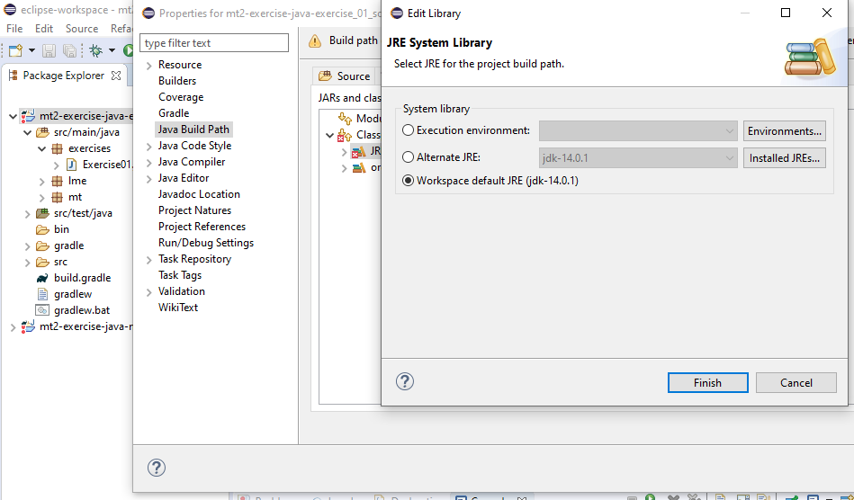

+++
date= 2021-04-06
title = "Import a Gradle project with Eclipse"

[extra]
author="Stephan Seitz"
+++

- On Windows, [download the latest Java version 16 from Oracle](https://www.oracle.com/java/technologies/javase-jdk16-downloads.html).
  On Ubuntu Linux, you can install `sudo apt install openjdk-14-jdk` or `sudo apt install openjdk-11-jdk`.
  At least Java 8 is required. If you have a working installtion from AuD, you can skip this step.

- Install Eclipse from [https://www.eclipse.org/downloads/](https://www.eclipse.org/downloads/)

- Open Eclipse 

    

- Import...

    

- Existing Gradle Project...

    

- Chose path of the downloaded project and click `Next` (it must be the folder that contains `build.gradle`)

    

- Grab a coffee while it's downloading ImageJ

    

- Try to run Exercise00

    

- You are seeing red squiggles, you found a bug in a Eclipse plugin. Upgrade it in the Eclipse Marketplace! 
  *Update: I think this bug is resolved on new Eclipse versions. So you don't have to upgrade "Buildship Gradle Integration" on new versions!*

    

- Search for `gradle build`! Then, click on the `Installed` button of "Buildship Gradle Integration".

  

- ... and click on `Update`! This should solve the bug after a restart.

  

- You should now see ImageJ when you start Exercise01.

  

- If you're still facing problems: please also check whether a valid Java Runtime Enviroment was found by right-clicking on the project folder
  (if it still has red crosses). Select `Properties` -> `Java Build Path`. Sometimes Eclipse does not find your Java
  installation. You can select it there.

  

Still facing problems? Are you sure you imported the folder that contains `build.gradle`.
If you imported a subfolder or a folder that contain the folder that contains `build.gradle`, Eclipse will be very confused
but does not yield an error.

[Back to exercise 00](../exercise-0)
