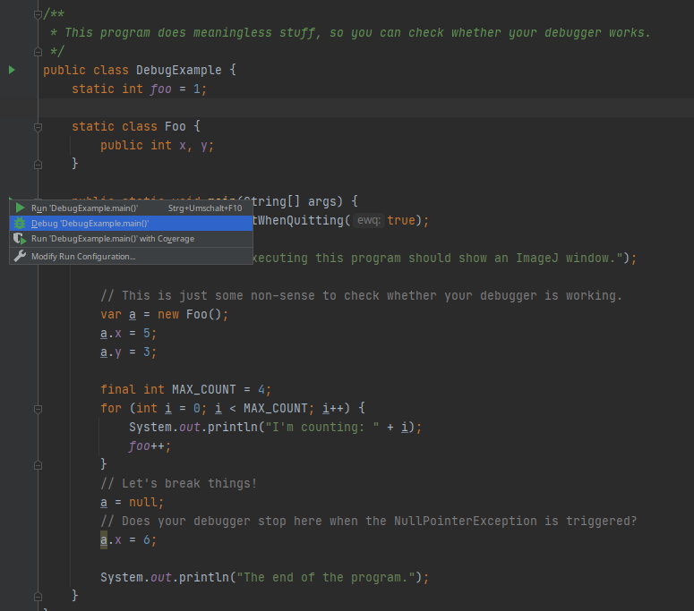
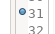
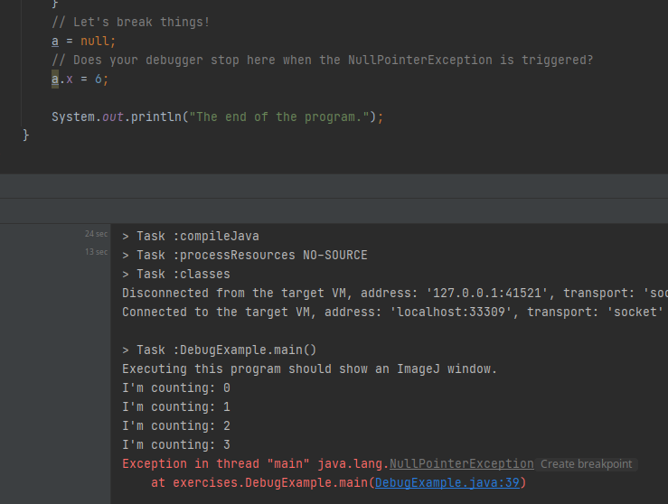
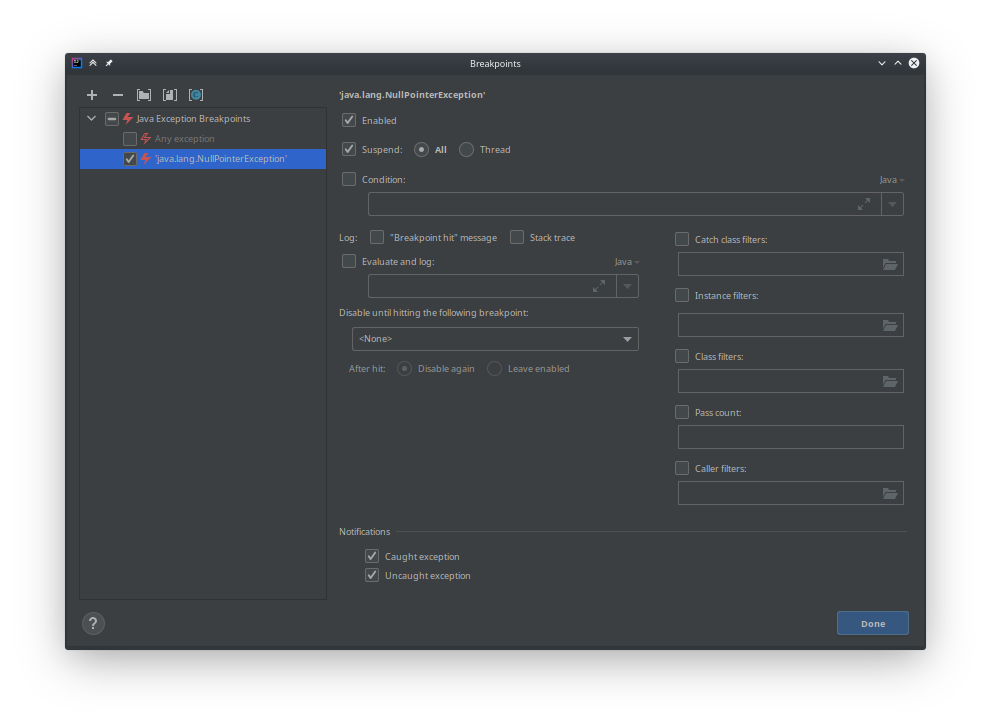
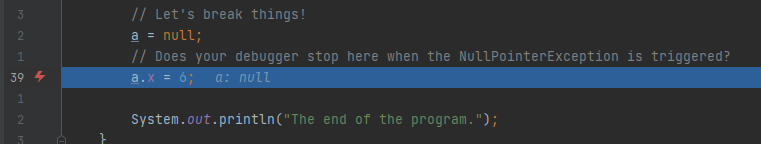
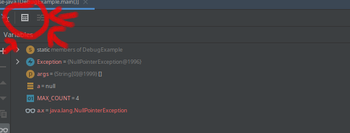

+++
date= 2026-06-23T07:00:00Z
title = "Installation"

[extra]
author= "Sebastian Dietz, Mischa Dombrowski, Stephan Seitz"
+++

# Project Setup

Since you have been working with IntelliJ throughout the semester, you should already have it installed.
If not, refer to the setup guide from the beginning of the semester.

If you encounter any problems, feel free to ask your tutors.

## 1. Download the template

Download or clone the project template from [Github](https://github.com/mt2-erlangen/MT2-Project-MRI.git).

The easiest way is to click **Code → Download ZIP**, unzip it, and place the folder somewhere convenient (e.g. your Desktop).

## 2. Open the project in IntelliJ

Open IntelliJ and go to **File → Open**, then select the folder that contains `build.gradle` — this is the `MT2-Project-MRI` folder itself, **not** any parent folder you may have unzipped it into.

For example, if you unzipped to `~/Desktop/MT2-Project-MRI/`, open `MT2-Project-MRI`. Opening a parent folder is the most common mistake and will cause run configurations and Gradle sync to not work.

IntelliJ will detect it as a Gradle project and show a popup asking to load the Gradle project — click **Load** (or **Trust Project** if prompted).

## 3. Wait for Gradle to sync

IntelliJ will now download all required libraries automatically (this may take a minute on first run). You can watch the progress in the bottom status bar.

If IntelliJ does not sync automatically, click the **Gradle elephant icon** in the top-right toolbar and hit the refresh button.

## 4. Select the JDK

Navigate to **File → Project Structure → Project** and make sure the SDK is set to **Java 17** (or whichever version you used for the exercises).

## 5. Run the project

The run configuration **"Project"** is already included in the template. You will see it in the top-right dropdown next to the green run button. Simply select **Project** and click the green arrow.

**If "Project" does not appear in the dropdown**, one of the following is likely the cause:

- **Gradle has not finished syncing yet** — wait for the progress bar at the bottom of IntelliJ to finish, then check again.
- **The module is not recognised** — go to **File → Project Structure → Modules** and check that a module named `MT2-Project-MRI.main` is listed. If not, try **File → Invalidate Caches → Invalidate and Restart**, then wait for Gradle to re-sync.
- **The IDE has not updated** - Create a dummy configuration. Afterwards the Configuration `Project` should appear. 

As a fallback, you can always run the project manually: navigate to `src/main/java/project/Project.java` in the file tree, right-click it, and select **Run 'Project.main()'**.

This will open the **ImageJ** window. At this point you will see an error in the console — that is expected! It means the template is set up correctly and you are ready to start implementing.

## General Info

### What is included in the template?

The template contains the following:

- `src/main/java/project/` — the files you need to implement:
  - `ComplexImage.java` — Tasks 2 & 4
  - `ComplexSignal.java` — Task 3
  - `LinearComplexImageFilter.java` — Task 4
  - `SincFilter2d.java` — Task 4
  - `MaxPooling2d.java` — Task 4
  - `Project.java` — the main entry point (do not modify)
  - `ProjectHelpers.java` — FFT and file I/O utilities (provided, do not modify)
- `src/main/java/mt/` — base classes from the exercises (provided)
  - `Image.java` — you need to add `setBufferFromCenterArea()` here (Task 4)
- `kdata_knee.h5` / `kdata_brain.h5` — MRI k-space data files

### ImageJ

ImageJ is the image display library used in this project. It opens automatically when you run `Project.java`. All results are displayed as ImageJ windows — you do not need to install anything separately.

### Debugging

<i>Everything here should just be a recap of what you know about debugging from the exercises. Feel free to skip if you know how debugging works!</i>

To do the project during this semester, you will often need to use the debug mode to find errors in your code.
Please always try to debug an issue first before you ask a tutor for help!

To debug an application just click on the bug symbol!

Also set some breakpoints (where the program should stop) by clicking on the space left to the line numbers.

<figure>

<figcaption><i>A Breakpoint. The program will stop here in debug mode.</i></figcaption>
</figure>

You should also know how to make the debugger stop on an exception (to see what's wrong when the program is crashing).
When you run it, you should see a crash:

IntelliJ suggests to create a break point. Click `Create breakpoint`!

Confirm with `Done`.

When you run the program again in debug mode it will stop at the line where the error happened.
This will help you to find out what is wrong at that point.

Very useful is also the calculator symbol, that lets you evaluate expressions.
If you don't know what is wrong in a line, you can use it to determine the value of `a` or `a.x` to find out which one is `null`.

Now you should be well prepared for the project!
