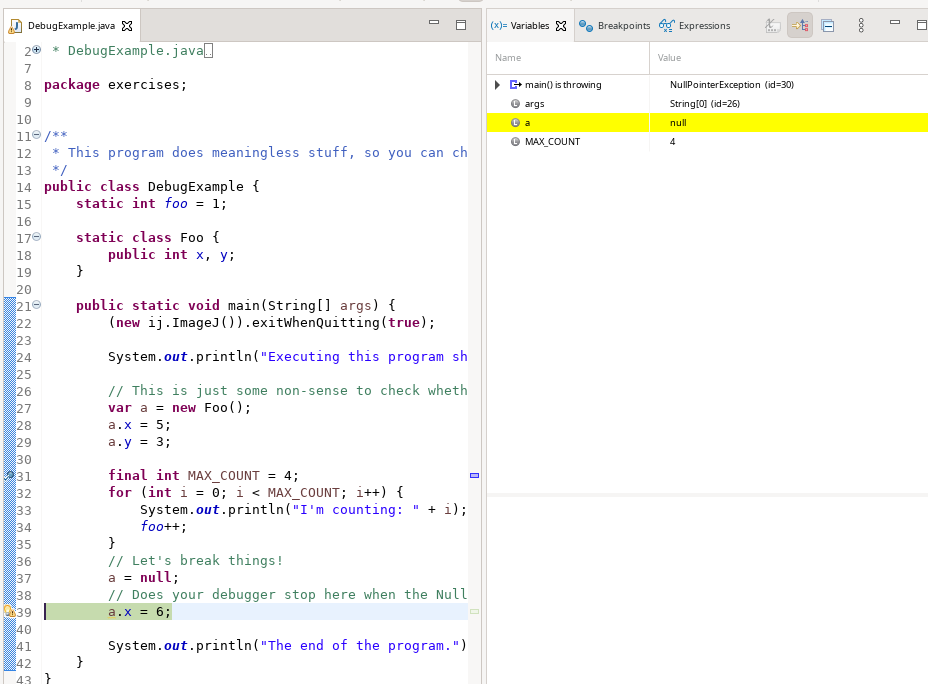

+++
date= 2024-06-23T07:00:00Z
title = "Installation"

[extra]
author= "Sebastian Dietz, Mischa Dombrowski, Stephan Seitz"
+++

# Project Setup:

Since you have been working with IntelliJ throughout the entire semester when working on your exercises, you should already have it installed on the device you intend to use. 
If not, have a look at the setup-guide you were given at the beginning of the Semester and install it accordingly.

The setup for this project will work very similar to the setup for your exercises.

If you encounter any problems while setting up, feel free to ask your tutors. 

To do: 

1. Download the project template from [Github](https://github.com/mt2-erlangen/MT2-project-ImageProcessing). 
 

2. Unpack the zip-file and be sure to select the file-destination such that it is not unpacked "into its own folder" (meaning that there would be a `MT2-project-ImageProcessing`-folder within the `MT2-project-ImageProcessing`-folder) as might be the case by default.
  

3. Open IntelliJ and click  **(File) &rarr; Open &rarr; MT2-project-ImageProcessing**

   and hit `ok` to open the empty project template. 

    Make sure to select the entire `MT2-project-ImageProcessing`-folder and not one of the folders contained within. 
 

4. Navigate to **File &rarr; Project Structure &rarr; Project** and select jbr-17 or 17 or a similar SDK. 
 The SDK that works for you may vary depending on your device and the IntelliJ version you are using. If you have been working on your exercises, simply use the one that worked for you when setting up initially. 
  

5.  Navigate to **File → Project Structure → Modules → Paths**.
 Check, that **Use module compile output path** is selected and that the
 **plugins**-folder contained in the is selected as the destination. If this is set
 incorrectly, simply use the folder-icon towards the right of the path to navigate to
 this folder and select it.
  

6.  In the same window select **Libraries** and make sure that **ij** is listed.
 If it is missing, add it by hitting **+ → Java** and selecting the ij.jar file that is contained within your project.

7. After concluding these steps, your project structure should look something like this:   
 

   

    
    You should now be able to build your project without any errors. 
    
 

8. You can now right-click on the `ij.jar`-file in your project structure and select ``Run 'ij.jar'``. This should open the ImageJ interface. Check the `Plugins`-dropdown-menu. It should look like this: 
     

    

Similar to the intitial exercise-setup, you should be able to run the included ``Setup_Test``- Plugin and the message should pop up. 

Once you are done with this and everything is working nicely, you can get started with working on your first task. 

## General Info:

### ImageJ

The image processing program we want to use during this semester is called ImageJ.
It was developed at the US National Institutes of Health and is used nowadays especially in research
for medical and biological images.

If you want to, you can download a stand-alone version of the program [here](https://fiji.sc/).
This is not necessary for the exercises.

### Debugging

<i>Everything here should just be a recap of what you know about debugging from the exercises. Feel free to skip if you know how debugging works!</i>

To do the project during this semester, you will often need to use the debug mode to find errors in your code.
Please make sure that you know how to run your program in debug mode, since you might not have seen it before (Shame on you AuD!).
Please always try to debug an issue first before you ask a tutor for help!

To debug an application just click on the bug symbol! You can try this with file `src/main/java/exercises/DebugExample.java`.
</td>

</td>

Also set some breakpoints (where the program should stop) by clicking on the space left to the line numbers.

<figure>
</td>
<figcaption><i>A Breakpoint. The program will stop here in debug mode.</i></figcaption>
</figure>

You should also know how to make the debugger stop on an exception (to see what's wrong when the program is crashing).
There is a bug in program! When you run it, you should see a crash:

IntelliJ suggests to create a break point. Click `Create breakpoint`!

Confirm with `Done`.

When you run the program again in debug mode it will stop at the line where the error happened.
This will help you to find out what is wrong at that point.

Also Eclispe will stop automatically and indicate what the problem is (if it doesn't please upgrade to the newest version of Eclispe):

Very useful is also the calculator symbol, that let's you evaluate expressions.
If you don't know, what is wrong in a line, you can tell the calculator to the termine the value of `a` or `a.x` to determine which one
is `null` (or of `very.complicated.expression[2]` when things get more complicated and a variable is not shown in the list below).

In Eclipse, the calculator are a pair of glasses (make sure you are in debug perspective, menu: `Window > Perspective > Open Perspective > Debug`).

Now you should be well prepared for the project!
