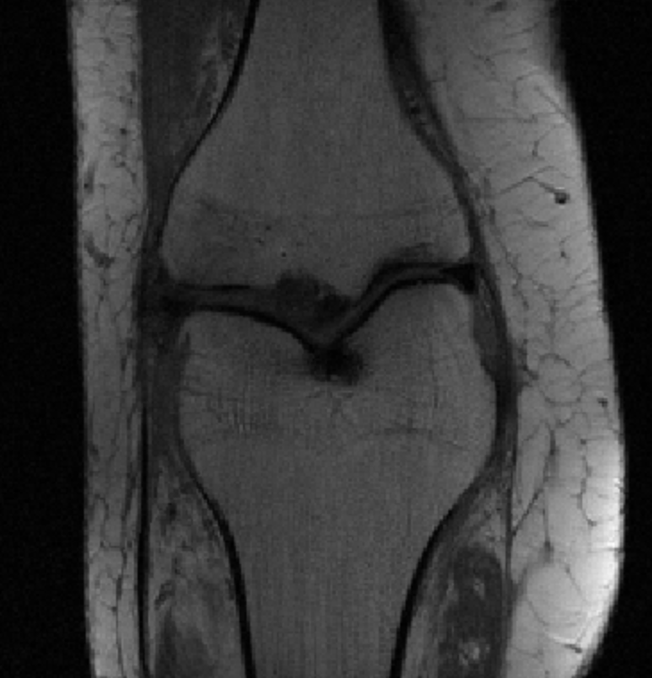

+++
date= 2022-06-20T08:00:00Z
title = "Project Work 1 - Introduction"
[extra]
author= "Bruno Riemenschneider, Zhengguo Tan, Jinho Kim"
+++

# Overview

1) Introduction *(Tafelübung 24. Juni)*
2) [*k*-Space](../kspace)
3) [Image Reconstruction](../fftshift) *(Tafelübung 08. Juli)*
4) [Filters](../filters) *(Tafelübung 15. Juli)*
5) [Outlook and Conclusion](../conclusion)

# 0. Disclaimer
During the winter term we don't offer in person blackboard exercises.
All the illustrations are done using an mri scan of a brain, however, you are required to do reimplement the project using a scan of a knee:

<table><tr>
<td>  </td>
</tr></table>

For the report we prepared a **new template** that you should use. It provides a more detailed structure for the report. Don't change the order.

# 1. Introduction

In this semester's project work, you will learn some basic concepts of magnetic resonance imaging (MRI). The MRI scanner acquires data in the spatial frequency domain, known as *k*-space. MR image reconstruction requires the (inverse) Fourier transform of the acquired *k*-space data.

Your first task is to write an introduction, which should include:

* What are the **advantages and disadvantages of MRI** compared to other imaging modalities, like computer tomography (CT)? e.g. Does MRI require ionizing radiation? Does MRI provide better soft-tissue contrast? Is the acquisition speed of MRI as fast as CT? If not, why?
* **What is MRI?**  Why is a strong magnetic field needed? What does the word "resonance" in MRI mean? Why is an antenna (receiver coil) needed? From a signal processing point of view, what is the relationship between the data acquired from an MRI machine and MR images?
* Give a **brief overview** of the contents of the following tasks.

Use **references** when necessary. Try to cite scientific publications (e.g. journal papers) in your introduction.
Your introduction and conclusion should not contain any images.

Please have a look at our [project report guidelines](../checklist).
<!--Whenever we refer to the maximum length of a section we're not counting figures and tables and just consider the length-->
<!--of the text.-->

We also provide you with a basic [java template](https://github.com/mt2-erlangen/project-ss2022) including some useful helper functions, similar to what you saw during the exercises. You have to use this template as the starting point of your project.

[Next task: *k*-Space](../kspace)
