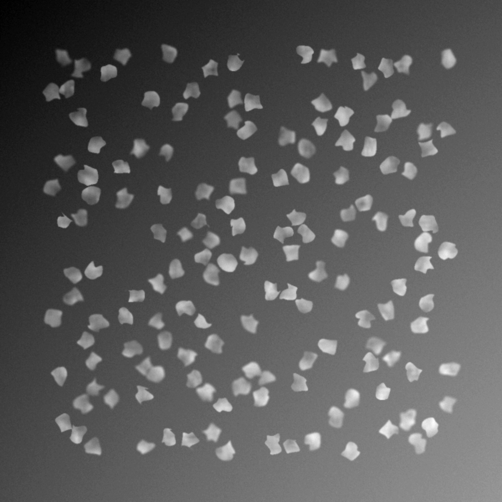

+++
date= 2025-06-24T05:00:00Z
title = "Project Work 0 - Introduction"
[extra]
author= "Mischa Dombrowski, Sebastian Dietz, Zhengguo Tan, Jinho Kim"
+++

# Overview

0) [Introduction](../introduction)
1) [Thresholding](../thresholding)
2) [Segmentation](../segmentation)
3) [Otsu's Method](../otsu)
4) [Edge Detection](../edgedetection) 
5) [Canny Edge](../cannyedge) 
6) [Outlook and Conclusion](../conclusion)

# Disclaimer

This is a short introduction with general information and best practices, as well as guidelines for your project-report. We highly suggest you __read through the entirety of this Introduction__ in order to get a detailed impression of the project-work ahead of you. We have also prepared a video with all the necessary information about the report. 

You have been provided with a basic [java template](https://github.com/mt2-erlangen/project_ss2024) containing a fully set up project, as well as the empty task-classes you will be working with.

For information on the **initial Setup**, have a look at our [getting started guide](../installation).

Furthermore, you have been provided a [**latex-template**](https://github.com/mt2-erlangen/LaTeX-template-2025) as a starting point for your report. 
It already defines the structure your report should have, so please **do not change the order of the report-sections**. 

In cases where the images to expect after completing a task were given in the exercise, you should obviously **only use images you generated with your own code in your report**

If you are working on CIP machines, you may run into quota issues. You can fix these issues with this short [guide](../quota).

Please also note, that you can connect remotely to CIP machines using a [remote SSH connection](https://wwwcip.informatik.uni-erlangen.de/documentation/services.de.html)

## Introduction:

This project aims to introduce you to some fundamental image-processing-techniques which find application in a large variety of fields. 
Since you are studying to become biomedical engineers, you will mainly be working with an image of cells, as a simple example of images you might encounter over the course of your scientific career.

The techniques you will be working with are the following: 

+ Basic Thresholding / image-segmentation
+ Evaluation of your segmentation
+ Otsu-Segmentation
+ Primitive edge-detection
+ Canny edge-detection
  
By the end of this project, you will have built a set of __ImageJ-Plugins__ that are capable of performing all of these operations. In addition to that, you will be documenting your progress and results in the form of a __written Project-Report__. 
This is why at the end of every task you will find a number of bullet-points detailing which topics you should include in your report. 

The coding section of your project will be written in Java using __IntelliJ__ as the editor of choice. You should already be familiar with coding in IntelliJ from lectures like AuD-MT as well as from your MT2 computer-exercises.

Your written project report will be written in LaTeX using the online editor __Overleaf__. 

## General Information

The project report, as well as the coding, are individual work. As such, you need to submit them individually. Also, do not use any built-in methods that we do not specifically allow.
Note: we'll check for plagiarism.

## Report Guidelines

The project report can be written in either English or German. Please write between 4 and 7 pages of text, not counting the images.

We expect you to:

- Use the **LaTeX template** we provide
  - [LaTeX template link](https://github.com/mt2-erlangen/LaTeX-template-2024)
  - Do not modify the style or the formatting. No ornaments for page numbers!
  - The template defines the overall structure of your project. You have to fill in all the gaps.
  - Do not change the order of the sections in our template.
  - Do not change the titles of sections or subsections.
  - Do not change the order of the figures in the project. You can optionally add new figures to the report.
  - We will only count answers that appear in the correct subsection of the report. If you want to avoid repeating yourself, use `\label{}` and `\ref{}`.
  - The template contains examples for all commands necessary for the report. It is allowed to import and use other packages if desired. 

- Use **scientific references** in your explanations to clearly separate your work from the work of others:
  - Use the **bibliography** (see template `Bib/bibliography.tex`) and keep the citation style provided in the template.
      The bibliography must be sorted (either alphabetically when using the Name/Year citation style or
      by the order you use them in the text when numbering the sources).
  - Do not use more than two references that are websites only. 

- All **symbols in equations** need to be **explained** in the text.
- All **equations, figures and tables**, if applicable, have to be **numbered and referenced** in the text.
  - All your figures should look professional.
  They should not be blurry or hand-drawn and images should not have a window border of ImageJ.
  They should not overlap with the text.
  - All figures need to have **captions** giving a brief description what the figure shows. The caption should be below the figure.
  - Label all axes in all plots and coordinate systems!
  - A list of figures is not needed.
  - Replace the images in the report template with images from your own implementation applied to knee data.

- **Do not use abbreviations without introducing them**. E.g., the first time you should write "Magnetic Resonance Imaging (MRI)".
After that, "MRI" is enough.
- Just like in storytelling, connect the context of the project report, so everyone can see the flow.
- Do not use footnotes!
- Check your spelling: there shouldn't be any obvious spelling errors that can be detected by a spell checker.

To obtain all the points for the content of your report, additional to the above

- Check whether you have addressed all the questions in the task description.
- Check whether you have provided all the result figures and a detailed explanation of them.

### Guidelines for the Use of Writing Assistants

We welcome students to use writing assistants to enhance the quality of the written report. However, we would like to point out that
students are responsible for the correctness of the content, and that **scientific references** are mandatory to verify all the claims made in the report.

If you decide to use any writing assistant, we ask you to **add the tool to the list of references**.
The use of spell-checking and translation software is encouraged and can be done without adding them to the list of references.    

[Next](../thresholding)
