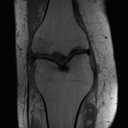

+++
date= 2026-06-12T08:00:00Z
title = "Project Work 1 - Introduction"
[extra]
author= "Mischa Dombrowski, Zhengguo Tan, Jinho Kim"
+++

# Overview

1) Introduction
2) [*k*-Space](../kspace)
3) [Image Reconstruction](../fftshift)
4) [Filters](../filters)
5) [Outlook and Conclusion](../conclusion)

# 0. Disclaimer
All the illustrations are done using an mri scan of a brain, however, you are required to reimplement the project using a scan of a knee:

<table><tr>
<td>  </td>
</tr></table>

The data is part of the Java template `kdata_knee.h5`. Please replace the figures in the report with results from your own implementation.
For general information and best practices have a look at our [project report guidelines](../checklist).

We also provide you with a basic [java template](https://github.com/mt2-erlangen/MT2-Project-MRI) including some useful helper functions, similar to what you saw during the exercises. You have to use this template as the starting point of your project. For more information on the **installation** have a look at our [getting started guide](../installation).

Furthermore, we provide a [**latex-template**](https://github.com/mt2-erlangen/LaTeX-template-2025) that you should use. It gives a more detailed structure for the report. Don't change the order and replace all images with images generated from your own implementation.

In case you are working on CIP machines you may run into quota issues due to large packages loaded by gradle. You can fix these issues with our [guide](../quota).

Please also note that you can connect remotely to CIP machines using a [remote SSH connection](https://wwwcip.informatik.uni-erlangen.de/documentation/services.de.html)

<strong>⚠ Warning: Exact Naming Is Required</strong>  
All class names, method names, field names, and parameter names must match the specifications on this website <em>exactly</em> — including capitalization and spelling. Any deviation will result in point deductions.  
To avoid typos, <strong>copy names directly from the website</strong> rather than typing them by hand.  
Additionally, <strong>do not modify any code we provide</strong>. This includes the provided class skeletons, import statements, and class names. Only add your own implementation inside the designated areas.

# 1. Introduction

In this semester's project work, you will learn some basic concepts of magnetic resonance imaging (MRI). The MRI scanner acquires data in the spatial frequency domain, known as *k*-space. MR image reconstruction requires the (inverse) Fourier transform of the acquired *k*-space data.

Your first task is to write an introduction, which should include:

* **What is MRI?**  Motivation an purpose of MRI.
* **Image acquisition**:  Why is a strong magnetic field needed? What does the word "resonance" in MRI mean? Why is an antenna (receiver coil) needed? From a signal processing point of view, what is the relationship between the data acquired from an MRI machine and MR images?
* What are the **advantages and disadvantages of MRI** compared to other imaging modalities, like computer tomography (CT)? e.g. Does MRI require ionizing radiation? Does MRI provide better soft-tissue contrast? Is the acquisition speed of MRI as fast as CT? If not, why?
* Give a **brief overview** of the contents of the following tasks.

Use **references** when necessary. Try to cite scientific publications (e.g. journal papers) in your introduction.
Your introduction and conclusion should not contain any images.

[Next task: *k*-Space](../kspace)
