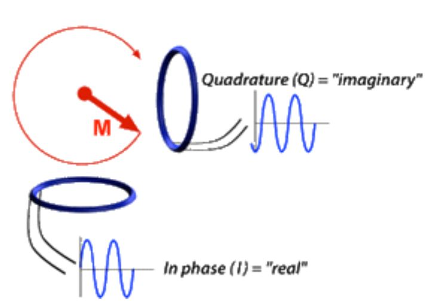
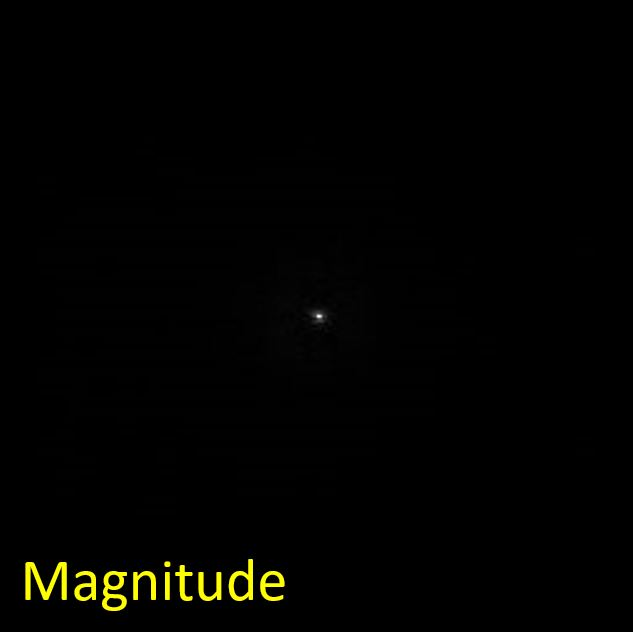
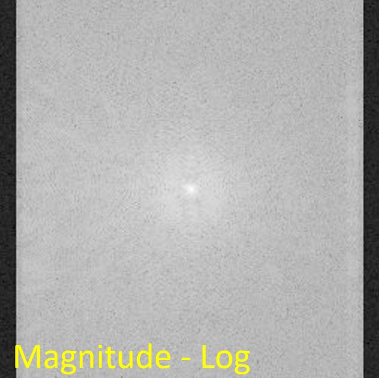
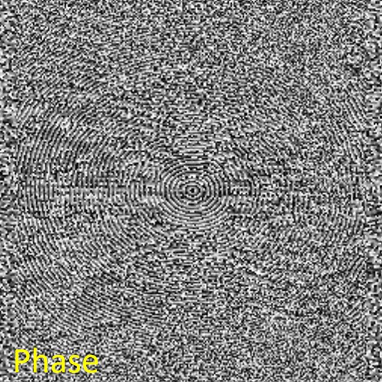

+++
date= 2022-06-20T08:00:10Z
title = "Project Work 2 - k-Space"
[extra]
author= "Zhengguo Tan, Jinho Kim, Bruno Riemenschneider"
+++

# Overview

1) [Introduction](../introduction) *(Tafelübung 24. Juni)*
2) *k*-Space
3) [Image Reconstruction](../fftshift) *(Tafelübung 08. Juli)*
4) [Filters](../filters) *(Tafelübung 15. Juli)*
5) [Outlook and Conclusion](../conclusion)

# 2. Complex Numbers and *k*-Space

Measured MRI signals are essentially radiofrequency waves summed over the imaged volume. Due to the nature of these waves
and the underlying spin precession, the most convenient way of the mathematical formulation is the framework of complex numbers.
Complex numbers are very well suited to describe the magnitude and phase of an oscillation/precession.

In this section, you will load a measured and provided MRI $k$-space into an array, using a provided function, and save it in an instance of a class for complex images, written by you. This class also provides calculation of magnitude and phase of the complex images from its real and imaginary parts.

## 2.1 Complex Numbers

### 2.1.1 A Single Complex Number by Itself

<p align="center">
  
</p>
<p align="center">
  <b>Figure 2.1.</b> A complex number can be visually represented as a pair of numbers (a, b) forming a vector
 in the so-called complex plane. <i>Re</i> stands for the real part, shown on the horizontal axis,
 <i>Im</i> stands for the imaginary part, shown on the vertical axis, and <i>i</i> is the "imaginary unit". (reference: <a href="https://en.wikipedia.org/wiki/Complex_number">complex numbers on wiki</a>)
</p>

As illustrated in Figure 2.1, a complex number $z$ is defined as,

$$ z = a + i \cdot b $$

Here, both $a$ and $b$ are real numbers. $i$ is the "imaginary unit", which is multiplied with the imaginary part of the complex
number to denote the "2<sup>nd</sup> dimension" of the complex number. (Side note: For mathematical convenience of this powerful number framework,
it satisfies $i^2 = -1$.) Likewise, you can think
of the "real unit" as being $1$. One can also denote the complex number $z$ as an ordered pair,

$$ z = (\mathrm{Re}(z), \mathrm{Im}(z)) $$

where its real and imaginary part is $\mathrm{Re}(z) = a$ and $\mathrm{Im}(z) = b$, respectively. Noteworthy, the "
vector" representation of $z$ in Figure 2.1 can be characterized by

1. its length, i.e. the absolute value (or **magnitude**), $$ r = |z| = \sqrt{a^2 + b^2} $$

2. its argument (or angle or **phase**), $$\varphi = \mathrm{atan2}({b},{a})$$

Therefore, one can write the complex number $z$ in a different form,

$$ z = |z| \cdot e^{i\varphi} $$

### 2.1.2 The Relation to MR Images

At every location of the object that is imaged in the MR scanner, the signal that is measured is produced by precessing
(rotating) spins. Complex numbers are very well suited to capture the state of a precessing volume of spins by describing the magnitude and phase of the precession.
The precessing spins create a precessing magnetization that results in radiofrequency radiation and can
be measured with radiofrequency coils.
<p align="center">
  
</p>
<p align="center">
  <b>Figure 2.2.</b> The precessing magnetization M that produces the MR signal is detected from two orthogonal directions,
then demodulated using the multiplication of sinusoid or cosinusoid signals. They can be detected from two orthogonal
directions to fully capture the signal rotation. In reality, only one coil can be used and demodulated to capture the
rotation. (Reference: <a href="https://mriquestions.com/real-v-imaginary.html">Real vs. Imaginary Signals</a>)
</p>

In consequence, the MR image can be described by complex numbers, i.e., a 2D plane of complex numbers. After digitization,
we can then treat MR images as 2D arrays of complex numbers, i.e., every element of the array is a complex number.

### 2.1.3 MR Signals Are Measured in $k$-Space

As shown in Section 2.1.2, MR signals are generated by precession of magnetization. In the context of the measurement
process, this happens after a radiofrequency pulse excitation of the measured volume, which causes the magnetization
to precess.

As covered in the lecture, the sum of the total magnetization of the excited spins that are apparent in the measured volume
is what matters for the measured signal. The magic of MRI is that it can be manipulated by external magnet field gradients
in such a way that the resulting signal is a Fourier transform of the image to be measured. (Making MRI feasible by using
this method is a Nobel price idea!)

The Fourier transform of an image (space) represents the spatial frequencies and is usually called $k$-space.
As such, the result of the MR measurement process and subsequent demodulation is an array storing complex $k$-space values
(also known as spatial frequencies of the MR images).
To reconstruct the MR images, the (inverse) *Fourier transform* is used to transform the signal from the frequency domain to the
spatial domain. In other words, $k$-space is an intermediate step between MR scan and reconstructed image.

(Not mandatory: If you are interested in the Fourier transform, we encourage you to look at this page: [Discrete Fourier Transform](../dft).)

## 2.2 The ComplexImage Class

In order to deal with 2D arrays of complex numbers in this project, we need to implement a new class, ```ComplexImage```,
in ```complexImage.java```. For the sake of consistency and efficiency, we will utilize the code base of exercises 1-4.
Consequently, we will implement the real part and the imaginary part of our complex image each into an ```Image``` object.

```java
package project;

import mt.Image;

public class ComplexImage {
    protected mt.Image real;    //Image object to store real part
    protected mt.Image imag;    //Image object to store imaginary part
    protected String name;      //Name of the image
    protected int width;       
    protected int height;
}
```

Create constructors and getters. Remember: class objects, ```real```, ```imag```, and ```name```, and class variables, ```width``` and ```height```,  must be set in the constructor. Since ```Image``` class contains two types of constructors, there will be two types of constructors in ```complexImage``` class as well.
```java
public ComplexImage(int width, int height, String name)
public ComplexImage(int width, int height, String name, float[] bufferReal, float[] bufferImag)

public int getWidth()
public int getHeight()
public String getName()
```

For the project, $k$-space data is provided in the *HDF5* format. You can read $k$-space data using ```LoadKSpace()```
method in the given class ```ProjectHelpers.java```

```java
ComplexImage kSpace = ProjectHelpers.LoadKSpace("kdata.h5");
```
## 2.3 Images of Magnitude and Phase of Complex Arrays

We learned in Section 2.1 that both MR images and their spatial frequencies, i.e., $k$-space, are complex images, and made up of and usually stored as real and imaginary parts. Also, that complex numbers can be characterized by their *magnitude* and *phase*.\
One very important aspect of MRI images is the following: while both real and imaginary parts, or both magnitude and phase,
are needed to compute the image, the diagnostic information for the radiologist is mostly just visible in the magnitude image.\
Therefore, let's implement methods to compute magnitude and phase images from real and imaginary parts.

Implement two methods ```calculateMagnitude()``` and ```calculatePhase()``` as methods of the ```ComplexImage``` class
for calculating magnitude and phase, respectively. Refer to the related equations above in subsection 2.1.1.
```java
private Image calculateMagnitude(ComplexImage input, boolean logFlag)
private Image calculatePhase(ComplexImage input)
```

We are implementing a *logFlag* in the ```calculateMagnitude()``` method because the magnitude of $k$-space has a huge
image intensity range between the center (low-frequency part, very large) and the periphery (high-frequency part, very small).
As a result, taking a logarithm of the magnitude of $k$-space can reduce the huge image intensity range for better
visualization of the magnitude of $k$-space.\
Once we compute the magnitude and phase, we get them by getters.
```java
public float[] getMagnitude()
public float[] getLogMagnitude()
public float[] getPhase()
```

Eventually, You can show the magnitude and phase images using the given method ```DisplayUtils.showImage()```. Please use this method in the ```Project.java```


 <p style="text-align: center;">
<table><tr>
<td>  </td>
<td>  </td>
</tr></table>
 <p>

<p align="center">
  <b>Figure 2.3.</b> Magnitude images of <i>k</i>-space without (left) and with (right) logarithmic scale. The left figure shows only one small dot in the middle due to a huge image intensity range, while the right figure displays a better image intensity range.
</p>

<p align="center">
  

<p align="center">
  <b>Figure 2.4.</b> A phase image of <i>k</i>-space.
</p>

In the project report, you should

* Show the real and imaginary parts of the $k$-space
* Show the magnitude and phase images of the $k$-space
* Explain what those mean. Can you elaborate on why the phase does not show the same intensity variation as the magnitude?


[Next task: Image Reconstruction](../fftshift)