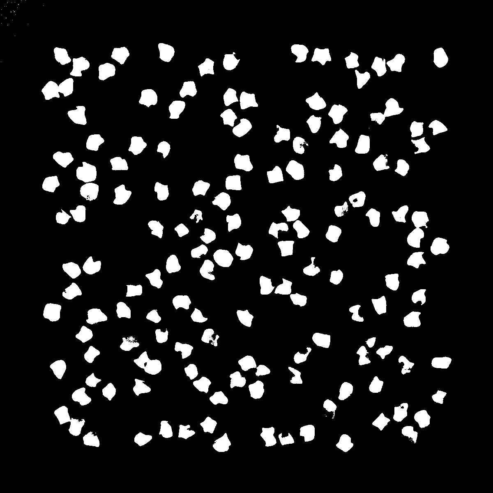

+++
date= 2024-06-24T10:00:00Z
title = "Project Work 3 - Otsu"
[extra]
author= "Sebastian Dietz, Mischa Dombrowski"
+++

# Overview

0) [Introduction](../introduction)
1) [Thresholding](../thresholding)
2) [Segmentation](../segmentation)
3) [Otsu's Method](../otsu)
4) [Edge Detection](../edgedetection) 
5) [Canny Edge](../cannyedge) 
6) [Outlook and Conclusion](../conclusion)


# 3: Otsu's Method

Otsu's method is a commonly used algorithm to compute the ideal threshold-value for image-segmentation. It is used in cases where the image-histogram is bimodal (meaning it contains two distinct peaks) to find the ideal "middle ground". 

We highly recommmend that you have a look at the [original publication](https://ieeexplore.ieee.org/document/4310076) from 1975 regarding the algorithm (Access should be granted if you try to access it using the university internet).


---
## 3.1: Theory

Otsu's method works by maximizing the **between class variance** σ<sub>B</sub>² which is defined as:

<center></center>

with __h(i)__ being the normalized histogram of the image, __&theta;__ being the current threshold and __L__ being the length of the histogram-array.

---
## 3.2: The Plugin


In order to implement this algorithm, you will need to:

+ Generate the histogram of the image
+ Use the histogram to determine P<sub>1</sub>(θ) and P<sub>2</sub>(θ) for all possible θ's
+ Use these values to calculate μ<sub>1</sub>(θ) and μ<sub>2</sub>(θ) for all possible θ's
+ Calculate σ<sub>B</sub>² (θ) for all possible θ's

Moving foreward, these steps will be explained in further detail. 
Since your code for this task can get rather long, you should pay attention to an orderly programming style to avoid difficulties while debugging later on. Make sure to adequately comment your code.

To do:

1. Open the empty `Task_3_Otsu`-class and create a new method called 
   ```java
    public ByteProcessor otsuSegementation(ImageProcessor ip, int threshold){}
   ```
   Once you are done this method will return the segmented image in the `result`-ByteProcessor

2. Inherit the `threshold()`- and `correctIllumination()`-methods from Task_1 by using:
   ```java
   Task_1_Threshold Threshold = new Task_1_Threshold();
   ``` 
   Then correct the illumination of the `in`-image (in the `otsuSegmentation`-method). You can call methods belonging to the Threshold-Object by using `Threshold.correctIllumination()`.

3. Generate the histogram:
   ```java
      public double[] getHistogram(ImageProcessor in) {};
   ```

   a. Create a `double`-array of appropriate size to store the histogram-values
   b. Iterate through the input-image and update the corresponding histogram-entry for each pixel's value
   c. Normalize and return the histogram. 

   __Note__: 
Normalizing refers to converting the histogram to a probability distribution. If you are unsure how to do that, have a look at the original publication.  
   

4. Implement methods to compute P<sub>1</sub>(θ), P<sub>2</sub>(θ), μ<sub>1</sub>(θ) and μ<sub>2</sub>(θ):
   ```java
   public double[] getP1(double[] histogram){};
   public double[] getP2(double[] P1){};
   public double[] getMu1(double[] histogram, double[] P1){};
   public double[] getMu2(double[] histogram, double[] P2){};
   ```

   P<sub>1</sub>(θ) and P<sub>2</sub>(θ):

      * Consider which values for **θ** are possible in an **8-bit** grayscale image
      * Create the necessary number of `double`-arrays to store all values for P<sub>1</sub>(θ) and P<sub>2</sub>(θ)
      * Iterate through the possible values of **θ** and calculate P<sub>1</sub>(θ) and P<sub>2</sub>(θ) for each instance as efficiently as possible

   μ<sub>1</sub>(θ) and μ<sub>2</sub>(θ):

      * Calculate the values for μ<sub>1</sub>(θ) and μ<sub>2</sub>(θ) similar to step 3.
      * Pay attention to the possibility of dividing by zero.
         You can handle this by checking beforehand if you will be dividing by zero and simply dividing by a very small number instead. We use **10e-10**


5. σ<sub>B</sub>² (θ):
   ```java
      public double[] getSigmas(double[] histogram, double[] P1, double[] P2, double[] mu1, double[] mu2 {};
   ```
   1. Create a new `double`-array of suitable length
   2. Calculate σ<sub>B</sub>² (θ) for each value of θ and store it in the array you just created
   3. Return the array of sigmas
   

6. Finding the maximum:
   ```java
      public int getMaximum(double[] sigmas){};
   ```
    Determine the index (within the array of possible σ's) of the maximum value for σ<sub>B</sub>² (θ) and store the index as an `int`-variable
    (In case there is no definite maximum, you can simply select the σ with the highest index, as this adds the least amount of extra programming)

7. Write a method to automatically compute the threshold given an input image. Use all the methods you previously implemented.

   ```java
    public int otsuGetThreshold(ImageProcessor in) {
         ...
        return threshold;
    }
    ```
8. Write a helper method that applies the threshold to an image and returns the thresholded image: 
   ```java
    public ByteProcessor otsuSegementation(ImageProcessor ip, int threshold) {};
    ```

<br/>

Come up with a `run`-method, which performs the Otsu-Segmentation of an image and then displays the resulting segmentation, as well as prints the threshold value to the terminal.
    
<br/>

To check your code you can perform an Otsu-Segmentation of the "Cells"-image.
Your plugin should return the following: 

<center></center>


---

#### 3.3: Project-Report

The part of your report concerning Task_3 should contain the following:

+ A brief explanation of what Otsu's method is
+ What it aims to achieve and how 
+ Its limitations
+ Example of your segmentation
+ In the original publication, Otsu mentions that "An optimal threshold is selected autoatically and stably, not based on the differentiation (i.e. a local property such as valley), but on the integration (i.e., a global
property) of the histogram." Explain what this means, especially where the integration comes from. 
+  Compare the results to the naive thresholding method 
+ Otsu's method, while still applied and useful in practice, has several shortcomings. Discuss two of them and name examples of current methods that can be applied to similar problems that solve these issues, by providing a citation and briefly explaining them. 


[Next](../edgedetection)
