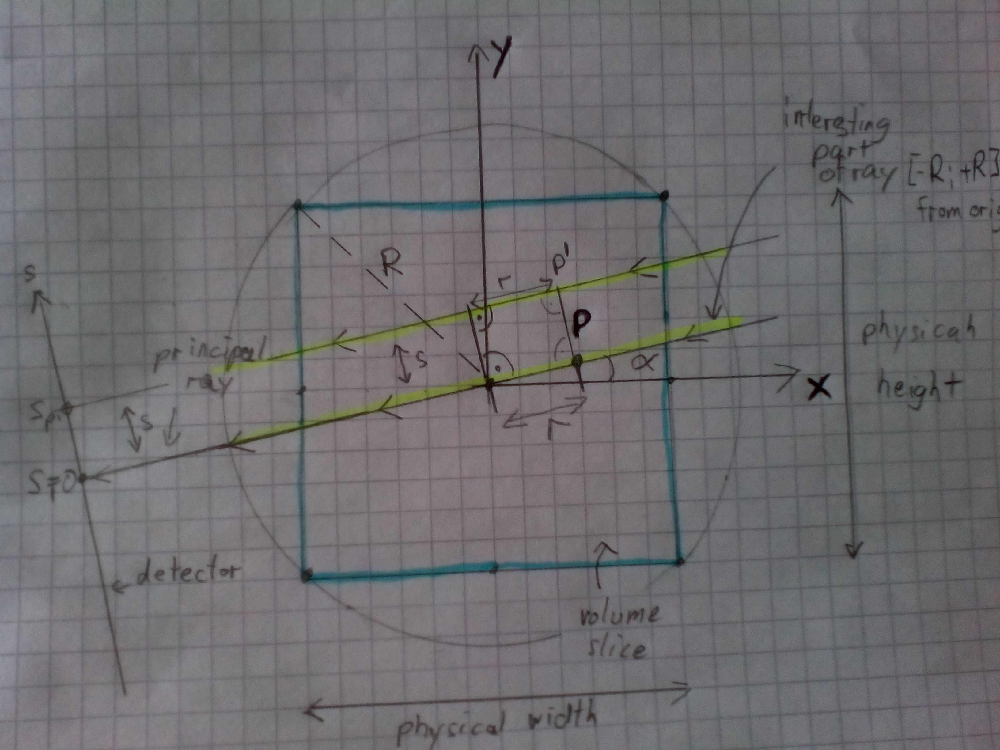

+++
date= 2020-06-03T08:03:00Z
title = "Project Work 3 – Projection"

[extra]
author = "Stephan Seitz"
+++


<h1 style="background-color:Tomato;">Projections</h1>

- Röntgenstrahlenabschwächung: *5P*
    - Unterschiedliche Materialien dämpfen Röntgenstrahlung unterschiedlich stark.
    Exponentielle Abschwächung mit Parameter $\mu$ (Röntgendichte, Abschwächungskoeffizient) *1P*
    - Mindestens ein stark dämpfendes Material, ein schwach dämpfendes Material *1P*
    - Lambert-Beer im Text genannt *1P*
    - Gleichung mit Beleg *1P*
    - Erklärung der Formelzeichen *1P*

- Erklärung Projektionsgeometrie *5P*
    - verständliche, informatike und übersichtlice Grafik(en) *3P*
    - Gleichung $x_P$ *1P*
    $$ ( r * \cos($\theta) , r * \sin($\theta) $$
    - Gleichung $x_P'$ *1P*
    $$ ( r * \cos($\theta) - s * \sin(\theta) , r * \sin($\theta) + s * \cos(\theta)$$

- Kontrastierung Parallelstrahlgeometrie/Fächerstrahlgeometrie bzw. Helixtrajectorie *2P*
    - Implementierung: Parallelstrahlgeometrie, Moderne CTs: Fächerstrahlgeometrie *1P*
    - Grund: Parallelstrahlakquisition ist langsam, aber möglich (jeden Strahl einzeln abmessen).
     Moderne Scanner wollen aber schnell aufnehmen. *1P*

- Beschreibung der Implementierung *8P*
    - Beschreibung der Implementierung. *3P*
    - Formel für Aufnahmewinkel *1P*
    - Formel für Berechnung des Sinogramwerte *1P*
    - Drei nicht berücksichtigte physikalische Effekte *3P*
        - z.B. (Sensor-)Rauschen, nicht-lineare Abschwächung, Streuung,

- Länge *1P*
    

**TOTAL: 21P**

<h1 style="background-color:Tomato;">END Projections</h1>

# Projections

To understand how we can reconstruct a volume from X-ray images, we will first go through the process of how these X-ray images
were acquired from a physical volume.

In your project report you should...

- explain the reader the physical process of **X-ray attenuation** and its material dependance.
What materials in the human body attenuate more X-rays than others?
How is this represented in a CT reconstruction? Or in other words: what quantity does a CT reconstruction actually show?
Which kind of tissues appear therefore lighter and which darker?
- explain the **fundamental theorem** hat describes this process (X-ray attenuation). Give a formula!
Explain all the symbols that you use in the formula.
- prove your explanations with references, also provide the source of the formula.

In this project work, we will make some simplifying assumptions on the acquisition geometry.
I made a drawing of the path of a single X-ray through a slice of our volume.
Since this ray crosses the origin of our coordinate system we call it the **principal ray**.


What are the coordinates $\vec{x}_{P}$ of a point $P$ on the line of the principal ray in dependency of the angle $\theta$ ($\alpha$ in drawing) and the distance
from origin $r$?

In reality, not all X-rays cross the coordinate origin. 
What are the coordinates $\vec{x}_{P'}$ of a point $P'$ that is on a ray that hits the detector at coordinate $s$ in depedency of $r$ and $\theta$?
We assume parallel rays.

*Hint: What vector do you have to add to $P$ to get to $P'$?*



Unfortunally, the figure was written on paper and you shouldn't use hand drawn figures in the project report (as you can see they look ugly).
Please create one or two plots on the computer that are explaining your derived the ray equations to the reader of the project
report. Decide which information is important for the reader to understand your text.

- How does the described situation differ from the **actual acquisition geometry** of modern CT scanners?
  What are the reasons for that? Could our simplified situation be implemented in reality?
<!--- **After Implementation:** what would you need to change in your implementation to cover the real geometry?-->
- **After Implementation:** Describe briefly your implementation of the projection.
  Do not refer any Java classes or variable names!
  Give a formula for how you calculated the different projection angles.
  Give a formula for how you calculated the projection result for each ray.
  What physical effects were neglected in our simulation but are present in reality?
  Name at least three non-idealities of real systems.

This part of the project work should be not longer than 1.5 pages.

## Implementation

We already have an volume class which can store the stack of image slices. Additionally, we also want
to store the projection images (referred as sinograms) for these stack of image slices. For this create
create a class `mt.Projector` in a file `src/main/java/mt/Projector.java`, which can hold both volume slices
and the sinograms.

```java
// Your name here <your idm>
package mt;

import java.util.stream.IntStream;

public class Projector {
    // Our volume
    private mt.Volume volume;
    // Our sinogram
    private mt.Volume sinogram;

}
```
Imlement a constructor for this class.
It should call `this.volume.centerOrigin()` and set the origin of each sinogram slice to `0.0f, -sinogram.physicalHeight() * 0.5f` so we use the same coordinate
systems as in our drawings (it might be handy to set the origin of sinogram to `0.0f, -sinogram.physicalHeight() * 0.5f, -sinogram.physicalDepth() * 0.5f`, requires a `Volume.setOrigin` method)

```java
    public Projector(mt.Volume projectionVolume, mt.Volume sinogram) {
        ... // Implementation here
        assert sinogram.depth() == volume.depth() : "Should have same amount of slices";
    }
```

Constructor and Setters/Getters:
```java
    public void setSinogram(Volume sinogram)
    public Volume singogram()

    public void setVolume(Volume volume)
    public Volume volume()

    public int numAngles() // == sinogram.width()
```

We assume that we aquire $N$ projections at $N$ different angles $\theta$.
All angles should have the same distance from each other and divide $2\cdot \pi$ in $N$ equal parts (we always use [radians](https://en.wikipedia.org/wiki/Radian) for angles).

Implement a method which computes angle value of $n^{th}$ angle index. We want to use the method such that at $n=0$ our angle value should return $\theta=0$, at $n=1$ returns $\theta= \frac{2\cdot \pi}{N}$, and so on. Think of a general formula to compute the $n^{th}$ angle and describe it briefly in the description of your implmentation.

Use this formula to implement the following method:

```java
    // In mt.Projector
    public float getNthAngle(int angleIdx)
```

Now, recall the formula you derived for the position of point $P'$ in the previous section.
We could directly use those coordinates $\vec{x}$ to calculate the integral in Lambert-Beer's law for a ray with angle $\theta$ and shift $s$ over a slice $\mu$ on our computers:

$$ I_{\textrm{mono}} = I_{0} \cdot  \exp\left(-\intop\mu\left(\vec{x}\right)\textrm{d}\vec{x}\right) = I_{0} \cdot  \exp\left(-\intop_{-R}^{R}\mu\left(r,\theta, s\right)\textrm{d}r\right)$$

*$R$ is the radius of the circle circumscribing our rectangular slice. You can see it in the drawing.
The path integral goes along the path marked in yellow in the drawings.*

We are only interested in the value of the line integral

$$ P(s, \theta) = \intop_{-R}^{R}\mu\left(r, s, \theta\right)\textrm{d}r $$

and we have to replace the integral by a sum (computers cannot calculate integrals directly)

$$ P(s, \theta) = \sum_{r=-R}^{R}\mu\left(r,\theta, s\right) \cdot \mathtt{spacing}$$

Calculate this sum for a fixed $s$ and $\theta$ on a slice of our volume!
You can use `volumeSlice.interpolatedAt(x,y)` to deterime $\mu(\vec{x})$ and access values of our slice.

```java
    // in mt.Projector
    public float projectRay(mt.Image volumeSlice, float s, float theta)
```

We have now calculated one value of one of the gray rays on our slice which translates to one point in our sinogram.


Next we want to call this function for every ray and every pixel of our sinogram in the following method:

```java
    // in mt.Projector
    public void projectSlice(int sliceIdx) {
```

To do that ...

- Get the slice `sliceIdx` from `this.volume` using `getSlice`
  
  - This is a slice of our volume with coordinates $x$ and $y$.
  - $x$ runs from left to right
  - $y$ runs from top to bottom
  
- Get the sinogram for that slice `sliceIdx` from `this.sinogramm` using `getSlice`
  - This is a slice of our sinogram with physical coordinates $s$ and $\theta$.
  - $\theta$ runs from left to right
  - $s$ runs from top to bottom
  
- Iterate over each pixel of the sinogram. I would use `angleIdx`, `sIndex`  as a loop variables.
  - Calculate the actual value of `s` from `sIndex`.
  - Calculate `theata` from `angleIndex` by calling the function `getNthAngle`
  - Call `projectRay` with `s` and `theta`
  - Save the result to sinogram at positions `angleIndex` and `sIndex`

__Hint__ Computing `s` from `sIndex` is just using the physical coordinates and shifting the origin of $s$ axis in
the sinogram to the center.
This can be done by muliplying `sIndex` with `sinogram.spacing()` (pixel size of the detector) and adding
`sinogram.origin()[1]` (`== -sinogram.physicalHeight() * 0.5f`).

We recommend you to test your algorithm using a simple image.
Choose a good size for the sinogram to capture the whole image (e.g. height == `volume.height`).
For simplicity, you do not need to change the spacing of the volume or the sinogram.

<table>
<tr> 
    <td><a href="../dot.png" ></a></ts>
    <td><a href="../sinogram_dot.png" ></a></ts>
</tr>
<tr> 
    <th>Simple test slice</th>
    <th>Sinogram of that slice</th>
</td>
</table>

*I used a high number of 500 angles to get a near square image.
When you are using less angles the width of your sinogram will be smaller.
Use less angles to compute the results faster.*

You may also apply `projectSlice` on all slices and display the sinogram.
`Ctrl+Shift+H` should reveal a rotating torso when using one the Cancer Archive scans:


<video controls loop width="300">
  <source src="../sinogram_ct_scan.webm" type="video/webm">
</video> 

Or of the test image above

<video controls loop width="300">
  <source src="../sinogram_rotation.webm" type="video/webm">
</video> 

[Previous section](../volume)

[Next section](../sinogram)
