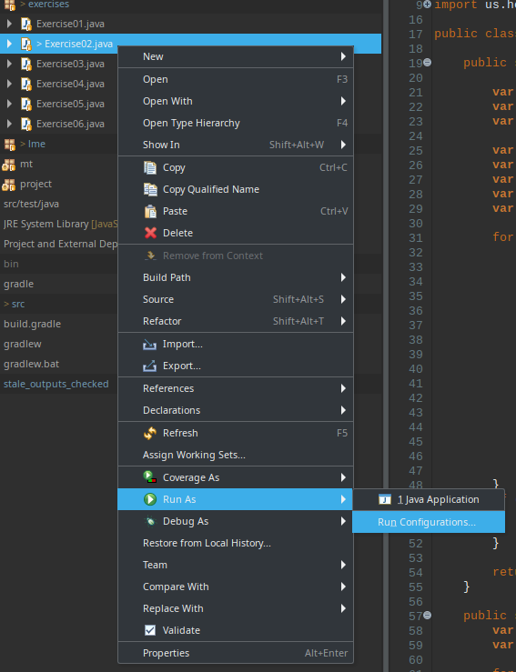
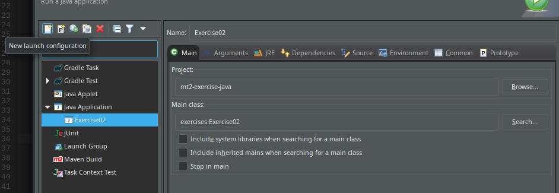
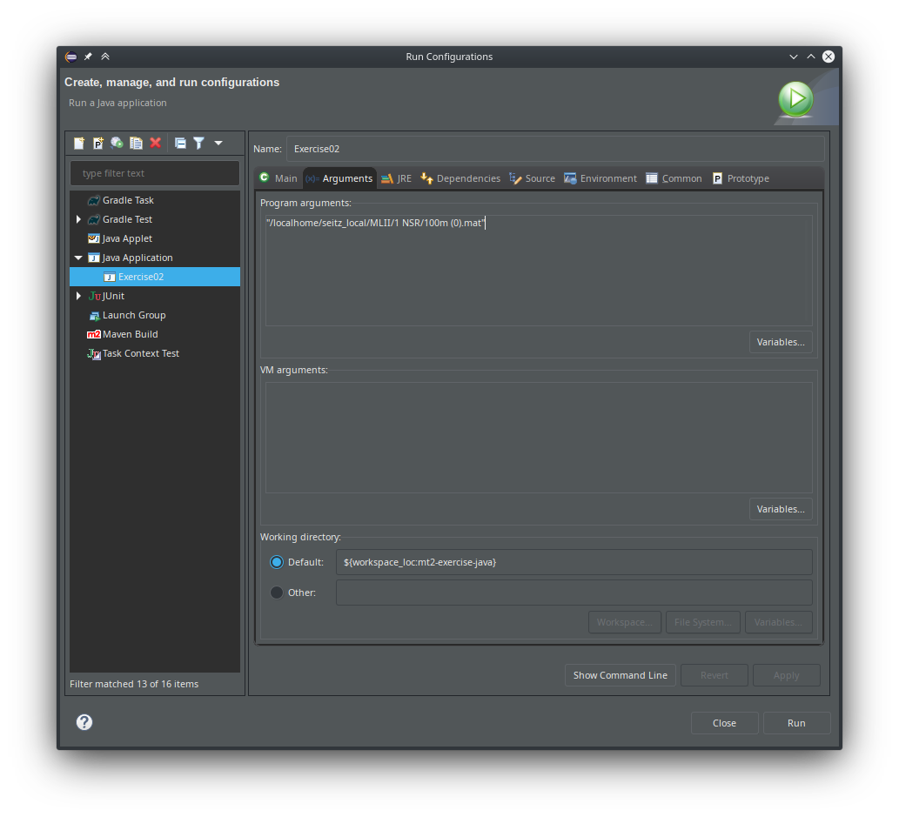

+++
date= 2020-04-29
title = "Set Program Arguments in Eclipse"

[extra]
author="Stephan Seitz"
+++

# Set Program Arguments in Eclipse

Go to **Run Configurations...**

Create a **New launch configuration** with main class `exercises.Exercise02`

Set the arguments with the file name in **quotes**: **"*path to your data set file*"** (`e.g. <where_you_saved_your_data_set>/MLII/1 NSR/100m (0).mat`). Don't forget the **quotes**!

Click **Run**!

