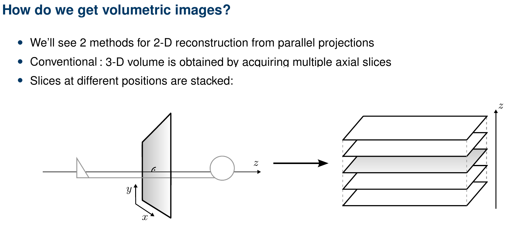

+++
date= 2021-06-07T08:02:00Z
title = "Project Work 2 – Volumes"

[extra]
author = "Stephan Seitz"
+++

# Getting started

**Important: You have to work alone on your project work. No team partners allowed anymore 😔!**

MR reconstruction for a three-dimensional volume can be done with two different methods. We are using slice selection in this project.
So we will need two classes that represent our volume and our stack of MR projections.
It turns out that we can interpret our projections and our volume just as a list of 2-d images.

<table>
<tr>
<td></td>
</tr>
<tr>
<th>A volume: very much just multiple images stacked one over another</th>
</tr>
</table>

Create a class `mt.Volume`

```java
// Your name <your idm>
// No team partner... So sad 😢!

package mt;

import java.util.Arrays;
import java.util.stream.IntStream;

public class Volume {
    // Here we store our images
    protected mt.Image[] slices;

    // Dimensions of our volume
    protected int width, height, depth;

    // Spacing and origin like for mt.Image
    protected float spacing = 1.f; // spacing is now our voxel size
    protected float[] origin = new float[]{0, 0, 0}; // position of the top-left-bottom corner

    // A name for the volume
    protected String name;
    
    //Boolean for the k-space
    protected boolean kspace = false;

}
```

Create a constructor. Remember: `width`, `height`, `depth`, `name` must be set and `slices` must be created as an array.
We need `depth` images of size `width` $\times$ `height` for the `slices`.

```java
    public Volume(int width, int height, int depth, String name)
```

Getters/setters...
```java
    public int width()
    public int height()
    public int depth()
    public float physicalWidth() // width * spacing()
    public float physicalHeight() // height * spacing()
    public float physicalDepth() // depth * spacing()

    public mt.Image getSlice(int z) 
    public void setSlice(int z, mt.Image slice)

    public float spacing()
    public void setSpacing(float spacing) // should also set spacing also for all slices!
    public String name()
    public float[] origin()

    // should set origin to (-0.5 physicalWidth, -0.5 physicalHeight, -0.5 physicalDepth) and call centerOrigin on each slice
    public void centerOrigin()
```

We need also another setter Method in our `image` class:
```java
public void setSpacing(float spacing) // set spacing for the image

```

Now comes the interesting part: visualize the volume!
You will need to update [`src/main/java/lme/DisplayUtils.java`](https://github.com/mt2-erlangen/exercises-ss2020/blob/master/src/main/java/lme/DisplayUtils.java) file and use the following command to visualize the volume.

```java
    public void show() {
        lme.DisplayUtils.showVolume(this);
    }
```

You can download a volume from [the Cancer Imaging Archive](https://wiki.cancerimagingarchive.net/pages/viewpage.action?pageId=50135447).
Use one of the following links (it does not matter which MRI volume you use).


- [Volume 1](https://faubox.rrze.uni-erlangen.de/getlink/fiCit5SqdUPAPWKk6t7FVpgo/BreastCancer1)
- [Volume 2](https://faubox.rrze.uni-erlangen.de/getlink/fiLNB2C3X9HBvKVAi9GKR4uc/BreastCancer2)
- [Volume 3](https://faubox.rrze.uni-erlangen.de/getlink/fiNy6vtps2T6nZXP5XRDuZz2/BreastCancer3)

Unzip the folder and drag the whole folder onto a running ImageJ, e.g. by the following code snippet in a file `src/main/java/project/Playground.java`.
([if you have problems unzipping the files you might try the official downloader from the website](https://wiki.cancerimagingarchive.net/pages/viewpage.action?pageId=50135447T). You need [their downloader to open the *.tcia files](https://wiki.cancerimagingarchive.net/display/NBIA/Downloading+TCIA+Images). The whole data set is very big too, so you can select different image sets with the downloader.)


```java
// This file is only for you to experiment. We will not correct it.

package project;

import mt.Volume;

class Playground {

    public static void main(String[] args) {
        // Starts ImageJ
        (new ij.ImageJ()).exitWhenQuitting(true);

        // You can now use drag & drop to convert the downloaded folder into a *.tif file
        
    }

}

```

Save the opened DICOM Volume as a `*.tif` file (*File > Save As > Tiff...*).


Open the saved tiff file in the main of a file `src/main/java/project/Playground.java`:


```java
// This file is only for you to experiment. We will not correct it.

package project;

import mt.Volume;

class Playground {

    public static void main(String[] args) {
        (new ij.ImageJ()).exitWhenQuitting(true);
        
        Volume groundTruth = DisplayUtils.openVolume("path/to/file.tif");
        groundTruth.show();
        
    }

}

```

You can now scroll through the different slices.
<iframe src="https://giphy.com/embed/3o6gbenQcUjEGTaNfW" width="480" height="480" frameBorder="0" class="giphy-embed" allowFullScreen></iframe><p><a href="https://giphy.com/gifs/sloth-sloths-slothilda-3o6gbenQcUjEGTaNfW">via GIPHY</a></p>

Here a short summary of handy functions of ImageJ when working with MRI images.

- Ctrl+Shift+C: Brightness and Contrast
- Ctrl+Shift+H: Orthogonal Views (view volume from three sides)
- After selecting a line: Ctrl+K Line Plot
- Ctrl+I: Get patient information of a DICOM
- Look at a [3-d rendering with ClearVolume](../clearvolume)


[Previous: Introduction](../introduction) 

[Next: Projection](../projection)
